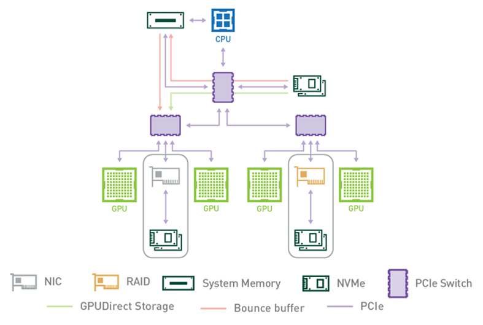
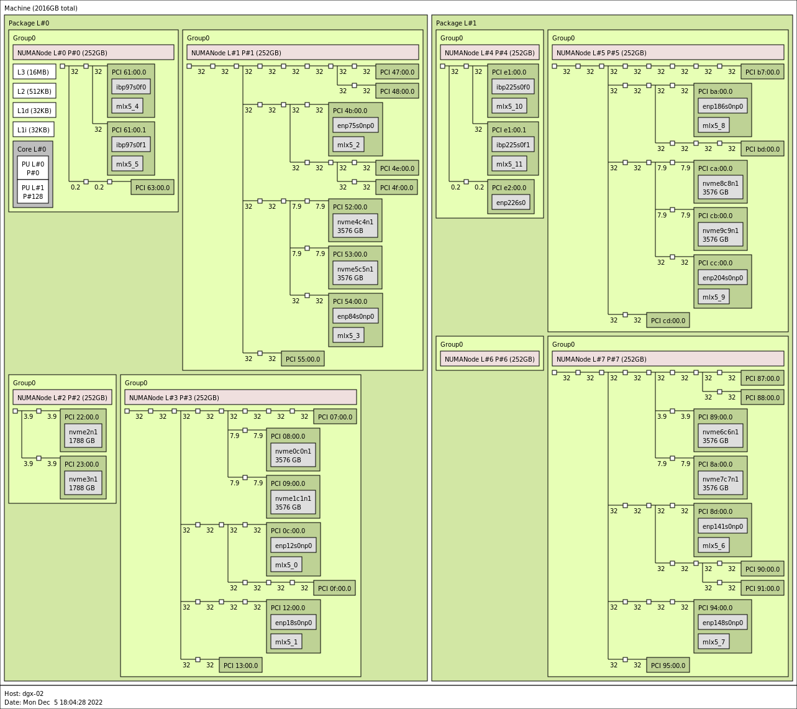

# 1. Benchmarking and Configuration Guide - GPUDirect Storage Benchmarking and Configuration Guide

# 1\. Benchmarking and Configuration Guide[#](<https://docs.nvidia.com/gpudirect-storage/configuration-guide/index.html#benchmarking-and-configuration-guide> "Link to this heading")

The Benchmarking and Configuration Guide helps you evaluate and test GDS functionality and performance by using sample applications.

# 2\. Introduction[#](<https://docs.nvidia.com/gpudirect-storage/configuration-guide/index.html#introduction> "Link to this heading")

NVIDIA® GPUDirect® Storage (GDS) is the newest addition to the GPUDirect family. GDS enables a direct data path for direct memory access (DMA) transfers between GPU memory and storage, which avoids a bounce buffer through the CPU. This direct path increases system bandwidth and decreases the latency and utilization load on the CPU.

The purpose of this guide is to help the user evaluate and test GDS functionality and performance by using sample applications. These applications can be run after you set up and install GDS and before you run the custom applications that have been modified to take advantage of GDS.

Refer to the following guides for more information about GDS:

  * [Design Guide](<https://docs.nvidia.com/gpudirect-storage/design-guide/index.html>)

  * [Overview Guide](<https://docs.nvidia.com/gpudirect-storage/overview-guide/index.html>)

  * [cuFile API Reference Guide](<https://docs.nvidia.com/gpudirect-storage/api-reference-guide/index.html>)

  * [Release Notes](<https://docs.nvidia.com/gpudirect-storage/release-notes/index.html>)

  * [Best Practices Guide](<https://docs.nvidia.com/gpudirect-storage/best-practices-guide/index.html>)

  * [Troubleshooting Guide](<https://docs.nvidia.com/gpudirect-storage/troubleshooting-guide/index.html>)

  * [O_DIRECT Requirements Guide](<https://docs.nvidia.com/gpudirect-storage/o-direct-guide/index.html>)

To learn more about GDS, refer to the following posts:

  * [GPUDirect Storage: A Direct Path Between Storage and GPU Memory](<https://devblogs.nvidia.com/gpudirect-storage/>).

  * The [Magnum IO](<https://developer.nvidia.com/blog/tag/magnum-io/>) series.

# 3\. About this Guide[#](<https://docs.nvidia.com/gpudirect-storage/configuration-guide/index.html#about-this-guide> "Link to this heading")

Configuration and benchmarking are very tightly coupled activities. Benchmarking provides the ability to determine the potential performance based on the current system configuration, and the impact of configuration changes. Configuration changes are sometimes required to achieve optimal benchmark results, which will potentially translate into increased performance of production workloads.

This guide provides information and examples of the various system configuration attributes, both hardware and software, and how they factor into the delivered performance of GPUDirect Storage. Local drive configurations (Direct Attached Storage - DAS) and Network storage (Network Attached Storage - NAS) are covered. The benchmarking tool included when GDS is installed, gdsio, is covered and its use demonstrated.

Appendix A covers benchmarking and performance in general, along with considerations when benchmarking storage systems.

# 4\. Benchmarking GPUDirect Storage[#](<https://docs.nvidia.com/gpudirect-storage/configuration-guide/index.html#benchmarking-gpudirect-storage> "Link to this heading")

GDS enables high throughput and low latency data transfer between storage and GPU memory, which allows you to program the DMA engine of a PCIe device with the correct mappings to move data in and out of a target GPU’s memory. As such, it becomes clear the path between the GPU and the network card or storage device/controller factors significantly into delivered performance, both throughput and latency. The PCIe topology, PCIe root complex, switches and the physical location of the GPU and network and storage devices need to be examined and factored into the configuration details when benchmarking GDS.

Achieving optimal performance with GDS benchmarking requires working through the PCIe topology and determining:

  * which IO devices and GPUs are on the same PCIe switch or root complex

  * which device communication paths require traversing multiple PCIe ports and possibly crossing CPU socket boundaries

The diagram in the following section illustrates an example of PCIe topology, showing different devices across multiple PCIe switches.

Determining PCIe device proximity is not necessarily an easy task, as it requires using multiple Linux utilities to correlate device names and numbers to the hierarchical numbering scheme used to identify PCIe devices, referred to as BDF notation (`bus:device.func`) or extended BDF notation, which adds a PCIe domain identifier to the notation, as in `domain:bus:device.func`.
    
    
    $ lspci | grep -i nvidia
    36:00.0 3D controller: NVIDIA Corporation Device 20b0 (rev a1)
    
    $ lspci -D | grep -i nvidia
    0000:36:00.0 3D controller: NVIDIA Corporation Device 20b0 (rev a1)
    

Copy to clipboard

In the first example, note the standard PCIe BDF notation for the first NVIDIA GPU, `36:00.0`. In the second example, the `-D` flag was added to show the PCIe domain (extended BDF), `0000:36:00.0`.

## 4.1. Determining PCIe Device Affinity[#](<https://docs.nvidia.com/gpudirect-storage/configuration-guide/index.html#determining-pcie-device-affinity> "Link to this heading")

The examples in this section were performed on an NVIDIA DGX-2™ system. The figure below shows a subset of the DGX-2 system architecture, illustrating the PCIe topology:

Figure 4.1 PCIe Topology[#](<https://docs.nvidia.com/gpudirect-storage/configuration-guide/index.html#id17> "Link to this image")

A DGX-2 system has two CPU sockets, and each socket has two PCIe trees. Each of the four PCIe trees (only one is shown above) has two levels of switches. Up to four NVMe drives hang off of the first level of switches. Each second-level switch has a connection to the first level switch, a PCIe slot that can be populated with a NIC or RAID card, and two GPUs.

The commands and methodology in the following sample output apply to any system that runs Linux. The goal is to associate GPUs and NVMe drives in the PCIe hierarchy and determine which device names to use for GPUs and NVMe drives that share the same upstream PCIe switch. To resolve this issue, you must correlate Linux device names with PCIe BDF values. For the locally attached NVMe disks, here is an example that uses Linux `/dev/disk/by-path` directory entries:
    
    
    dgx2> ls -l /dev/disk/by-path
    total 0
    lrwxrwxrwx 1 root root  9 Nov 19 12:08 pci-0000:00:14.0-usb-0:8.1:1.0-scsi-0:0:0:0 -> ../../sr0
    lrwxrwxrwx 1 root root  9 Nov 19 12:08 pci-0000:00:14.0-usb-0:8.2:1.0-scsi-0:0:0:0 -> ../../sda
    lrwxrwxrwx 1 root root 13 Nov 19 12:08 pci-0000:01:00.0-nvme-1 -> ../../nvme0n1
    lrwxrwxrwx 1 root root 15 Nov 19 12:08 pci-0000:01:00.0-nvme-1-part1 -> ../../nvme0n1p1
    lrwxrwxrwx 1 root root 15 Nov 19 12:08 pci-0000:01:00.0-nvme-1-part2 -> ../../nvme0n1p2
    lrwxrwxrwx 1 root root 13 Nov 19 12:08 pci-0000:05:00.0-nvme-1 -> ../../nvme1n1
    lrwxrwxrwx 1 root root 15 Nov 19 12:08 pci-0000:05:00.0-nvme-1-part1 -> ../../nvme1n1p1
    lrwxrwxrwx 1 root root 15 Nov 19 12:08 pci-0000:05:00.0-nvme-1-part2 -> ../../nvme1n1p2
    lrwxrwxrwx 1 root root 13 Nov 19 12:08 pci-0000:2e:00.0-nvme-1 -> ../../nvme2n1
    lrwxrwxrwx 1 root root 13 Nov 19 12:08 pci-0000:2f:00.0-nvme-1 -> ../../nvme3n1
    lrwxrwxrwx 1 root root 13 Nov 19 12:08 pci-0000:51:00.0-nvme-1 -> ../../nvme4n1
    lrwxrwxrwx 1 root root 13 Nov 19 12:08 pci-0000:52:00.0-nvme-1 -> ../../nvme5n1
    lrwxrwxrwx 1 root root 13 Nov 19 12:08 pci-0000:b1:00.0-nvme-1 -> ../../nvme6n1
    lrwxrwxrwx 1 root root 13 Nov 19 12:08 pci-0000:b2:00.0-nvme-1 -> ../../nvme7n1
    lrwxrwxrwx 1 root root 13 Nov 19 12:08 pci-0000:da:00.0-nvme-1 -> ../../nvme8n1
    lrwxrwxrwx 1 root root 13 Nov 19 12:08 pci-0000:db:00.0-nvme-1 -> ../../nvme9n1
    

Copy to clipboard

Since the current system configuration has nvme0 and nvme1 devices configured into a RAID0 device (`/dev/md0` not shown here), the focus is on the remaining available nvme devices, `nvme2` through `nvme9`. You can get the same PCIe-to-device information for the GPUs that use the `nvidia-smi` utility and specify the GPU attributes to query:
    
    
    dgx2> nvidia-smi --query-gpu=index,name,pci.domain,pci.bus,pci.device,pci.device_id,pci.sub_device_id --format=csv
    index, name, pci.domain, pci.bus, pci.device, pci.device_id, pci.sub_device_id
    0, Tesla V100-SXM3-32GB, 0x0000, 0x34, 0x00, 0x1DB810DE, 0x12AB10DE
    1, Tesla V100-SXM3-32GB, 0x0000, 0x36, 0x00, 0x1DB810DE, 0x12AB10DE
    2, Tesla V100-SXM3-32GB, 0x0000, 0x39, 0x00, 0x1DB810DE, 0x12AB10DE
    3, Tesla V100-SXM3-32GB, 0x0000, 0x3B, 0x00, 0x1DB810DE, 0x12AB10DE
    4, Tesla V100-SXM3-32GB, 0x0000, 0x57, 0x00, 0x1DB810DE, 0x12AB10DE
    5, Tesla V100-SXM3-32GB, 0x0000, 0x59, 0x00, 0x1DB810DE, 0x12AB10DE
    6, Tesla V100-SXM3-32GB, 0x0000, 0x5C, 0x00, 0x1DB810DE, 0x12AB10DE
    7, Tesla V100-SXM3-32GB, 0x0000, 0x5E, 0x00, 0x1DB810DE, 0x12AB10DE
    8, Tesla V100-SXM3-32GB, 0x0000, 0xB7, 0x00, 0x1DB810DE, 0x12AB10DE
    9, Tesla V100-SXM3-32GB, 0x0000, 0xB9, 0x00, 0x1DB810DE, 0x12AB10DE
    10, Tesla V100-SXM3-32GB, 0x0000, 0xBC, 0x00, 0x1DB810DE, 0x12AB10DE
    11, Tesla V100-SXM3-32GB, 0x0000, 0xBE, 0x00, 0x1DB810DE, 0x12AB10DE
    12, Tesla V100-SXM3-32GB, 0x0000, 0xE0, 0x00, 0x1DB810DE, 0x12AB10DE
    13, Tesla V100-SXM3-32GB, 0x0000, 0xE2, 0x00, 0x1DB810DE, 0x12AB10DE
    14, Tesla V100-SXM3-32GB, 0x0000, 0xE5, 0x00, 0x1DB810DE, 0x12AB10DE
    15, Tesla V100-SXM3-32GB, 0x0000, 0xE7, 0x00, 0x1DB810DE, 0x12AB10DE
    

Copy to clipboard

Use the Linux `lspci` command to tie it all together:
    
    
    dgx2> lspci -tv | egrep -i "nvidia | micron"
    -+-[0000:d7]-+-00.0-[d8-e7]----00.0-[d9-e7]--+-00.0-[da]----00.0  Micron Technology Inc 9200 PRO NVMe SSD
     |           |                               +-01.0-[db]----00.0  Micron Technology Inc 9200 PRO NVMe SSD
     |           |                               +-04.0-[de-e2]----00.0-[df-e2]--+-00.0-[e0]----00.0  NVIDIA Corporation GV100GL [Tesla V100 SXM3 32GB]
     |           |                               |                               \-10.0-[e2]----00.0  NVIDIA Corporation GV100GL [Tesla V100 SXM3 32GB]
     |           |                               \-0c.0-[e3-e7]----00.0-[e4-e7]--+-00.0-[e5]----00.0  NVIDIA Corporation GV100GL [Tesla V100 SXM3 32GB]
     |           |                                                               \-10.0-[e7]----00.0  NVIDIA Corporation GV100GL [Tesla V100 SXM3 32GB]
     +-[0000:ae]-+-00.0-[af-c7]----00.0-[b0-c7]--+-00.0-[b1]----00.0  Micron Technology Inc 9200 PRO NVMe SSD
     |           |                               +-01.0-[b2]----00.0  Micron Technology Inc 9200 PRO NVMe SSD
     |           |                               +-04.0-[b5-b9]----00.0-[b6-b9]--+-00.0-[b7]----00.0  NVIDIA Corporation GV100GL [Tesla V100 SXM3 32GB]
     |           |                               |                               \-10.0-[b9]----00.0  NVIDIA Corporation GV100GL [Tesla V100 SXM3 32GB]
     |           |                               +-0c.0-[ba-be]----00.0-[bb-be]--+-00.0-[bc]----00.0  NVIDIA Corporation GV100GL [Tesla V100 SXM3 32GB]
     |           |                               |                               \-10.0-[be]----00.0  NVIDIA Corporation GV100GL [Tesla V100 SXM3 32GB]
     |           |                               \-10.0-[bf-c7]----00.0-[c0-c7]--+-02.0-[c1]----00.0  NVIDIA Corporation Device 1ac2
     |           |                                                               +-03.0-[c2]----00.0  NVIDIA Corporation Device 1ac2
     |           |                                                               +-04.0-[c3]----00.0  NVIDIA Corporation Device 1ac2
     |           |                                                               +-0a.0-[c5]----00.0  NVIDIA Corporation Device 1ac2
     |           |                                                               +-0b.0-[c6]----00.0  NVIDIA Corporation Device 1ac2
     |           |                                                               \-0c.0-[c7]----00.0  NVIDIA Corporation Device 1ac2
     +-[0000:4e]-+-00.0-[4f-67]----00.0-[50-67]--+-00.0-[51]----00.0  Micron Technology Inc 9200 PRO NVMe SSD
     |           |                               +-01.0-[52]----00.0  Micron Technology Inc 9200 PRO NVMe SSD
     |           |                               +-04.0-[55-59]----00.0-[56-59]--+-00.0-[57]----00.0  NVIDIA Corporation GV100GL [Tesla V100 SXM3 32GB]
     |           |                               |                               \-10.0-[59]----00.0  NVIDIA Corporation GV100GL [Tesla V100 SXM3 32GB]
     |           |                               +-0c.0-[5a-5e]----00.0-[5b-5e]--+-00.0-[5c]----00.0  NVIDIA Corporation GV100GL [Tesla V100 SXM3 32GB]
     |           |                               |                               \-10.0-[5e]----00.0  NVIDIA Corporation GV100GL [Tesla V100 SXM3 32GB]
     |           |                               \-10.0-[5f-67]----00.0-[60-67]--+-02.0-[61]----00.0  NVIDIA Corporation Device 1ac2
     |           |                                                               +-03.0-[62]----00.0  NVIDIA Corporation Device 1ac2
     |           |                                                               +-04.0-[63]----00.0  NVIDIA Corporation Device 1ac2
     |           |                                                               +-0a.0-[65]----00.0  NVIDIA Corporation Device 1ac2
     |           |                                                               +-0b.0-[66]----00.0  NVIDIA Corporation Device 1ac2
     |           |                                                               \-0c.0-[67]----00.0  NVIDIA Corporation Device 1ac2
     +-[0000:2b]-+-00.0-[2c-3b]----00.0-[2d-3b]--+-00.0-[2e]----00.0  Micron Technology Inc 9200 PRO NVMe SSD
     |           |                               +-01.0-[2f]----00.0  Micron Technology Inc 9200 PRO NVMe SSD
     |           |                               +-04.0-[32-36]----00.0-[33-36]--+-00.0-[34]----00.0  NVIDIA Corporation GV100GL [Tesla V100 SXM3 32GB]
     |           |                               |                               \-10.0-[36]----00.0  NVIDIA Corporation GV100GL [Tesla V100 SXM3 32GB]
     |           |                               \-0c.0-[37-3b]----00.0-[38-3b]--+-00.0-[39]----00.0  NVIDIA Corporation GV100GL [Tesla V100 SXM3 32GB]
     |           |                                                               \-10.0-[3b]----00.0  NVIDIA Corporation GV100GL [Tesla V100 SXM3 32GB]
    

Copy to clipboard

In the above example, we explicitly searched for SSDs from the given vendor. To determine the manufacturer of the NVMe SSD devices on your system, simply run `lsblk -o NAME,MODEL`. Alternatively, use `nvme` as the string to match with `nvidia`.

A few things to note here. First, the NVME SSD devices are grouped in pairs on each of the PCIe upstream switches, as shown in the displayed extended BDF format (left most column), showing domain zero, and Bus IDs 0xd7 (`0000:d7`), 0xae, 0x4e and 0x2b. Also, two distinct NVIDIA device IDs are revealed (right-most column) - 0x1db8 and 0x1ac2. The 0x1db8 devices are the Tesla V100 SXM3 32GB GPUs, and the 0x1ac2 devices are NVSwitches. Our interest here is in the GPU devices, and the topology shows that there will be an optimal performance path between a pair of NVMe SSDs and four possible V100 GPUs. Given this information, we can create a RAID0 device comprised of two NVMe SSDs on the same PCIe switch, and determine which GPUs are on the same PCIe upstream switch.

Starting at the top of the `lspci` output, note two NVMe drives at PCIe bus 0xda and 0xdb. The disk-by-path data indicates these are nvme8 and nvme9 devices. The four GPUs on the same segment, 0xe0, 0xe2, 0xe5 and 0xe7, are GPUs 12, 13, 14 and 15 respectively, as determined from the `nvidia-smi` output. The following table s hows the PCIe GPU-to-NVMe affinity for all installed GPUs and corresponding NVMe SSD pairs.

Table 4.1 DGX-2 GPU / NVMe Affinity (example)[#](<https://docs.nvidia.com/gpudirect-storage/configuration-guide/index.html#id18> "Link to this table") See`nvidia-smi` command output |  | See`/dev/disk/by-path` entries |   
---|---|---|---  
GPU # | GPU PCIe | NVMe # | NVMe PCIe  
0, 1, 2, 3 | 0x34, 0x36, 0x39, 0x3b | nvme2, nvme3 | 0x2e, 0x2f  
4, 5, 6, 7 | 0x57, 0x59, 0x5c, 0x5e | nvme4, nvme5 | 0x51, 0x52  
8, 9, 10, 11 | 0xb7, 0xb9, 0xbc, 0xbe | nvme6, nvme7 | 0xb1, 0xb2  
12, 13, 14, 15 | 0xe0, 0xe2, 0xe5, 0xe7 | nvme8, nvme9 | 0xda, 0xdb  
  
With this information, we can configure a target workload for optimal throughput and latency, leveraging PCIe topology and device proximity of the GPUs and NVMe SSDs. This will be demonstrated in the next couple sections. Note that it is not guaranteed the actual PCIe BDF values will be the same for every NVIDIA DGX-2. This is because enumeration of the PCIe topology is based on specific configuration details and determined at boot time.

The same logic applies to storage that is network attached (NAS). The network interface (NIC) becomes the “storage controller”, in terms of the data flow between the GPUs and storage. Fortunately, determining PCIe topology is a much easier task for GPUs and NICs, as the `nvidia-smi` utility includes options for generating this information. Specifically, `nvidia-smi topo -mp` generates a simple topology map in the form of a matrix showing the connection(s) at the intersection of the installed GPUs and network interfaces.

For readability, the sample output below from a DGX-2 system shows the first eight columns, and the first four Mellanox device rows, not the entire table generated when executing `nvidia-smi topo -mp`.
    
    
    dgx2> nvidia-smi topo -mp
            GPU0   GPU1   GPU2   GPU3   GPU4   GPU5   GPU6   GPU7
    GPU0     X     PIX    PXB    PXB    NODE   NODE   NODE   NODE
    GPU1    PIX     X     PXB    PXB    NODE   NODE   NODE   NODE
    GPU2    PXB    PXB     X     PIX    NODE   NODE   NODE   NODE
    GPU3    PXB    PXB    PIX     X     NODE   NODE   NODE   NODE
    GPU4    NODE   NODE   NODE   NODE    X     PIX    PXB    PXB
    GPU5    NODE   NODE   NODE   NODE   PIX     X     PXB    PXB
    GPU6    NODE   NODE   NODE   NODE   PXB    PXB     X     PIX
    GPU7    NODE   NODE   NODE   NODE   PXB    PXB    PIX     X
    GPU8    SYS    SYS    SYS    SYS    SYS    SYS    SYS    SYS
    GPU9    SYS    SYS    SYS    SYS    SYS    SYS    SYS    SYS
    GPU10   SYS    SYS    SYS    SYS    SYS    SYS    SYS    SYS
    GPU11   SYS    SYS    SYS    SYS    SYS    SYS    SYS    SYS
    GPU12   SYS    SYS    SYS    SYS    SYS    SYS    SYS    SYS
    GPU13   SYS    SYS    SYS    SYS    SYS    SYS    SYS    SYS
    GPU14   SYS    SYS    SYS    SYS    SYS    SYS    SYS    SYS
    GPU15   SYS    SYS    SYS    SYS    SYS    SYS    SYS    SYS
    mlx5_0  PIX    PIX    PXB    PXB    NODE   NODE   NODE   NODE
    mlx5_1  PXB    PXB    PIX    PIX    NODE   NODE   NODE   NODE
    mlx5_2  NODE   NODE   NODE   NODE   PIX    PIX    PXB    PXB
    mlx5_3  NODE   NODE   NODE   NODE   PXB    PXB    PIX    PIX
    
    Legend:
    
      X    = Self
      SYS  = Connection traversing PCIe as well as the SMP interconnect between NUMA nodes (for example, QPI/UPI)
      NODE = Connection traversing PCIe as well as the interconnect between PCIe Host Bridges within a NUMA node
      PHB  = Connection traversing PCIe as well as a PCIe Host Bridge (typically the CPU)
      PXB  = Connection traversing multiple PCIe bridges (without traversing the PCIe Host Bridge)
      PIX  = Connection traversing at most a single PCIe bridge
    

Copy to clipboard

The optimal path between a GPU and NIC will be one PCIe switch path designated as PIX. The least optimal path is designated as `SYS`, which indicates that the data path requires traversing the CPU-to-CPU interconnect (NUMA nodes).

If you use this data when you configure and test GDS performance, the ideal setup would be, for example, a data flow from `mlx5_0` to/from GPUs 0 and 1, `mlx5_1` to/from GPUs 1 and 2, and so on.

On systems where `nvidia-smi` is not available and cannot be installed, determining the ideal setup can still be accomplished. Using tools such as `lscpi` or hwloc’s `lstopo` can enable administrators to identify the best pairing of GPUs with NVMes and NICs. Below is an example output of `lstopo` from a different DGX-2 machine:

Figure 4.2 dgx2> lstopo –of png[#](<https://docs.nvidia.com/gpudirect-storage/configuration-guide/index.html#id19> "Link to this image")

Taking the grouping associated with NUMANode L#3 in the bottom left quadrant for an example, it can be seen that the GPU identified by PCI 07:00.0 would best be associated with the NVMes `nvme0c0n1` (PCI 08:00.0) and `nvme1c1nc` (PCI 09:00.0). The GPU identified by PCI 0f:00.0 can also be associated with those same NVMes and nvidia-smi would categorize their relationship as PXB, but as the image shows this will involve crossing a greater number of PCIe bridges compared to the 07 GPU. It should also be noted that since both GPUs must communicate via a common switch down to the NVMes, concurrent communication by both GPUs with the NVMes may reduce performance. Regarding NIC affinity, it likely makes sense to use `mlx5_0` in conjunction with GPU 0f:00.0 and `mlx5_1` with GPU 07:00.0 to avoid concurrent communication across shared bridges.

For machines that cannot render graphical output, the xml output of lstopo can also be used to identify the same features. Below is a snippet of such an output, obtained by running `lstopo --of xml`, for the NUMANode L#3 grouping just examined. Various lines have been removed for readability and brevity, but the topology has not been altered.
    
    
    <object type="Bridge" gp_index="867" bridge_type="1-1" depth="2" bridge_pci="0000:[02-13]" pci_busid="0000:01:00.0" pci_type="0604 [1000:c010] [1000:a096] b0" pci_link_speed="31.507692">
      <info name="PCIVendor" value="Broadcom / LSI"/>
      <object type="Bridge" gp_index="843" bridge_type="1-1" depth="3" bridge_pci="0000:[03-09]" pci_busid="0000:02:00.0" pci_type="0604 [1000:c010] [1000:a096] b0" pci_link_speed="31.507692">
        <info name="PCIVendor" value="Broadcom / LSI"/>
        <object type="Bridge" gp_index="822" bridge_type="1-1" depth="4" bridge_pci="0000:[04-09]" pci_busid="0000:03:00.0" pci_type="0604 [1000:c010] [1000:a096] b0" pci_link_speed="31.507692">
          <info name="PCIVendor" value="Broadcom / LSI"/>
          <object type="Bridge" gp_index="951" bridge_type="1-1" depth="5" bridge_pci="0000:[05-07]" pci_busid="0000:04:00.0" pci_type="0604 [1000:c010] [1000:a096] b0" pci_link_speed="31.507692">
            <info name="PCIVendor" value="Broadcom / LSI"/>
            <object type="Bridge" gp_index="924" bridge_type="1-1" depth="6" bridge_pci="0000:[06-07]" pci_busid="0000:05:00.0" pci_type="0604 [1000:c010] [10de:13b8] b0" pci_link_speed="31.507692">
              <info name="PCIVendor" value="Broadcom / LSI"/>
              <object type="Bridge" gp_index="903" bridge_type="1-1" depth="7" bridge_pci="0000:[07-07]" pci_busid="0000:06:00.0" pci_type="0604 [1000:c010] [10de:13b8] b0" pci_link_speed="31.507692">
                <info name="PCIVendor" value="Broadcom / LSI"/>
                <object type="PCIDev" gp_index="878" pci_busid="0000:07:00.0" pci_type="0302 [10de:20b2] [10de:1463] a1" pci_link_speed="31.507692">
                  <info name="PCIVendor" value="NVIDIA Corporation"/>
                  <object type="OSDev" gp_index="1017" name="opencl0d0" subtype="OpenCL" osdev_type="5">
                    <info name="GPUModel" value="NVIDIA A100-SXM4-80GB"/>
    ...
    

Copy to clipboard
    
    
          <object type="Bridge" gp_index="900" bridge_type="1-1" depth="5" bridge_pci="0000:[08-08]" pci_busid="0000:04:10.0" pci_type="0604 [1000:c010] [1000:a096] b0" pci_link_speed="7.876923">
            <info name="PCIVendor" value="Broadcom / LSI"/>
            <object type="PCIDev" gp_index="852" pci_busid="0000:08:00.0" pci_type="0108 [144d:a824] [144d:a801] 00" pci_link_speed="7.876923">
              <info name="PCIVendor" value="Samsung Electronics Co Ltd"/>
              <object type="OSDev" gp_index="984" name="nvme0c0n1" subtype="Disk" osdev_type="0">
    ...
    

Copy to clipboard
    
    
          <object type="Bridge" gp_index="866" bridge_type="1-1" depth="5" bridge_pci="0000:[09-09]" pci_busid="0000:04:14.0" pci_type="0604 [1000:c010] [1000:a096] b0" pci_link_speed="7.876923">
            <info name="PCIVendor" value="Broadcom / LSI"/>
            <object type="PCIDev" gp_index="831" pci_busid="0000:09:00.0" pci_type="0108 [144d:a824] [144d:a801] 00" pci_link_speed="7.876923">
              <info name="PCIVendor" value="Samsung Electronics Co Ltd"/>
              <object type="OSDev" gp_index="983" name="nvme1c1n1" subtype="Disk" osdev_type="0">
    ...
    

Copy to clipboard
    
    
      <object type="Bridge" gp_index="966" bridge_type="1-1" depth="3" bridge_pci="0000:[0a-0f]" pci_busid="0000:02:04.0" pci_type="0604 [1000:c010] [1000:a096] b0" pci_link_speed="31.507692">
        <info name="PCIVendor" value="Broadcom / LSI"/>
        <object type="Bridge" gp_index="870" bridge_type="1-1" depth="4" bridge_pci="0000:[0b-0f]" pci_busid="0000:0a:00.0" pci_type="0604 [1000:c010] [1000:a096] b0" pci_link_speed="31.507692">
          <info name="PCIVendor" value="Broadcom / LSI"/>
          <object type="Bridge" gp_index="848" bridge_type="1-1" depth="5" bridge_pci="0000:[0c-0c]" pci_busid="0000:0b:00.0" pci_type="0604 [1000:c010] [1000:a096] b0" pci_link_speed="31.507692">
            <info name="PCIVendor" value="Broadcom / LSI"/>
            <object type="PCIDev" gp_index="824" pci_busid="0000:0c:00.0" pci_type="0207 [15b3:101b] [15b3:0007] 00" pci_link_speed="31.507692">
              <info name="PCIVendor" value="Mellanox Technologies"/>
              <info name="PCIDevice" value="MT28908 Family [ConnectX-6]"/>
              <object type="OSDev" gp_index="995" name="ibp12s0" osdev_type="2">
              </object>
              <object type="OSDev" gp_index="1011" name="mlx5_0" osdev_type="3">
    ...
    

Copy to clipboard
    
    
          <object type="Bridge" gp_index="948" bridge_type="1-1" depth="5" bridge_pci="0000:[0d-0f]" pci_busid="0000:0b:10.0" pci_type="0604 [1000:c010] [1000:a096] b0" pci_link_speed="31.507692">
            <info name="PCIVendor" value="Broadcom / LSI"/>
            <object type="Bridge" gp_index="954" bridge_type="1-1" depth="6" bridge_pci="0000:[0e-0f]" pci_busid="0000:0d:00.0" pci_type="0604 [1000:c010] [10de:13b8] b0" pci_link_speed="31.507692">
              <info name="PCIVendor" value="Broadcom / LSI"/>
              <object type="Bridge" gp_index="926" bridge_type="1-1" depth="7" bridge_pci="0000:[0f-0f]" pci_busid="0000:0e:00.0" pci_type="0604 [1000:c010] [10de:13b8] b0" pci_link_speed="31.507692">
                <info name="PCIVendor" value="Broadcom / LSI"/>
                <object type="PCIDev" gp_index="907" pci_busid="0000:0f:00.0" pci_type="0302 [10de:20b2] [10de:1463] a1" pci_link_speed="31.507692">
                  <info name="PCIVendor" value="NVIDIA Corporation"/>
                  <object type="OSDev" gp_index="1018" name="opencl0d1" subtype="OpenCL" osdev_type="5">
                    <info name="GPUModel" value="NVIDIA A100-SXM4-80GB"/>
    ...
    

Copy to clipboard

Examination of the XML will lead to the same conclusions regarding GPU and NVMe/NIC affinity, again for instance taking the GPU associated with `pci_busid=0000:07:00.0`, we see that it shares an upstream bridge (`gp_index="822"`) with the NVMes `nvme0c0n1` and `nvme1c1n1` at a depth of 3. The GPU associated with `pci_busid=0000:0f:00.0` also shares an upstream bridge with these NVMes, but further upstream at a depth of 2 (`gp_index="867"`), matching up with the depiction in the graphical output examined earlier.

## 4.2. GPUDirect Storage Configuration Parameters[#](<https://docs.nvidia.com/gpudirect-storage/configuration-guide/index.html#gpudirect-storage-configuration-parameters> "Link to this heading")

There are various parameters and settings that will factor into delivered performance. In addition to storage/filesystem-specific parameters, there are system settings and GDS-specific parameters defined in `/etc/cufile.json`.

### 4.2.1. System Parameters[#](<https://docs.nvidia.com/gpudirect-storage/configuration-guide/index.html#system-parameters> "Link to this heading")

On the system side, the following should be checked:

  * PCIe Access Control Service (ACS)

PCIe ACS is a security feature for peer-to-peer transactions Each transaction is checked to determine whether peer-to-peer communication is allowed between the source and destination devices. Each such transaction must be routed through the root complex, which induces latency and impacts sustainable throughput. The best GDS performance is obtained when PCIe ACS is disabled.

  * IOMMU

The PCIe Input/Output Memory Management Unit (IOMMU) is a facility for handling address translations for IO devices, and requires routing though the PCIe root complex. On most systems, it is recommended that the IOMMU be disabled as it can cause GDS IO operations to fail or perform poorly. For Grace Hopper based systems, the IOMMU does not need to be disabled.

### 4.2.2. GPUDirect Storage Parameters[#](<https://docs.nvidia.com/gpudirect-storage/configuration-guide/index.html#gpudirect-storage-parameters> "Link to this heading")

This section describes the JSON configuration parameters used by GDS.

When GDS is installed, the `/etc/cufile.json` parameter file is installed with default values. The implementation allows for generic GDS settings and parameters specific to a file system or storage partner.

Note

Consider `compat_mode` for systems or mounts that are not yet set up with GDS support.

Table 4.2 GPUDirect Storage cufile.json Variables[#](<https://docs.nvidia.com/gpudirect-storage/configuration-guide/index.html#id20> "Link to this table") Parameter | Default Value | Description  
---|---|---  
`logging:dir` | CWD | Location of the GDS log file.  
`logging:level` | ERROR | Verbosity of logging.  
`profile:nvtx` | false | Boolean which if set to true, generates NVTX traces for profiling.  
`profile:cufile_stats` | 0 | Enable cuFile IO stats. Level 0 means no cuFile statistics.  
`profile:io_batchsize` | 128 | Maximum size of the batch allowed.  
`properties:max_direct_io_size_kb` | 16384 | Maximum IO chunk size (4K aligned) used by cuFile for each IO request (in KB).  
`properties:max_device_cache_size_kb` | 131072 | Maximum device memory size (4K aligned) for reserving bounce buffers for the entire GPU (in KB).  
`properties:max_device_pinned_mem_size_kb` | 33554432 | Maximum per-GPU memory size in KB, including the memory for the internal bounce buffers, that can be pinned.  
`properties:use_poll_mode` | false | Boolean that indicates whether the cuFile library uses polling or synchronous wait for the storage to complete IO. Polling might be useful for small IO transactions. Refer to **Poll Mode** below.  
`properties:poll_mode_max_size_kb` | 4 | Maximum IO request size (4K aligned) in or equal to which library will be polled (in KB).  
`properties:poll_mode_max_size_kb` `properties:poll_mode_max_size_kb` `properties:poll_mode_max_size_kb` `properties.force_compat_mode` | 4 4 4 false | Maximum IO request size (4K aligned) in or equal to which library will be polled (in KB). Maximum IO request size (4K aligned) in or equal to which library will be polled (in KB). Maximum IO request size (4K aligned) in or equal to which library will be polled (in KB). If true, this option can be used to force all IO to use compatibility mode. Alternatively the admin can unload the `nvidia_fs.ko` or not expose the character devices in the docker container environment.  
`properties:allow_compat_mode` | false | If true, enables the compatibility mode, which allows cuFile to issue POSIX read/write. To switch to GDS-enabled I/O, set this to `false`. Refer to **Compatibility Mode** below.  
`properties:use_pci_p2pdma` | false | If true, enables GDS to preferentially use p2pdma over the traditional nvidia-fs path if the kernel supports it. Otherwise, the traditional path via nvidia-fs is used. Refer to **P2P Mode** below.  
`properties:rdma_dev_addr_list` | [] | Provides the list of relevant client IPv4 addresses for all the interfaces that can be used for RDMA.  
`properties:rdma_load_balancing_policy` | RoundRobin | Specifies the load balancing policy for RDMA memory registration. By default, this value is set to RoundRobin. Here are the valid values that can be used for this property: `FirstFit` \- Suitable for cases where `numGpus` matches `numPeers` and GPU PCIe lane width is greater or equal to the peer PCIe lane width. `MaxMinFit` \- This will try to assign peers in a manner that there is least sharing. Suitable for cases, where all GPUs are loaded uniformly. `RoundRobin` \- This parameter uses only the NICs that are the closest to the GPU for memory registration in a round robin fashion. `RoundRobinMaxMin` \- Similar to RoundRobin but uses peers with least sharing. `Randomized` \- This parameter uses only the NICs that are the closest to the GPU for memory registration in a randomized fashion.  
`properties:rdma_dynamic_routing` | false | Boolean parameter applicable only to Network Based File Systems. This could be enabled for platforms where GPUs and NICs do not share a common PCIe-root port.  
`properties:rdma_dynamic_routing_order` | `[ "GPU_MEM_NVLINKS", "GPU_MEM", "SYS_MEM", "P2P" ]` | The routing order applies only if `rdma_dynamic_routing` is enabled. Users can specify an ordered list of routing policies selected when routing an IO on a first-fit basis.  
`properties:io_batchsize` | 128 | The max number of IO operations per batch.  
`properties:gds_rdma_write_support` | true | Enable GDS write support for RDMA based storage.  
`properties:io_priority` | default | Enable io priority w.r.t. compute streams Valid options are “default”, “low”, “med”, “high” Tuning this might be helpful in cases where `cudaMemcpy` is not performing as expected because of the GPU being consumed by the compute.  
`fs:generic:posix_unaligned_writes` | false | Setting to `true` forces the use of a POSIX write instead of cuFileWrite for unaligned writes.  
`fs:lustre:posix_gds_min_kb` | 4KB | Applicable for the Amazon FSx for Lustre and EXAScaler filesystem. This is applicable for reads and writes. IO threshold for read/write (4K aligned) that is equal to or below the threshold that cuFile will use for a POSIX read/write. It was observed that for smaller IO size such as 4KB/8KB, setting this threshold to 4KB/8KB yields better performance.  
`fs:lustre:rdma_dev_addr_list` | [] | Provides the list of relevant client IPv4 addresses for all the interfaces that can be used by a single lustre mount. This property is used by the cuFile dynamic routing feature to infer preferred RDMA devices.  
`fs:lustre:mount_table` | [] | Specifies a dictionary of IPv4 mount addresses against a Lustre mount point.This property is used by the cuFile dynamic routing feature. Refer to the default `cufile.json` for sample usage.  
`fs:lustre:use_pci_p2pdma` | false | If true, enables GDS to preferentially use p2pdma over the traditional nvidia-fs path for lustre. This property should be enabled only if lustre is enabled with p2pdma support, otherwise the IO will fail via p2pdma path and not be re-tried via nvidia-fs path.  
`fs:nfs:rdma_dev_addr_list` | [] | Provides the list of IPv4 addresses for all the interfaces a single NFS mount can use. This property is used by the cuFile dynamic routing feature to infer preferred RDMA devices.  
`fs:nfs:use_pci_p2pdma` | false | If true, enables GDS to preferentially use p2pdma over the traditional nvidia-fs path for NFS. This property should be enabled only if NFS is enabled with p2pdma support, otherwise the IO will fail via p2pdma path and not be re-tried via nvidia-fs path.  
`fs:nfs:mount_table` | [] | Specifies a dictionary of IPv4 mount addresses against a Lustre mount point. This property is used by the cuFile dynamic routing feature. Refer to the default `cufile.json` for sample usage.  
`fs:weka:rdma_write_support` | false | If set to true, cuFileWrite will use RDMA writes instead of falling back to posix writes for a WekaFs mount.  
`fs:weka:<rdma_dev_addr_list>` | [] | Provides the list of relevant client IPv4 addresses for all the interfaces a single WekaFS mount can use. This property is also used by the cuFile dynamic routing feature to infer preferred rdma devices.  
`fs:weka:mount_table` | [] | Specifies a dictionary of IPv4 mount addresses against a WekaFS mount point. This property is used by the cuFile dynamic routing feature. Refer to the default `cufile.json` for sample usage.  
`block:nvme:use_pci_p2pdma` | false | If true, enables GDS to preferentially use p2pdma over the traditional nvidia-fs path for NVMe. This property should be enabled only if NVMe is enabled with p2pdma support, otherwise the IO will fail via p2pdma path and not be re-tried via nvidia-fs path.  
`block:nvmeof:use_pci_p2pdma` | false | If true, enables GDS to preferentially use p2pdma over the traditional nvidia-fs path for NVMeoF. This property should be enabled only if NVMeoF is enabled with p2pdma support, otherwise the IO will fail via p2pdma path and not be re-tried via nvidia-fs path.  
`block:raid:use_pci_p2pdma` | false | If true, enables GDS to preferentially use p2pdma over the traditional nvidia-fs path for NVMe Raid. This property should be enabled only if NVMe Raid path is enabled with p2pdma support, otherwise the IO will fail via p2pdma path and not be re-tried via nvidia-fs path.  
`denylist:drivers` | [] | Administrative setting that disables supported storage drivers on the node.  
`denylist:devices` | [] | Administrative setting that disables specific supported block devices on the node. Not applicable for DFS.  
`denylist:mounts` | [] | Administrative setting that disables specific mounts in the supported GDS-enabled filesystems on the node.  
`denylist:filesystems` | [] | Administrative setting that disables specific supported GDS-ready filesystems on the node.  
`miscellaneous:skip_topology_detection` | false | Setting this to true will skip topology detection in compat mode. This will reduce the high startup latency seen in compat mode on systems with multiple PCI devices.  
`execution::max_io_queue_depth` | 128 | This specifies the maximum number of pending work items that can be held by the cuFile library’s internal threadpool sub-system.  
`execution::max_io_threads` | 4 | This specifies the number of threadpool threads that can process work items produced into a work queue corresponding to a single GPU on the system.  
`execution::parallel_io` | true | Setting this to true will allow parallel processing of work items by enqueuing into the threadpool subsystem provided by the cuFile library  
`execution::min_io_threshold_size_kb` | 8192 | This option specifies the size in KB that the I/O work item submitted by the application would be split into, when enqueuing into threadpool sub-system, provided there are enough parallel buffers available.  
`execution::max_request_parallelism` | 4 | This number specifies the maximum number of parallel buffers available, that the original I/O work item buffer can be split into, when enqueuing into the threadpool sub-system.  
  
Note

Workload/application-specific parameters can be set by using the `CUFILE_ENV_PATH_JSON` environment variable that is set to point to an alternate `cufile.json` file, for example, `CUFILE_ENV_PATH_JSON=/home/gds_user/my_cufile.json`.

There are two mode types that you can set in the `cufile.json` configuration file:

  * **Poll Mode**

The cuFile API set includes an interface to put the driver in polling mode. Refer to `cuFileDriverSetPollMode()` in the [cuFile API Reference Guide](<https://docs.nvidia.com/cuda/cufile-api/index.html>) for more information. When the poll mode is set, a read or write issued that is less than or equal to `properties:poll_mode_max_size_kb` (4KB by default) will result in the library polling for IO completion, rather than blocking (sleep). For small IO size workloads, enabling poll mode may reduce latency.

  * **Compatibility Mode**

There are several possible scenarios where GDS might not be available or supported, for example, when the GDS software is not installed, the target file system is not GDS supported,`O_DIRECT` cannot be enabled on the target file, and so on. When you enable compatibility mode, and GDS is not functional for the IO target, the code that uses the cuFile APIs fall backs to the standard POSIX read/write path. To learn more about compatibility mode, refer to [cuFile Compatibility Mode](<https://docs.nvidia.com/cuda/cufile-api/index.html#cufile-compatibility-mode>).

In more recent Linux kernels, support has been added for peer-to-peer DMA amongst devices without the use of custom kernel modules. Starting in CUDA 12.8, GDS supports this new P2P mode of operation and nvidia-fs is no longer needed under certain configurations. Refer to the [GDS Troubleshooting Guide](<https://docs.nvidia.com/gpudirect-storage/troubleshooting-guide/index.html#troubleshoot-faq-nvme>) for more information on system requirements and how to enable this mode.

From a benchmarking and performance perspective, the default settings work very well across a variety of IO loads and use cases. We recommended that you use the default values for `max_direct_io_size_kb`, `max_device_cache_size_kb`, and `max_device_pinned_mem_size_kb` unless a storage provider has a specific recommendation, or analysis and testing show better performance after you change one or more of the defaults.

The `cufile.json` file has been designed to be extensible such that parameters can be set that are either generic and apply to all supported file systems (`fs:generic`), or file system specific (`fs:lustre`). The `fs:generic:posix_unaligned_writes` parameter enables the use of the POSIX write path when unaligned writes are encountered. Unaligned writes are generally sub-optimal, as they can require read-modify-write operations.

If the target workload generates unaligned writes, you might want to set `posix_unaligned_writes` to true, as the POSIX path for handling unaligned writes might be more performant, depending on the target filesystem and underlying storage. Also, in this case, the POSIX path will write to the page cache (system memory).

When the IO size is less than or equal to `posix_gds_min_kb`, the `fs:lustre:posix_gds_min_kb` setting invokes the POSIX read/write path rather than cuFile path. When using Lustre, for small IO sizes, the POSIX path can have better (lower) latency.

The GDS parameters are among several elements that factor into delivered storage IO performance. It is advisable to start with the defaults and only make changes based on recommendations from a storage vendor or based on empirical data obtained during testing and measurements of the target workload.

This is the JSON schema:
    
    
    # /etc/cufile.json
    {
      "logging": {
        // log directory, if not enabled will create log file
        // under current working directory
        //"dir": "/home/<xxxx>",
        // ERROR|WARN|INFO|DEBUG|TRACE (in decreasing order of priority)
    
         "level": "ERROR"
      },
    
      "profile": {
        // nvtx profiling on/off
        "nvtx": false,
        // cufile stats level(0-3)
        "cufile_stats": 0
       },
    
    "execution" : {
                        // max number of workitems in the queue;
                        "max_io_queue_depth": 128,
                        // max number of host threads per gpu to spawn for parallel IO
                        "max_io_threads" : 4,
                        // enable support for parallel IO
                        "parallel_io" : true,
                        // minimum IO threshold before splitting the IO
                        "min_io_threshold_size_kb" :8192,
                        // maximum parallelism for a single request
                        "max_request_parallelism" : 4
                },
    
       "properties": {
         // max IO size (4K aligned) issued by cuFile to nvidia-fs driver(in KB)
         "max_direct_io_size_kb" : 16384,
         // device memory size (4K aligned) for reserving bounce buffers
         // for the entire GPU (in KB)
         "max_device_cache_size_kb" : 131072,
         // limit on maximum memory (4K aligned) that can be pinned
         // for a given process (in KB)
         "max_device_pinned_mem_size_kb" : 33554432,
         // true or false (true will enable asynchronous io submission to nvidia-fs driver)
         "use_poll_mode" : false,
         // maximum IO request size (4K aligned) within or equal
         // to which library will poll (in KB)
         "poll_mode_max_size_kb": 4,
         // allow compat mode, this will enable use of cufile posix read/writes
         "allow_compat_mode": false,
         // client-side rdma addr list for user-space file-systems
    
         // (e.g ["10.0.1.0", "10.0.2.0"])
         "rdma_dev_addr_list": [ ]
       },
    
       "fs": {
         "generic": {
            // for unaligned writes, setting it to true
            // will use posix write instead of cuFileWrite
    
            "posix_unaligned_writes" : false
          },
    
          "lustre": {
            // IO threshold for read/write (4K aligned)) equal to or below
            // which cufile will use posix reads (KB)
            "posix_gds_min_kb" : 0
          }
        },
    
        "blacklist": {
          // specify list of vendor driver modules to blacklist for nvidia-fs
          "drivers": [ ],
          // specify list of block devices to prevent IO using libcufile
          "devices": [ ],
          // specify list of mount points to prevent IO using libcufile
          // (e.g. ["/mnt/test"])
          "mounts": [ ],
          // specify list of file-systems to prevent IO using libcufile
          // (e.g ["lustre", "wekafs", "vast"])
          "filesystems": [ ]
        }
        // Application can override custom configuration via
        // export CUFILE_ENV_PATH_JSON=<filepath>
        // e.g : export CUFILE_ENV_PATH_JSON="/home/<xxx>/cufile.json"
      }
    

Copy to clipboard

## 4.3. GPUDirect Storage Benchmarking Tools[#](<https://docs.nvidia.com/gpudirect-storage/configuration-guide/index.html#gpudirect-storage-benchmarking-tools> "Link to this heading")

There are several storage benchmarking tools and utilities for Linux systems, with varying degrees of features and functionality. The [fio](<https://linux.die.net/man/1/fio>) utility is one of the more popular and powerful tools that is used to generate storage IO loads and offers significant flexibility for tuning IO generation based on the desired IO load characteristics. For those familiar with `fio` on Linux systems, the use of `gdsio` will be very intuitive.

Since GDS is relatively new technology, with support dependencies and a specific set of libraries and APIs that fall outside standard POSIX IO APIs, none of the existing storage IO load generation utilities include GDS support. As a result, the installation of GDS includes the `gdsio` load generator which provides several command line options that enable generating various storage IO load characteristics via both the traditional CPU and the GDS data path.

### 4.3.1. gdsio Utility[#](<https://docs.nvidia.com/gpudirect-storage/configuration-guide/index.html#gdsio-utility> "Link to this heading")

The `gdsio` utility is similar to a number of disk/storage IO load generating tools. It supports a series of command line arguments to specify the target files, file sizes, IO sizes, number of IO threads, and so on. Additionally, `gdsio` includes built-in support for using the traditional IO path (CPU), as well as the GDS path - storage to/from GPU memory.

Starting 12.2, the tool also supports three new memory (-m <2, 3, 4>) types to exercise the host memory support option using cuFile APIs. The new memory type option is only supported with certain transfer modes such as -x (0, 5, 6, 7). Additionally support for non O_DIRECT file descriptors is also introduced. It can be specified by the option -O 1. By default the `gdsio` utility works with O_DIRECT file descriptors which is represented by -O 0, although that need not be specified explicitly.
    
    
    dgx2> ./gdsio --help
    gdsio version :1.1
    Usage [using config file]: gdsio rw-sample.gdsio
    Usage [using cmd line options]:./gdsio
             -f <file name>
             -D <directory name>
             -d <gpu_index (refer nvidia-smi)>
             -n <numa node>
             -m <memory type(0 - (cudaMalloc), 1 - (cuMem), 2 - (cudaMallocHost), 3 - (malloc) 4 - (mmap))>
             -w <number of threads for a job>
             -s <file size(K|M|G)>
             -o <start offset(K|M|G)>
             -i <io_size(K|M|G)> <min_size:max_size:step_size>
             -p <enable nvlinks>
             -b <skip bufregister>
             -o <start file offset>
             -V <verify IO>
             -x <xfer_type>
             -I <(read) 0|(write)1| (randread) 2| (randwrite) 3>
             -T <duration in seconds>
             -k <random_seed> (number e.g. 3456) to be used with random read/write>
             -U <use unaligned(4K) random offsets>
             -R <fill io buffer with random data>
             -F <refill io buffer with random data during each write>
             -B
    
    xfer_type:
    0 - Storage->GPU (GDS)
    1 - Storage->CPU
    2 - Storage->CPU->GPU
    3 - Storage->CPU->GPU_ASYNC
    4 - Storage->PAGE_CACHE->CPU->GPU
    5 - Storage->GPU_ASYNC_STREAM
    6 - Storage->GPU_BATCH
    7 - Storage->GPU_BATCH_STREAM
    
    
    Note:
    read test (-I 0) with verify option (-V) should be used with files written (-I 1) with -V option
    read test (-I 2) with verify option (-V) should be used with files written (-I 3) with -V option, using same random seed (-k),
    same number of threads(-w), offset(-o), and data size(-s)
    write test (-I 1/3) with verify option (-V) will perform writes followed by read
    

Copy to clipboard

These `gdsio` options provide the necessary flexibility to construct IO tests based on a specific set of requirements, and/or simply to assess performance for several different load types. Important to note that when using the `-D` flag to specify a target directory, `gdsio` must first execute write loads (`-I 1` or `-I 3`) to create the files. The number of files created is based on the thread count (`-w` flag); 1 file is created for each thread. This is an alternative to using the`-f`flag where file pathnames are specified. The `-D` and`-f` flags cannot be used together.

The transfer types (`-x` flag) are further defined in the following table:

Table 4.3 gdsio Data Path Transfer Options[#](<https://docs.nvidia.com/gpudirect-storage/configuration-guide/index.html#id21> "Link to this table") x | Transfer Type | File Open O_DIRECT? | Host Memory Allocation Type | Device Memory Allocation Type | Copies  
---|---|---|---|---|---  
0 | XFER_GPU_DIRECT | Yes | `cudaMallocHost`, `malloc` or `mmap` | `cudaMalloc()/cuMemMap()` | Zero copy  
1 | XFER_CPU_ONLY | Yes | Posix_mem_align (4k) | N/A | Zero copy  
2 | XFER_CPU_GPU | Yes | `cudaMallocHost()` | `cudaMalloc()` (use of multiple CUDA streams for `cuMemcpyAsync()` | One copy  
3 | XFER_CPU_ASYNC_GPU | Yes | `cudaMallocManaged()` | `cudaMallocManaged()` (use `cuMemAdvise()` to set hints for managed memory + `cuMemcpyPrefetchAsync()`) | One copy (streaming buffer)  
4 | XFER_CPU_CACHED_GPU | No (use page cache) | `cudaMallocHost()` | `cudaMalloc()` (use of multiple CUDA streams for `cuMemcpyAsync()`) | Two copies  
5 | XFER_GPU_DIRECT_ASYNC | Yes | `cudaMallocHost`, `malloc` or `mmap` | `cudaMalloc()/cuMemMap()` | Zero copy  
6 | XFER_GPU_BATCH | Yes | `cudaMallocHost`, `malloc` or `mmap` | `cudaMalloc()/cuMemMap()` | Zero copy  
7 | XFER_GPU_BATCH_STREAM | Yes | `cudaMallocHost`, `malloc` or `mmap` | `cudaMalloc()/cuMemMap()` | Zero copy  
  
* Starting from GDS 1.7 release, if the poll mode is enabled through `cufile.json` then it will use poll mode. Otherwise, the `XFER_GPU_DIRECT_ASYNC` option would exercise stream-based async I/O mechanism

Similar to the Linux `fio` storage load generator, `gdsio` supports the use of config files that contain the parameter values to use for a `gdsio` execution. This offers an alternative to lengthy command line strings, and the ability to build a collection of config files that can easily be reused for testing different configurations and workloads. The `gdsio` config file syntax supports global parameters, as well as individual job parameters. There are sample `gdsio` config files installed with GDS in `/usr/local/cuda/gds/tools`. The files with the `.gdsio` extension are sample `gdsio` config files, and the README included in the same directory provides additional information on the command line and config file syntax for `gdsio`.

With these options and the support of parameter config files, it is a relatively simple process to run `gdsio` and assess performance using different data paths to/from GPU/CPU memory.

### 4.3.2. gds-stats Tool[#](<https://docs.nvidia.com/gpudirect-storage/configuration-guide/index.html#gds-stats-tool> "Link to this heading")

The `gds_stats` tool is used to extract per-process statistics on the GDS IO. It can be used in conjunction with other generic tools (Linux `iostat`), and GPU-specific tools (`nvidia-smi`, the Data Center GPU Manager (DCGM) command line tool, `dcgmi`) to get a complete picture of data flow on the target system.

To use `gds_stats`, the `profile:cufile_stats` attribute in `/etc/cufile.json` **must** be set to 1, 2 or 3.

Note

The default value of 0 disables statistics collection.

The different levels provide an increasing amount of statistical data. When `profile:cufile_stats` is set to 3 (max level), the `gds_stats` utility provides a `-l` (level) CLI flag. Even when GDS is collecting level 3 stats, only level 1 or level 2 stats can be displayed.

In the example below, a `gdsio` job is started in the background, and level 3 `gds_stats` are extracted:
    
    
    dgx2> gdsio -D /nvme23/gds_dir -d 2 -w 8 -s 1G -i 1M -x 0 -I 0 -T 300 &
    [1] 850272
    dgx2> gds_stats -p 850272 -l 3
    cuFile STATS VERSION : 3
    GLOBAL STATS:
    Total Files: 8
    Total Read Errors : 0
    Total Read Size (MiB): 78193
    Read BandWidth (GiB/s): 6.32129
    Avg Read Latency (us): 1044
    Total Write Errors : 0
    Total Write Size (MiB): 0
    Write BandWidth (GiB/s): 0
    Avg Write Latency (us): 0
    READ-WRITE SIZE HISTOGRAM :
    0-4(KiB): 0  0
    4-8(KiB): 0  0
    8-16(KiB): 0  0
    16-32(KiB): 0  0
    32-64(KiB): 0  0
    64-128(KiB): 0  0
    128-256(KiB): 0  0
    256-512(KiB): 0  0
    512-1024(KiB): 0  0
    1024-2048(KiB): 78193  0
    2048-4096(KiB): 0  0
    4096-8192(KiB): 0  0
    8192-16384(KiB): 0  0
    16384-32768(KiB): 0  0
    32768-65536(KiB): 0  0
    65536-...(KiB): 0  0
    PER_GPU STATS:
    GPU 0 Read: bw=0 util(%)=0 n=0 posix=0 unalign=0 r_sparse=0 r_inline=0 err=0 MiB=0 Write: bw=0 util(%)=0 n=0 posix=0 unalign=0 err=0 MiB=0 BufRegister: n=0 err=0 free=0 MiB=0
    GPU 1 Read: bw=0 util(%)=0 n=0 posix=0 unalign=0 r_sparse=0 r_inline=0 err=0 MiB=0 Write: bw=0 util(%)=0 n=0 posix=0 unalign=0 err=0 MiB=0 BufRegister: n=0 err=0 free=0 MiB=0
    GPU 2 Read: bw=6.32129 util(%)=797 n=78193 posix=0 unalign=0 r_sparse=0 r_inline=0 err=0 MiB=78193 Write: bw=0 util(%)=0 n=0 posix=0 unalign=0 err=0 MiB=0 BufRegister: n=8 err=0 free=0 MiB=8
    GPU 3 Read: bw=0 util(%)=0 n=0 posix=0 unalign=0 r_sparse=0 r_inline=0 err=0 MiB=0 Write: bw=0 util(%)=0 n=0 posix=0 unalign=0 err=0 MiB=0 BufRegister: n=0 err=0 free=0 MiB=0
    . . .
    GPU 15 Read: bw=0 util(%)=0 n=0 posix=0 unalign=0 r_sparse=0 r_inline=0 err=0 MiB=0 Write: bw=0 util(%)=0 n=0 posix=0 unalign=0 err=0 MiB=0 BufRegister: n=0 err=0 free=0 MiB=0
    PER_GPU POOL BUFFER STATS:
    PER_GPU POSIX POOL BUFFER STATS:
    GPU 0 4(KiB) :0/0 1024(KiB) :0/0 16384(KiB) :0/0
    GPU 1 4(KiB) :0/0 1024(KiB) :0/0 16384(KiB) :0/0
    GPU 2 4(KiB) :0/0 1024(KiB) :0/0 16384(KiB) :0/0
    . . .
    GPU 14 4(KiB) :0/0 1024(KiB) :0/0 16384(KiB) :0/0
    GPU 15 4(KiB) :0/0 1024(KiB) :0/0 16384(KiB) :0/0
    
    PER_GPU RDMA STATS:
    GPU 0000:34:00.0 :
    GPU 0000:36:00.0 :
    . . .
    GPU 0000:39:00.0 :
    GPU 0000:e5:00.0 :
    GPU 0000:e7:00.0 :
    
    RDMA MRSTATS:
    peer name   nr_mrs      mr_size(MiB)
    

Copy to clipboard

Here are the levels of `gds_stats` that are captured and displayed:

  * **Level 3**.

Shown above, includes (tarting at the top), a summary section, GLOBAL STATS, followed by a READ-WRITE SIZE HISTOGRAM section, PER_GPU STATS, PER_GPU POOL BUFFER STATS, PER_GPU POSIX POOL BUFFER STATS, PER_GPU RDMA STATS and RDMA MRSTATS.

  * **Level 2**

The GLOBAL STATS and READ-WRITE SIZE HISTOGRAM sections.

  * **Level 1**

GLOBAL STATS.

These are described as:

  * GLOBAL STATS - Summary data including read/write throughput and latency.

  * READ-WRITE SIZE HISTOGRAM - Distribution of the size of read and write IOs.

  * PER_GPU STATS - Various statistics for each GPU, including read and write throughput, counters for sparse IOs, POSIX IOs, errors, unaligned IOs and data on registered buffers.

The next two stats provide information on the buffer pool used for bounce buffers for both GDS IO and POSIX IO. These pools use fixed size 1MB buffers in a 128MB pool (See “max_device_cache_size_kb” : 131072 in the `/etc/cufile.json` parameters). This pool is used when buffers are not registered, unaligned buffer or file offsets, and when the storage and GPU cross NUMA nodes (typically CPU sockets).

  * PER_GPU POOL BUFFER STATS - Bounce buffer stats when GDS is in use.

  * PER_GPU POSIX POOL BUFFER STATS - System memory bounce buffer stats when compat mode (POSIX IO) is used.

These last two stats provide data related to RDMA traffic when GDS is configured with Network Attached Storage (NAS):

  * PER_GPU RDMA STATS - RDMA traffic.

  * PER_GPU RDMA MRSTATS - RDMA memory registration data.

The `gds_stats` are very useful for understanding important aspects of the IO load. Not just performance (BandWidth and Latency), but also the IO size distribution for understanding an important attribute of the workload, and PER_GPU STATS enable a view into which GPUs are reading/writing data to/from the storage.

There are various methods that you can use to monitor `gds_stats` data at regular intervals, such as shell wrappers that define intervals and extract the data of interest. Additionally, the Linux `watch` command can be used to monitor `gds_stats` data at regular intervals:
    
    
    Every 1.0s: gds_stats -p 951816 | grep 'BandWidth\|Latency'
    psg-dgx2-g02: Fri Nov 20 13:16:36 2020
    
    Read BandWidth (GiB/s): 6.38327
    Avg Read Latency (us): 1261
    Write BandWidth (GiB/s): 0
    Avg Write Latency (us): 0
    

Copy to clipboard

In the above example, `gds_stats` was started using the Linux `watch` command:
    
    
    watch -n 1 "gds_stats -p 31470 | grep 'BandWidth\|Latency'"
    

Copy to clipboard

This command results in the bandwidth and latency stats being updated in your Command Prompt window every second.

# 5\. GPUDirect Storage Benchmarking on Direct Attached Storage[#](<https://docs.nvidia.com/gpudirect-storage/configuration-guide/index.html#gpudirect-storage-benchmarking-on-direct-attached-storage> "Link to this heading")

This section covers benchmarking GDS on storage directly attached to the server, typically in the form of NVMe SSD devices on the PCIe bus. The specific examples on DGX-2 and DGX A100 can be used as guidelines for any server configuration. Note that in the following examples, the output of various command line tools and utilities is included. In some cases, rows or columns are deleted to improve readability and clarity.

## 5.1. GPUDirect Storage Performance on DGX-2 System[#](<https://docs.nvidia.com/gpudirect-storage/configuration-guide/index.html#gpudirect-storage-performance-on-dgx-2-system> "Link to this heading")

Currently, GDS supports NVMe devices as direct attached storage, where NVMe SSDs are plugged directly into the PCIe bus. The DGX-2 system comes configured with up to 16 of these devices that are typically configured as a large RAID metadevice. As per the previous section, the DGX-2 system used to execute these examples was very specifically configured, such that pairs of NVMe SSDs on the same PCIe switch are in a RAID0 group, and the gdsio command line intentionally selects GPUs that share the same upstream PCIe switch.

**A Simple Example: Writing to large files with a large IO size using the GDS path.**

This example uses a RAID0 device configured with nvme2 and nvme3 with an ext4 file system (mounted as `/nvme23`, with a `gds_dir` subdirectory to hold the generated files).
    
    
    dgx2> gdsio -D /nvme23/gds_dir -d 2 -w 8 -s 500M -i 1M -x 0 -I 0 -T 120
    IoType: READ XferType: GPUD Threads: 8 DataSetSize: 818796544/4096000(KiB) IOSize: 1024(KiB) Throughput: 6.524658 GiB/sec, Avg_Latency: 1197.370995 usecs ops: 799606 total_time 119.679102 secs
    

Copy to clipboard

Here is some additional information about the options in the example:

  * `-D /nvme23/gds_dir`, the target directory.

  * `-d 2`, selects GPU # 2 for data target/destination.

  * `-w 8`, 8 workers (8 IO threads)

  * `-s 500M`, the target file size.

  * `-i 1M`, IO size (important for assessing throughput).

  * `-x 0`, the IO data path, in this case GDS.

See _Table 2_ in [gdsio Utility](<https://docs.nvidia.com/gpudirect-storage/configuration-guide/index.html#gdsio-utility>) for more information.

  * `-I 0`, writes the IO load (0 is for reads, 1 is for writes)

  * `-T 120`, runs for 120 seconds.

The results generated by gdsio show expected performance, given that the storage IO target is a RAID 0 configuration of the two NVMe SSDs, where each SSD is configured with around 3.4GB/sec large read performance. The average sustained throughput was 6.5GB/sec, with a 1.2ms average latency. We can look at system data during the gdsio execution for additional data points on data rates and movement. This is often useful for validating results reported by load generators, as well as ensuring the data path is as expected. Using the Linux `iostat` utility (`iostat -cxzk 1`):
    
    
    avg-cpu:  %user   %nice %system %iowait  %steal   %idle
               0.03    0.00    0.42    7.87    0.00   91.68
    
    Device            r/s     rkB/s   r_await rareq-sz  w/s   wkB/s . . .  %util
    md127         54360.00 6958080.00  0.00   128.00    0.00  0.00  . . .   0.00
    nvme2n1       27173.00 3478144.00  1.03   128.00    0.00  0.00  . . .   100.00
    nvme3n1       27179.00 3478912.00  0.95   128.00    0.00  0.00  . . .   100.00
    

Copy to clipboard

Also, data from the `nvidia-smi dmon` command:
    
    
    dgx2> nvidia-smi dmon -i 2 -s putcm
    # gpu   pwr gtemp mtemp    sm   mem   enc   dec rxpci txpci  mclk  pclk    fb  bar1
    # Idx     W     C     C     %     %     %     %  MB/s  MB/s   MHz   MHz    MB    MB
        2    63    37    37     0     4     0     0  8923     0   958   345   326    15
        2    63    37    37     0     4     0     0  8922     0   958   345   326    15
        2    63    37    37     0     4     0     0  8930     0   958   345   326    15
        2    63    37    37     0     4     0     0  8764     0   958   345   326    15
    

Copy to clipboard

This data is consistent with the results reported by gdsio. The iostat data shows just over 3.4GB/sec from each of the two NVMe drives, and close to 1ms latency per device. Note each drive sustained about 27k writes-per-second (IOPS). The second data set from the `dmon` subcommand of `nvidia-smi`, note the `rxpci` column. Recall our `gdsio` command line initiated GPUDirect Storage reads, so reads from the storage to the GPU. We see the selected GPU, 2, receiving over 8GB/sec over PCIe. This is GPUDirect Storage in action - the GPU reading (PCIe receive) directly from the NVMe drives over PCIe.

While the preceding information is important to enable an optimal configuration, the GDS software will always attempt to maintain an optimal data path, in some cases via another GPU that has better affinity to the storage targets. By monitoring PCIe traffic with either `nvidia-smi` or `dcgmi` (the command line component of DCGM), we can observe data rates in and out of the GPUs.

Using a previous example, running on the same RAID0 metadevice comprised of two NVMe drives on the same PCIe switch, but specifying GPU 12 this time, and capturing GPU PCIe traffic with dcgmi, we’ll observe sub-optimal performance as GPU 12 is not on the same downstream PCIe switch as our two NVMe drives.
    
    
    dgx2> gdsio -D /nvme23/gds_dir -d 12 -w 8 -s 500M -i 1M -x 0 -I 0 -T 120
    IoType: READ XferType: GPUD Threads: 8 DataSetSize: 491438080/4096000(KiB) IOSize: 1024(KiB) Throughput: 3.893747 GiB/sec, Avg_Latency: 2003.091575 usecs ops: 479920 total_time 120.365276 secs
    

Copy to clipboard

Note throughput dropped from 6.5GB/sec to 3.9GB/sec, and latency almost doubled to 2ms. The PCIe traffic data tells an interesting story:
    
    
    dgx2> dcgmi dmon -e 1009,1010 -d 1000
    # Entity                 PCITX                 PCIRX
          Id
        GPU 0            4712070210            5237742827
        GPU 1                435418                637272
    . . .
        GPU 11                476420                739272
        GPU 12             528378278            4721644934
        GPU 13                481604                741403
        GPU 14                474700                736417
        GPU 15                382261                611617
    

Copy to clipboard

Note we observe PCIe traffic on GPU 12, but also traffic on GPU 0. This is GDS in action once again. The cuFile library will select a GPU for the data buffers (GPU memory) that is on the same PCIe switch as the storage. In this case, GPU 0 was selected by the library, as it is the first of four GPUs on the same PCIe switch as the NVMe devices. The data is then moved to the target GPU (12).

The net effect of a sub-optimal device selection is an overall decrease in throughput, and increase in latency. With GPU 2, the average throughput was 6.5GB/sec, average latency 1ms. With GPU 12, the average throughput was 3.9GB/sec, average latency 2ms. Thus we observe a 40% decrease in throughput and a 2X increase in latency when a non-optimal configuration is used.

Not all workloads are about throughput. Smaller IO sizes and random IO patterns are an attribute of many production workloads, and assessing IOPS (IO Operations Per Second) performance is a necessary component to the storage benchmarking process.

A critical component to determining what peak performance levels can be achieved is ensuring there is sufficient load. Specifically, for storage benchmarking, the number of processes/threads generating IO is critical to determining maximum performance.

The `gdsio` tool provides for specifying random reads or random writes (`-I` flag). In the examples below, once again we’re showing an optimal combination of GPU (0) and NVMe devices, generating a small (4k) random read low with an increasing number of threads (`-w`).
    
    
    dgx2> gdsio -D /nvme23/gds_dir -d 0 -w 4 -s 1G -i 4K -x 0 -I 2 -k 0308 -T 120
    IoType: RANDREAD XferType: GPUD Threads: 4 DataSetSize: 11736528/4194304(KiB) IOSize: 4(KiB) Throughput: 0.093338 GiB/sec, Avg_Latency: 163.478958 usecs ops: 2934132 total_time 119.917332 secs
    dgx2> gdsio -D /nvme23/gds_dir -d 0 -w 8 -s 1G -i 4K -x 0 -I 2 -k 0308 -T 120
    IoType: RANDREAD XferType: GPUD Threads: 8 DataSetSize: 23454880/8388608(KiB) IOSize: 4(KiB) Throughput: 0.187890 GiB/sec, Avg_Latency: 162.422553 usecs ops: 5863720 total_time 119.049917 secs
    dgx2> gdsio -D /nvme23/gds_dir -d 0 -w 16 -s 1G -i 4K -x 0 -I 2 -k 0308 -T 120
    IoType: RANDREAD XferType: GPUD Threads: 16 DataSetSize: 48209436/16777216(KiB) IOSize: 4(KiB) Throughput: 0.385008 GiB/sec, Avg_Latency: 158.918796 usecs ops: 12052359 total_time 119.415992 secs
    dgx2> gdsio -D /nvme23/gds_dir -d 0 -w 32 -s 1G -i 4K -x 0 -I 2 -k 0308 -T 120
    IoType: RANDREAD XferType: GPUD Threads: 32 DataSetSize: 114100280/33554432(KiB) IOSize: 4(KiB) Throughput: 0.908862 GiB/sec, Avg_Latency: 139.107219 usecs ops: 28525070 total_time 119.726070 secs
    dgx2> gdsio -D /nvme23/gds_dir -d 0 -w 64 -s 1G -i 4K -x 0 -I 2 -k 0308 -T 120
    IoType: RANDREAD XferType: GPUD Threads: 64 DataSetSize: 231576720/67108864(KiB) IOSize: 4(KiB) Throughput: 1.848647 GiB/sec, Avg_Latency: 134.554997 usecs ops: 57894180 total_time 119.465109 secs
    dgx2> gdsio -D /nvme23/gds_dir -d 0 -w 128 -s 1G -i 4K -x 0 -I 2 -k 0308 -T 120
    IoType: RANDREAD XferType: GPUD Threads: 128 DataSetSize: 406924776/134217728(KiB) IOSize: 4(KiB) Throughput: 3.243165 GiB/sec, Avg_Latency: 151.508258 usecs ops: 101731194 total_time 119.658960 secs
    

Copy to clipboard

We can compute the IOPS by dividing the ops value by the total time. Note in all cases the total time was just over 119 seconds (120 seconds was specified as the run duration on the command line).

Thread Count (-w) | IOPS (ops / total_time)  
---|---  
4 | 24,468  
8 | 49,255  
16 | 100,928  
32 | 238,245  
64 | 484,612  
128 | 850,240  
  
It is interesting to observe the average latency on each run (Avg_Latency) actually gets better as the number of threads and IOPS increases, with 134.5us average latency at 484,612 IOPS running 64 threads. Increasing the thread count to 128, we observe a slight uptick in latency to 151.51us while sustaining 850,240 random reads per second. Tracking latency with throughput (or, in this case, IOPS) is important in characterizing delivered performance. In this example, the specification for the NVMe drives that make up the RAID0 device indicates a random read capability of about 800k IOPS per drive. Thus, even with 128 threads generating load, the latency is excellent as the load is well within drive specifications, as each of the two drives in the RAID0 device sustained about 425,000 IOPS. This was observed with the `iostat` utility:
    
    
    avg-cpu:  %user   %nice %system %iowait  %steal   %idle
              16.03    0.00    6.52   76.97    0.00    0.48
    
    Device            r/s     rkB/s   rrqm/s  %rrqm r_await rareq-sz     . . .  %util
    md127         856792.00 3427172.00     0.00   0.00    0.00     4.00  . . .   0.00
    nvme2n1       425054.00 1700216.00     0.00   0.00    0.13     4.00  . . .   100.80
    nvme3n1       431769.00 1727080.00     0.00   0.00    0.13     4.00  . . .   100.00
    

Copy to clipboard

We observe the row showing the RAID0 metadevice, md127, displaying total reads per second (r/s) reflects the sum of the two underlying NVMe drives.

Extending this example to demonstrate delivered performance when a GPU target is specified that is not part of the same PCIe segment:
    
    
    dgx2> gdsio -D /nvme23/gds_dir -d 10 -w 64 -s 1G -i 4K -x 0 -I 2 -k 0308 -T 120
    IoType: RANDREAD XferType: GPUD Threads: 64 DataSetSize: 13268776/67108864(KiB) IOSize: 4(KiB) Throughput: 0.105713 GiB/sec, Avg_Latency: 2301.201214 usecs ops: 3317194 total_time 119.702494 secs
    

Copy to clipboard

In this example we specified GPU 10 as the data read target. Note the dramatic difference in performance. With 64 threads generating random reads, latency went from 151.51us to 2.3ms, and IOPS dropped from 850k IOPS to about 28k IOPS. This is due to the overhead of GDS using a GPU on the same PCIe segment for the primary read buffer, then moving that data to the specified GPU. Again, this can be observed when monitoring GPU PCIe traffic:
    
    
    dgx2> dcgmi dmon -e 1009,1010 -d 1000
    # Entity                 PCITX                 PCIRX
          Id
        GPU 0             108216883             122481373
        GPU 1                185690                 61385
        . . .
        GPU 9                183268                 60918
        GPU 10              22110153             124205217
        . . .
    

Copy to clipboard

We observe PCIe traffic on both GPU 10, which was specified in the gdsio command line, and GPU 0, which was selected by GDS as the primary read buffer due to its proximity to the NVMe devices. Using `gds_stats`, we can see the buffer allocation on GPU 0:
    
    
    dgx2> gds_stats -p 1545037 -l 3
    cuFile STATS VERSION : 3
    GLOBAL STATS:
    Total Files: 64
    Total Read Errors : 0
    Total Read Size (MiB): 4996
    Read BandWidth (GiB/s): 0.126041
    Avg Read Latency (us): 2036
    Total Write Errors : 0
    Total Write Size (MiB): 0
    Write BandWidth (GiB/s): 0
    Avg Write Latency (us): 0
    READ-WRITE SIZE HISTOGRAM :
    0-4(KiB): 0  0
    4-8(KiB): 1279109  0
    8-16(KiB): 0  0
    . . .
    65536-...(KiB): 0  0
    PER_GPU STATS:
    GPU 0 Read: bw=0 util(%)=0 n=0 posix=0 unalign=0 r_sparse=0 r_inline=0 err=0 MiB=0 Write: bw=0 util(%)=0 n=0 posix=0 unalign=0 err=0 MiB=0 BufRegister: n=0 err=0 free=0 MiB=0
    . . .
    GPU 9 Read: bw=0 util(%)=0 n=0 posix=0 unalign=0 r_sparse=0 r_inline=0 err=0 MiB=0 Write: bw=0 util(%)=0 n=0 posix=0 unalign=0 err=0 MiB=0 BufRegister: n=0 err=0 free=0 MiB=0
    GPU 10 Read: bw=0.124332 util(%)=6387 n=1279109 posix=0 unalign=0 r_sparse=0 r_inline=0 err=0 MiB=4996 Write: bw=0 util(%)=0 n=0 posix=0 unalign=0 err=0 MiB=0 BufRegister: n=64 err=0 free=0 MiB=0
    GPU 11 Read: bw=0 util(%)=0 n=0 posix=0 unalign=0 r_sparse=0 r_inline=0 err=0 MiB=0 Write: bw=0 util(%)=0 n=0 posix=0 unalign=0 err=0 MiB=0 BufRegister: n=0 err=0 free=0 MiB=0
    . . .
    PER_GPU POOL BUFFER STATS:
    GPU : 0 pool_size_MiB : 64 usage : 63/64 used_MiB : 63
    

Copy to clipboard

The output from `gds_stats` shows Read activity on GPU 10 (specified on the `gdsio` command line), and `POOL BUFFER` activity on GPU 0, with 63 of 64 1MB buffers in use. Recall GDS selected GPU 0 because it’s the first GPU on the same PCIe segment as the NVMe drives. This illustrates one of the uses of the GPU POOL BUFFER (see section on gds_stats).

There are two key points to consider based on these results. First, for small, random IO loads, a large number of threads generating load are necessary to assess peak performance capability. Second, for small, random IO loads, the performance penalty of a sub-optimal configuration is much more severe than was observed with large throughput-oriented IO loads.

## 5.2. GPUDirect Storage Performance on a DGX A100 System[#](<https://docs.nvidia.com/gpudirect-storage/configuration-guide/index.html#gpudirect-storage-performance-on-a-dgx-a100-system> "Link to this heading")

GDS is also supported on DGX A100 system, the world’s first 5 peta FLOPS AI system built with a new generation of GPUs, NVMe drives and network interfaces. Please refer to the [DGX A100 product page](<https://www.nvidia.com/en-us/data-center/dgx-a100/>) for details. In this section, we will use the same test methodology we used on the DGX-2 example to benchmark GDS performance on a DGX A100 system.

First, we map out the GPU and NMVe drive affinity:

  * Checking the NVMe drive name and PICe BFD values:
        
        dgxuser@dgxa100:~$ ls -l /dev/disk/by-path/
        total 0
        lrwxrwxrwx 1 root root 13 Oct 26 10:52 pci-0000:08:00.0-nvme-1 -> ../../nvme0n1
        lrwxrwxrwx 1 root root 13 Oct 26 10:52 pci-0000:09:00.0-nvme-1 -> ../../nvme1n1
        lrwxrwxrwx 1 root root 13 Oct 26 10:51 pci-0000:22:00.0-nvme-1 -> ../../nvme2n1
        lrwxrwxrwx 1 root root 15 Oct 26 10:51 pci-0000:22:00.0-nvme-1-part1 -> ../../nvme2n1p1
        lrwxrwxrwx 1 root root 15 Oct 26 10:51 pci-0000:22:00.0-nvme-1-part2 -> ../../nvme2n1p2
        lrwxrwxrwx 1 root root 13 Oct 26 10:51 pci-0000:23:00.0-nvme-1 -> ../../nvme3n1
        lrwxrwxrwx 1 root root 15 Oct 26 10:51 pci-0000:23:00.0-nvme-1-part1 -> ../../nvme3n1p1
        lrwxrwxrwx 1 root root 15 Oct 26 10:51 pci-0000:23:00.0-nvme-1-part2 -> ../../nvme3n1p2
        lrwxrwxrwx 1 root root  9 Oct 26 10:51 pci-0000:25:00.3-usb-0:1.1:1.0-scsi-0:0:0:0 -> ../../sr0
        lrwxrwxrwx 1 root root 13 Oct 26 10:52 pci-0000:52:00.0-nvme-1 -> ../../nvme4n1
        lrwxrwxrwx 1 root root 13 Oct 26 10:52 pci-0000:53:00.0-nvme-1 -> ../../nvme5n1
        lrwxrwxrwx 1 root root 13 Oct 26 10:52 pci-0000:89:00.0-nvme-1 -> ../../nvme6n1
        lrwxrwxrwx 1 root root 13 Oct 26 10:52 pci-0000:8a:00.0-nvme-1 -> ../../nvme7n1
        lrwxrwxrwx 1 root root 13 Oct 26 10:52 pci-0000:c8:00.0-nvme-1 -> ../../nvme8n1
        lrwxrwxrwx 1 root root 13 Oct 26 10:52 pci-0000:c9:00.0-nvme-1 -> ../../nvme9n1
        

Copy to clipboard

  * Checking the GPU index numbering correlated to the PCIe BFD:

    
    
    dgxuser@gpu01:~$ nvidia-smi --query-gpu=index,name,pci.domain,pci.bus, --format=csv
    index, name, pci.domain, pci.bus
    0, A100-SXM4-40GB, 0x0000, 0x07
    1, A100-SXM4-40GB, 0x0000, 0x0F
    2, A100-SXM4-40GB, 0x0000, 0x47
    3, A100-SXM4-40GB, 0x0000, 0x4E
    4, A100-SXM4-40GB, 0x0000, 0x87
    5, A100-SXM4-40GB, 0x0000, 0x90
    6, A100-SXM4-40GB, 0x0000, 0xB7
    7, A100-SXM4-40GB, 0x0000, 0xBD
    

Copy to clipboard

  * Checking the NVMe drive and GPU PCIe slot relationship:
        
        dgxuser@dgxa100:~$ lspci -tv | egrep -i "nvidia|NVMe"
         |           +-01.1-[b1-cb]----00.0-[b2-cb]--+-00.0-[b3-b7]----00.0-[b4-b7]----00.0-[b5-b7]----00.0-[b6-b7]----00.0-[b7]----00.0  NVIDIA Corporation Device 20b0
         |           |                               |                               \-10.0-[bb-bd]----00.0-[bc-bd]----00.0-[bd]----00.0  NVIDIA Corporation Device 20b0
         |           |                               +-08.0-[be-ca]----00.0-[bf-ca]--+-00.0-[c0-c7]----00.0-[c1-c7]--+-00.0-[c2]----00.0  NVIDIA Corporation Device 1af1
         |           |                               |                               |                               +-01.0-[c3]----00.0  NVIDIA Corporation Device 1af1
         |           |                               |                               |                               +-02.0-[c4]----00.0  NVIDIA Corporation Device 1af1
         |           |                               |                               |                               +-03.0-[c5]----00.0  NVIDIA Corporation Device 1af1
         |           |                               |                               |                               +-04.0-[c6]----00.0  NVIDIA Corporation Device 1af1
         |           |                               |                               |                               \-05.0-[c7]----00.0  NVIDIA Corporation Device 1af1
         |           |                               |                               +-04.0-[c8]----00.0  Samsung Electronics Co Ltd NVMe SSD Controller PM173X
         |           |                               |                               +-08.0-[c9]----00.0  Samsung Electronics Co Ltd NVMe SSD Controller PM173X
         |           +-01.1-[81-95]----00.0-[82-95]--+-00.0-[83-8a]----00.0-[84-8a]--+-00.0-[85-88]----00.0-[86-88]--+-00.0-[87]----00.0  NVIDIA Corporation Device 20b0
         |           |                               |                               +-10.0-[89]----00.0  Samsung Electronics Co Ltd NVMe SSD Controller PM173X
         |           |                               |                               \-14.0-[8a]----00.0  Samsung Electronics Co Ltd NVMe SSD Controller PM173X
         |           |                               |                               \-10.0-[8e-91]----00.0-[8f-91]--+-00.0-[90]----00.0  NVIDIA Corporation Device 20b0
         |           +-01.1-[41-55]----00.0-[42-55]--+-00.0-[43-48]----00.0-[44-48]----00.0-[45-48]----00.0-[46-48]--+-00.0-[47]----00.0  NVIDIA Corporation Device 20b0
         |           |                               |                               \-10.0-[4c-4f]----00.0-[4d-4f]--+-00.0-[4e]----00.0  NVIDIA Corporation Device 20b0
         |           |                               +-08.0-[50-54]----00.0-[51-54]--+-00.0-[52]----00.0  Samsung Electronics Co Ltd NVMe SSD Controller PM173X
         |           |                               |                               +-04.0-[53]----00.0  Samsung Electronics Co Ltd NVMe SSD Controller PM173X
         |           +-03.2-[22]----00.0  Samsung Electronics Co Ltd NVMe SSD Controller SM981/PM981/PM983
         |           +-03.3-[23]----00.0  Samsung Electronics Co Ltd NVMe SSD Controller SM981/PM981/PM983
                     +-01.1-[01-13]----00.0-[02-13]--+-00.0-[03-09]----00.0-[04-09]--+-00.0-[05-07]----00.0-[06-07]----00.0-[07]----00.0  NVIDIA Corporation Device 20b0
                     |                               |                               +-10.0-[08]----00.0  Samsung Electronics Co Ltd NVMe SSD Controller PM173X
                     |                               |                               \-14.0-[09]----00.0  Samsung Electronics Co Ltd NVMe SSD Controller PM173X
                     |                               |                               \-10.0-[0d-0f]----00.0-[0e-0f]----00.0-[0f]----00.0  NVIDIA Corporation Device 20b0
        dgxuser@dgxa100:~$
        

Copy to clipboard

Then mapping the NVMe and GPU affinities:

Table 5.1 Mapping the NVMe and GPU Affinity[#](<https://docs.nvidia.com/gpudirect-storage/configuration-guide/index.html#id22> "Link to this table") GPU # | GPU PCIe Bus # | NVMe # | NVMe PCIe Bus #  
---|---|---|---  
0, 1 | 0x07, 0x0F | nvme0, nvme1 | 0x08, 0x09  
2, 3 | 0x47, 0x4e | nvme4, nvme5 | 0x52, 0x53  
4, 5 | 0x87, 0x90 | nvme6, nvme7 | 0x89, 0x8a  
6, 7 | 0xb7, 0xbd | nvme8, nvme9 | 0xc8, 0xc9  
  
By default, all NVMe drives in DGX systems are configured as a RAID0 storage array `/dev/md1`, but they are connected with different PCIe switches, as shown below.

# 6\. GPUDirect Storage Benchmarking on Network Attached Storage[#](<https://docs.nvidia.com/gpudirect-storage/configuration-guide/index.html#gpudirect-storage-benchmarking-on-network-attached-storage> "Link to this heading")

NAS configurations bring the network element into the storage equation, which of course must be factored in when assessing performance. Throughput, IOPS, and latency are all dependent on the network configuration, such as the number of configured interfaces, interface speed, as well as the backend storage configuration. For example, if the storage backend is NVMe SSDs, 4 such devices doing streaming reads will saturate a single 100GB network. The entire configuration end-to-end needs to be examined and sized appropriately to ensure any potential hardware bottlenecks are identified and resolved.

## 6.1. GPUDirect Storage Benchmarking on NFS[#](<https://docs.nvidia.com/gpudirect-storage/configuration-guide/index.html#gpudirect-storage-benchmarking-on-nfs> "Link to this heading")

The Network File System, NFS, was invented by Sun Microsystems in the early 1980s, and became one of the earliest network storage solutions broadly deployed in production environments. An NFS server with direct attached storage can export that storage over the network, making exported file systems available to any number of NFS clients. NFS offers ease of use and administration, a mature code base (it’s been around for decades) which makes it relatively robust. Early implementations relied on UDP or TCP as the protocol for transferring data over the network with NFS. With Remote Direct Memory Access (RDMA) capability, network overhead is significantly reduced, enabling higher throughput and lower latency read/write operations between NFS clients and the server.

With GPUDirect Storage configured for NFS, the transport protocol is RDMA, leveraging the high-speed, low-latency data flow between the client(s) and server. The RDMA operations move data over the network via the IB interfaces, then data is moved to/from the IB cards to the GPUs via DMA operations, bypassing the CPU and system memory.

As discussed previously, the PCIe topology is a factor in determining the optimal configuration on the NFS client. Ideally, the NICs issuing reads/writes to the NFS server should be on the same PCIe switch as the issuing GPU. On NVIDIA DGX systems, the nvidia-smi utility helps to determine the optimal NIC/GPU pairings:
    
    
    nfs_client> nvidia-smi topo -mp
            GPU0    GPU1    GPU2    GPU3    GPU4    GPU5    GPU6    GPU7    . . . mlx5_0    mlx5_1  mlx5_2  mlx5_3
    GPU0     X      PIX     PXB     PXB     NODE    NODE    NODE    NODE    . . . PIX       PXB     NODE    NODE
    GPU1    PIX      X      PXB     PXB     NODE    NODE    NODE    NODE    . . . PIX       PXB     NODE    NODE
    GPU2    PXB     PXB      X      PIX     NODE    NODE    NODE    NODE    . . . PXB       PIX     NODE    NODE
    GPU3    PXB     PXB     PIX      X      NODE    NODE    NODE    NODE    . . . PXB       PIX     NODE    NODE
    GPU4    NODE    NODE    NODE    NODE     X      PIX     PXB     PXB     . . . NODE      NODE    PIX     PXB
    GPU5    NODE    NODE    NODE    NODE    PIX      X      PXB     PXB     . . . NODE      NODE    PIX     PXB
    GPU6    NODE    NODE    NODE    NODE    PXB     PXB      X      PIX     . . . NODE      NODE    PXB     PIX
    GPU7    NODE    NODE    NODE    NODE    PXB     PXB     PIX      X      . . . NODE      NODE    PXB     PIX
    mlx5_0  PIX     PIX     PXB     PXB     NODE    NODE    NODE    NODE    . . .  X        PXB     NODE    NODE
    mlx5_1  PXB     PXB     PIX     PIX     NODE    NODE    NODE    NODE    . . . PXB        X      NODE    NODE
    mlx5_2  NODE    NODE    NODE    NODE    PIX     PIX     PXB     PXB     . . . NODE      NODE     X      PXB
    mlx5_3  NODE    NODE    NODE    NODE    PXB     PXB     PIX     PIX     . . . NODE      NODE    PXB      X
    
    Legend:
    
      X    = Self
      SYS  = Connection traversing PCIe as well as the SMP interconnect between NUMA nodes (for example, QPI/UPI)
      NODE = Connection traversing PCIe as well as the interconnect between PCIe Host Bridges within a NUMA node
      PHB  = Connection traversing PCIe as well as a PCIe Host Bridge (typically the CPU)
      PXB  = Connection traversing multiple PCIe bridges (without traversing the PCIe Host Bridge)
      PIX  = Connection traversing at most a single PCIe bridge
    

Copy to clipboard

The above example is generated on a DGX-2 system. For brevity, 8 of the 16 GPUs and 4 of the 8 NICs are shown. From the Legend provided with the topology map, we see the optimal path is represented as PIX (`Connection traversing at most a single PCIe bridge`). Thus, for GPU 0 and 1, the `mlx5_0` is the closest NIC, for GPU 2 and 3, it’s `mlx5_1`, and so on. The network device names in Linux use the prefix `ib`, so we need to see which interface names map to which device names. This is done with the `ibdev2netdev` utility:
    
    
    nfs_client> ibdev2netdev
    mlx5_0 port 1 ==> ib0 (Up)
    mlx5_1 port 1 ==> ib1 (Up)
    mlx5_2 port 1 ==> ib2 (Up)
    mlx5_3 port 1 ==> ib3 (Up)
    mlx5_4 port 1 ==> ib4 (Down)
    mlx5_5 port 1 ==> ib5 (Down)
    mlx5_6 port 1 ==> ib6 (Up)
    mlx5_7 port 1 ==> ib7 (Up)
    mlx5_8 port 1 ==> ib8 (Up)
    mlx5_9 port 1 ==> ib9 (Up)
    

Copy to clipboard

The network configuration between the NFS server and client will obviously factor significantly into the delivered performance. It is beyond the scope of this document to detail the steps involved in configuring networks, subnets, routing tables. An overview covers the basics prior to getting into examples of running `gdsio` on NFS.

On the server side, there is a single RAID0 device consisting of 8 locally attached NVMe SSDs. The device is configured with an ext4 file system, and made accessible via two mount points. There are two 100GB network interfaces configured on the server for NFS traffic, and each NIC is assigned multiple IP addresses to different subnets to balance network traffic from the client.

On the client side, there are 8 100GB networks configured. The network configuration (subnets, routing tables) determines which interface on the client side will route to which of the two interfaces on the server side when the client issues an NFS mount. The client-side mount paths have been intentionally named to reflect the network path between the client and the server. Specifically, the mount points on the client are decomposed as:

`/mnt/nfs/`**``[client-side network interface]``**` /data/`**``[server-side network interface]``**

where the client network interface name is the actual device (ib9, ib8, etc.) and the server is either 0 or 1, indicating which one of the two server networks will handle the connection.
    
    
    nfs_client> mount | grep nfs
    192.168.0.10:/mnt/nfs_10/10 on /mnt/nfs/ib9/data/0 type nfs (rw,relatime,vers=3,rsize=1048576,wsize=1048576,namlen=255,hard,proto=rdma,port=20049,​timeo=600,retrans=2,sec=sys,mountaddr=192.168.0.10,mountvers=3,mountproto=tcp,​local_lock=none,addr=192.168.0.10)
    192.168.0.11:/mnt/nfs_11/11 on /mnt/nfs/ib9/data/1 type nfs (rw,relatime,vers=3,rsize=1048576,wsize=1048576,namlen=255,hard,proto=rdma,port=20049,​timeo=600,retrans=2,sec=sys,mountaddr=192.168.0.11,mountvers=3,mountproto=tcp,​local_lock=none,addr=192.168.0.11)
    192.168.1.10:/mnt/nfs_10/10 on /mnt/nfs/ib8/data/0 type nfs (rw,relatime,vers=3,rsize=1048576,wsize=1048576,namlen=255,hard,proto=rdma,port=20049,​timeo=600,retrans=2,sec=sys,mountaddr=192.168.1.10,mountvers=3,mountproto=tcp,​local_lock=none,addr=192.168.1.10)
    192.168.1.11:/mnt/nfs_11/11 on /mnt/nfs/ib8/data/1 type nfs (rw,relatime,vers=3,rsize=1048576,wsize=1048576,namlen=255,hard,proto=rdma,port=20049,​timeo=600,retrans=2,sec=sys,mountaddr=192.168.1.11,mountvers=3,mountproto=tcp,​local_lock=none,addr=192.168.1.11)
    . . .
    

Copy to clipboard

In the `mount` output on the client (partial, shown above), `/mnt/nfs/ib9/data/0` will route through the `ib9` interface on the client to the interface assigned 192.168.0.10 on the server (reflected as ‘0’ in the path string), and `/mnt/nfs/ib9/data/1` will also route through ib9 on the client, to the second interface on the server, 192.168.0.11 (reflected as ‘1’ in the path string). This convention is used for all the client-side mounts, so IO pathnames can be selected to effectively balance the load across all interfaces.

From a performance/benchmarking perspective, the key aspects of the configuration under test, in addition to the balanced network setup just discussed, are the underlying storage config on the server (8 x NVMe SSD) and number and speed of network interfaces on the server (2 x 100Gb). In terms of throughput, two 100Gb networks can sustain about 12GB/sec each under ideal conditions. The storage servers can support (2 x 12GB/sec) 24GB/sec or so, but keep in mind there are many things that factor into delivered performance - protocol overhead, network MTU size, NFS attributes, software stack, load characteristics, etc.

In this first example, gdsio is used to generate a random write load of small IOs (4k) to one of the NFS mount points, that will traverse ib0 on the client side. The ib0 interface is on the same PCIe segment as GPU 0 and 1.
    
    
    nfs_client> gdsio -D /mnt/nfs/ib0/data/0/gds_dir -d 0 -w 32 -s 500M -i 4K -x 0 -I 3 -T 120
    IoType: RANDWRITE XferType: GPUD Threads: 32 DataSetSize: 81017740/16384000(KiB) IOSize: 4(KiB) Throughput: 0.645307 GiB/sec, Avg_Latency: 189.166333 usecs ops: 20254435 total_time 119.732906 secs
    
    nfs_client> gdsio -D /mnt/nfs/ib0/data/0/gds_dir -d 12 -w 32 -s 500M -i 4K -x 0 -I 3 -T 120
    IoType: RANDWRITE XferType: GPUD Threads: 32 DataSetSize: 71871140/16384000(KiB) IOSize: 4(KiB) Throughput: 0.572407 GiB/sec, Avg_Latency: 213.322597 usecs ops: 17967785 total_time 119.742801 secs
    

Copy to clipboard

The first invocation specifies GPU 0, the second GPU 12. Note the difference in ops and latency. In the optimal GPU/IB case, we observed just over 169k IOPS, 189.2us average latency. In the non-optimal case (GPU 12 to the same mount point), we see an increase in latency to 213.3 usec at about 150k IOPS. The performance difference is not huge (12% in latency, 19% in IOPS), but worth noting nonetheless.

For random reads, the difference between the optimal and sub-optimal case is larger:
    
    
    nfs_client> gdsio -D /mnt/nfs/ib0/data/0/gds_dir -d 0 -w 32 -s 500M -i 4K -x 0 -I 2 -T 120
    IoType: RANDREAD XferType: GPUD Threads: 32 DataSetSize: 111181604/16384000(KiB) IOSize: 4(KiB) Throughput: 0.890333 GiB/sec, Avg_Latency: 137.105980 usecs ops: 27795401 total_time 119.091425 secs
    nfs_client> gdsio -D /mnt/nfs/ib0/data/0/gds_dir -d 10 -w 32 -s 500M -i 4K -x 0 -I 2 -T 120
    IoType: RANDREAD XferType: GPUD Threads: 32 DataSetSize: 78621148/16384000(KiB) IOSize: 4(KiB) Throughput: 0.629393 GiB/sec, Avg_Latency: 193.975032 usecs ops: 19655287 total_time 119.129013 secs
    

Copy to clipboard

With GPU 0 and ib0, we see about 234k IOPS, 194us average latency. With GPU 10 and ib0, we see about 165k IOPS, 194us latency.

Small, random IOs are all about IOPS and latency. For determining throughput, we use larger files sizes and much larger IO sizes.
    
    
    nfs_client> gdsio -D /mnt/nfs/ib0/data/0/gds_dir -d 0 -w 32 -s 1G -i 1M -x 0 -I 1 -T 120
    IoType: WRITE XferType: GPUD Threads: 64 DataSetSize: 876086272/67108864(KiB) IOSize: 1024(KiB) Throughput: 6.962237 GiB/sec, Avg_Latency: 8976.802942 usecs ops: 855553 total_time 120.004668 secs
    nfs_client> gdsio -D /mnt/nfs/ib0/data/0/gds_dir -d 0 -w 32 -s 1G -i 1M -x 0 -I 0 -T 120
    IoType: READ XferType: GPUD Threads: 32 DataSetSize: 1196929024/33554432(KiB) IOSize: 1024(KiB) Throughput: 9.482088 GiB/sec, Avg_Latency: 3295.183817 usecs ops: 1168876 total_time 120.382817 secs
    

Copy to clipboard

Above a large sequential write, then read, was generated. In both cases, 32 threads were spawned (`-w 32`) doing 1M IOs. In the write case, we sustained 6.9GB/sec, and in the read case 9.5GB/sec throughput. Both invocations used ib0 and GPU 0. Changing the GPU from 0 to 8:
    
    
    nfs_client> gdsio -D /mnt/nfs/ib0/data/0/gds_dir -d 8 -w 32 -s 1G -i 1M -x 0 -I 0 -T 120
    IoType: READ XferType: GPUD Threads: 32 DataSetSize: 1053419520/33554432(KiB) IOSize: 2048(KiB) Throughput: 8.352013 GiB/sec, Avg_Latency: 7480.408305 usecs ops: 514365 total_time 120.284676 secs
    

Copy to clipboard

We note again a decrease in throughput (8.3GB/sec from 9.5GB/sec) and increase in latency (3.4ms to 7.5ms).

Using the supported `gdsio` config files facilitates an easily reusable “tool box” of IO loads and configurations. Also, with multiple jobs running, `gdsio` will aggregate the results, making it easier to see the complete performance picture.

Here’s a sample configuration file to generate 4k random reads to multiple NFS mount points for 4 different GPUs. Note various parameters defined in the global section, then job-specific parameters (GPU, target mount point, number of threads) in each job section.
    
    
    [global]
    name=nfs_random_read
    #0,1,2,3,4,5
    xfer_type=0
    #IO type, rw=read, rw=write, rw=randread, rw=randwrite
    rw=randread
    #block size, for variable block size can specify range e.g. bs=1M:4M:1M, (1M : start block size, 4M : end block size, 1M :steps in which size is varied)
    bs=4k
    #file-size
    size=500M
    #secs
    runtime=120
    
    [job1]
    #numa node
    numa_node=0
    #gpu device index (check nvidia-smi)
    gpu_dev_id=0
    num_threads=16
    directory=/mnt/nfs/ib0/data/0/gds_dir
    
    [job2]
    numa_node=0
    gpu_dev_id=2
    num_threads=16
    directory=/mnt/nfs/ib1/data/0/gds_dir
    
    [job3]
    numa_node=0
    gpu_dev_id=4
    num_threads=16
    directory=/mnt/nfs/ib2/data/0/gds_dir
    
    [job4]
    numa_node=0
    gpu_dev_id=6
    num_threads=16
    directory=/mnt/nfs/ib3/data/0/gds_dir
    

Copy to clipboard

Executing `gdsio` using the above config file, simply pass the file name as the only argument:
    
    
    nfs_client> gdsio nfs_rr.gdsio
    IoType: RANDREAD XferType: GPUD Threads: 64 DataSetSize: 277467756/32768000(KiB) IOSize: 4(KiB) Throughput: 2.213928 GiB/sec, Avg_Latency: 110.279539 usecs ops: 69366939 total_time 119.522363 secs
    

Copy to clipboard

The sustained random read rate was about 580k IOPS (69366939 / 119.52).

For throughput testing, the load attributes need to be changed so gdsio issues reads and writes, not random reads and random writes (see `rw=`in the global section). Also, the IO size (`bs=` in the global section) must be increased to maximize throughput.

Using an edited gdsio config file reflecting those changes, we can generate a throughput-oriented workload with multiple GPUs. The configuration file:
    
    
    [global]
    name=nfs_large_read
    xfer_type=0
    rw=read
    bs=1M
    size=1G
    runtime=120
    do_verify=0
    
    [job1]
    numa_node=0
    gpu_dev_id=0
    num_threads=8
    directory=/mnt/nfs/ib0/data/0/gds_dir
    
    [job3]
    numa_node=0
    gpu_dev_id=2
    num_threads=8
    directory=/mnt/nfs/ib1/data/1/gds_dir
    
    [job5]
    numa_node=0
    gpu_dev_id=4
    num_threads=8
    directory=/mnt/nfs/ib2/data/0/gds_dir
    
    [job7]
    numa_node=0
    gpu_dev_id=6
    num_threads=8
    directory=/mnt/nfs/ib3/data/1/gds_dir
    
    [job9]
    numa_node=1
    gpu_dev_id=8
    num_threads=8
    directory=/mnt/nfs/ib6/data/0/gds_dir
    
    [job11]
    numa_node=1
    gpu_dev_id=10
    num_threads=8
    directory=/mnt/nfs/ib7/data/1/gds_dir
    
    [job13]
    numa_node=1
    gpu_dev_id=12
    num_threads=8
    directory=/mnt/nfs/ib8/data/0/gds_dir
    
    [job15]
    numa_node=1
    gpu_dev_id=14
    num_threads=8
    directory=/mnt/nfs/ib9/data/1/gds_dir
    

Copy to clipboard

Running the large read load:
    
    
    nfs_client> gdsio nfs_sr.gdsio
    IoType: READ XferType: GPUD Threads: 64 DataSetSize: 1608664064/67108864(KiB) IOSize: 1024(KiB) Throughput: 12.763141 GiB/sec, Avg_Latency: 4896.861494 usecs ops: 1570961 total_time 120.200944 secs
    

Copy to clipboard

We see 12.76GB/sec sustained throughput with the configuration used.

The examples shown are intended to serve as a starting point. NAS storage environments, NFS or partner solutions, can be complex to configure given the number of variables that come into play once a network is introduced in the storage IO path. Various configuration options can be changed, both in terms of the load generated (the gdsio command line or config file), as well as the system setup (network, NFS, and so on) in order to determine the optimal configuration for the target workload.

In order to observe the data rates while under load, there are a few options. Certainly, on the server side, Linux utilities like `iostat` should be used to monitor traffic and capture statistics on the backend storage, as well as `nfsstat` on both the client and server side for NFS specific statistics. For byte and packet rates over the networks, there is a dependency on the actual network devices and software stack, and whether or not any per-interface statistics are maintained. In our configuration, NVIDIA/Mellanox cards are used:
    
    
    nfs_client> lspci -v | grep -i mellanox
    35:00.0 Infiniband controller: Mellanox Technologies MT27800 Family [ConnectX-5]
        Subsystem: Mellanox Technologies MT27800 Family [ConnectX-5]
    . . .
    

Copy to clipboard

In this environment, various counters are maintained that can be examined and, with a relatively simple script, per-second data and packet rates can be monitored. These counters can be found in `/sys/class/infiniband/[INTERFACE]/ports/[PORT NUMBER]/counters`, e.g. `/sys/class/infiniband/mlx5_19/ports/1/counters`. The counters of interest are:

  * `port_rcv_data` \- receive bytes

  * `port_xmit_data` \- transmit bytes

  * `port_rcv_packets` \- receive packets

  * `port_xmit_packets` \- transmit packets

Note the `ibdev2netdev` utility should be used to determine the correct interface name that corresponds to the configured device name. And of course these same counters will be available on the client, assuming of course the same network hardware and software.

On the client side, GDS maintains a stats file with useful counters specific to GDS:
    
    
    nfs_client> cat /proc/driver/nvidia-fs/stats
    GDS Version: 0.9.0.743
    NVFS statistics(ver: 2.0)
    NVFS Driver(version: 2:3:1)
    
    Active Shadow-Buffer (MiB): 128
    Active Process: 1
    Reads                : n=424436862 ok=424436734 err=0 readMiB=21518771 io_state_err=0
    Reads                : Bandwidth(MiB/s)=13081 Avg-Latency(usec)=9773
    Sparse Reads                : n=19783000 io=0 holes=0 pages=0
    Writes                : n=309770912 ok=309770912 err=0 writeMiB=9748727 io_state_err=0 pg-cache=0 pg-cache-fail=0 pg-cache-eio=0
    Writes                : Bandwidth(MiB/s)=6958 Avg-Latency(usec)=18386
    Mmap                : n=3584 ok=3584 err=0 munmap=3456
    Bar1-map            : n=3584 ok=3584 err=0 free=3456 callbacks=0 active=128
    Error                : cpu-gpu-pages=0 sg-ext=0 dma-map=0
    Ops                : Read=128 Write=0
    GPU 0000:be:00.0  uuid:87e5c586-88ed-583b-df45-fcee0f1e7917 : Registered_MiB=0 Cache_MiB=0 max_pinned_MiB=8 cross_root_port(%)=0
    GPU 0000:e7:00.0  uuid:029faa3b-cb0d-2718-259c-6dc650c636eb : Registered_MiB=0 Cache_MiB=0 max_pinned_MiB=8 cross_root_port(%)=0
    . .
    

Copy to clipboard

The GDS stats provide read and write operations counts (for example, `Reads : n=[read_count]` and `Writes : n=[write_count]`), as well Bandwidth in MB/sec. Also error counters are maintained that should be monitored periodically.

# 7\. Summary[#](<https://docs.nvidia.com/gpudirect-storage/configuration-guide/index.html#summary> "Link to this heading")

Configuring and benchmarking storage can be a complex task. Fortunately the technology and tools have reached a state of maturity in the industry, reducing complexity and enabling reduced time to set up, measure and deploy a configuration that meets production performance requirements.

With the addition of GPUDirect Storage to the GPUDirect family, we now have the technology and the tools to feed data-hungry GPUs at extremely high throughput and very low latency. This translates into faster execution of computationally intensive workloads leveraging the immense compute power of NVIDIA GPUs.

# 8\. Benchmarking and Performance[#](<https://docs.nvidia.com/gpudirect-storage/configuration-guide/index.html#benchmarking-and-performance> "Link to this heading")

Benchmarking is the process of running software specifically designed to generate data for the purpose of assessing performance. The scope of what is being utilized/measured will vary. Many benchmarks are designed to simulate production workloads ([MLperf](<https://mlperf.org/>), [TPC](<http://www.tpc.org/>), [SPEC](<http://www.spec.org/>), and so on), utilize the entire system, and require an audit process before a vendor can make the benchmark results publicly available. Some benchmarks target measuring the performance of a specific subsystem; CPUs, GPUs, storage, etc. Such benchmarks are sometimes referred to as microbenchmarks, and are often publicly available software intended to generate load and report performance results specific to the components under test, e.g. [iperf](<https://iperf.fr/>) for network performance and [fio](<https://linux.die.net/man/1/fio>) for disk/storage performance. These subsystem-specific benchmarks and tools are extremely useful as they enable a “building-block” approach to overall system capability and performance. They also are good tools for verifying various compute subsystems before moving to a full system workload.

## 8.1. The Language of Performance[#](<https://docs.nvidia.com/gpudirect-storage/configuration-guide/index.html#the-language-of-performance> "Link to this heading")

System performance is typically described either in application-specific terms (for example, images-per-second, transactions-per-second, Deep Learning (DL) training time-per-epoch, Inference throughput, and so on) or more generic terms:

Bandwidth - _how much_
    

Bandwidth is the theoretical maximum attainable data rate, expressed as bytes-per-second, sometimes bits-per-second.

Throughput - _how fast_
    

Throughput can reflect a data rate, e.g. 12GB/sec over a network link, 3.4GB/sec sequential reads from an NVMe SSD. We also express some workload-specific metrics in terms of throughput, for example, words-per-second, images-per-second, and so on.

IOPS - _how many_
    

Input/Output operations per second, typically used in the context of disk IO (reads-per-second, writes-per-second) and network IO (packets-per-second, messages-per-second).

Latency - _how long_
    

The time required to complete an operation, e.g. 5 milliseconds (ms) to do a disk read on an HDD, 40 microseconds (us) to write to an SSD, 70 nanoseconds (ns) for a CPU read data from system memory.

Specific aspects of GPU and CPU performance may also be expressed in one or more of the above terms, for example, throughput as the number of floating point or integer operations per second, memory bandwidth and latency, interconnect (UPI/QPI, NVswitch, etc.) bandwidth and latency, and so on.

Monitoring performance and capturing metrics that fall into one or more of the above categories is typically done using base operating system utilities. There are a great many tools and utilities available for Linux intended to provide observability into system utilization and performance. A discussion of these tools is beyond the scope of this document, but we will refer to specific examples as applicable. Also, various benchmark tools generate these detailed metrics, for example, the `gdsio` utility, which gets installed as part of GDS, generates detailed data points of throughput, latency, and IOPS.

## 8.2. Benchmarking Storage Performance[#](<https://docs.nvidia.com/gpudirect-storage/configuration-guide/index.html#benchmarking-storage-performance> "Link to this heading")

Determining expected storage performance (and also network performance) has the advantage of doing the math based on the specifications of the underlying hardware being measured. For example, if the target storage is Direct Attached Storage (DAS) in the form of NVMe SSDs on the system’s PCIe bus, the device specifications provide throughput, IOPS and latency values, and that information, coupled with known PCIe bandwidth (Gen3, Gen4) and number of PCIe lanes (typically 16 lanes) configured for the devices, the maximum theoretical performance can be calculated. This is discussed further in the [Storage Performance Basics for Deep Learning](<https://developer.nvidia.com/blog/storage-performance-basics-for-deep-learning/>) blog post.

For example, NVIDIA DGX-2 systems include NVMe SSDs for local storage. For such devices configured as a RAID0 volume, the expectation for large reads and writes will be four times the specified performance for a single device. The same logic applies to workloads that are more IOPS intensive (small reads and writes). Putting some numbers on this example, the device specification for large reads indicates 3.5GB/sec, so (4 x 3.5GB/sec) 14GB/sec expected throughput on large reads from the RAID0 volume. As these are PCIe devices, depending on PCIe topology, achieving 14GB/sec pushes the theoretical limit of PCI3 Gen3 16 lanes. The key point here is a solid understanding of the configuration details is necessary to establish performance expectations.

The same logic and methodology applies to Network Attached Storage (NAS), for example, four NVMe SSDs doing large reads or writes will potentially saturate a 100Gb NIC, so it is important to understand the entire storage data path to correctly assess the delivered performance.

An important consideration when benchmarking storage is the presence of a file system. There are two components to file systems that will impact performance:

  * The operating system’s page cache

The page cache, which is implemented transparently and used by default when reading and writing data to/from a file system, caches data and metadata in the system’s main memory. The performance benefit of the page cache can be substantial, as a typical two CPU socket system can read/write system memory at significantly higher throughput and lower latency than storage.

  * The file system-specific settings and tuneable parameters

File system-specific settings/parameters can happen at both creation time (`mkfs`) and at mount time in the form of mount options. Some mount options are file system independent (for example, `atime`, `async`, and so on), while other options are specific to the file system. Any performance evaluation of the storage technology requires bypassing the page cache to ensure that actual storage performance is being measured, and not the page cache read/write performance.

GDS currently supports the ext4 file system on Linux, and requires the use of the `O_DIRECT` flag on files that are targeted for read/write by the GDS IO APIs. With `O_DIRECT` set, you can bypass the system’s page cache.

Another factor in assessing storage performance results are the IO characteristics, which are historically categorized as:

  * Random IO (small IO size)

  * Sequential IO (large IO size)

The terms random and sequential refer to the on-disk block layout of the target files and are relevant when assessing storage that uses hard disk drives (HDDs). HDD technology implements spinning disks with read/write heads that perform seek operations to locate the target blocks where the data is to be read or written. This _seek time_ induces IO latency due to electro-mechanical delays, (moving the read/write heads around the platters). With Solid State Disks (SSDs), no such electro-mechanical exist, so sequential versus random IO on SSDs is not a consideration in terms of seek times and latency.

However, in terms of setting expectations for the results, it is still important to factor in IO sizes. For IO loads that tend to be small (< 500kB), the performance metric of relevance is IO operations per second (IOPS) and latency, versus throughput, because loads with smaller IO sizes will not necessarily maximize available throughput. If assessing maximum throughput is the goal, larger IO sizes should be used when benchmarking.

# 9\. Notice[#](<https://docs.nvidia.com/gpudirect-storage/configuration-guide/index.html#notice> "Link to this heading")

This document is provided for information purposes only and shall not be regarded as a warranty of a certain functionality, condition, or quality of a product. NVIDIA Corporation (“NVIDIA”) makes no representations or warranties, expressed or implied, as to the accuracy or completeness of the information contained in this document and assumes no responsibility for any errors contained herein. NVIDIA shall have no liability for the consequences or use of such information or for any infringement of patents or other rights of third parties that may result from its use. This document is not a commitment to develop, release, or deliver any Material (defined below), code, or functionality.

NVIDIA reserves the right to make corrections, modifications, enhancements, improvements, and any other changes to this document, at any time without notice.

Customer should obtain the latest relevant information before placing orders and should verify that such information is current and complete.

NVIDIA products are sold subject to the NVIDIA standard terms and conditions of sale supplied at the time of order acknowledgement, unless otherwise agreed in an individual sales agreement signed by authorized representatives of NVIDIA and customer (“Terms of Sale”). NVIDIA hereby expressly objects to applying any customer general terms and conditions with regards to the purchase of the NVIDIA product referenced in this document. No contractual obligations are formed either directly or indirectly by this document.

NVIDIA products are not designed, authorized, or warranted to be suitable for use in medical, military, aircraft, space, or life support equipment, nor in applications where failure or malfunction of the NVIDIA product can reasonably be expected to result in personal injury, death, or property or environmental damage. NVIDIA accepts no liability for inclusion and/or use of NVIDIA products in such equipment or applications and therefore such inclusion and/or use is at customer’s own risk.

NVIDIA makes no representation or warranty that products based on this document will be suitable for any specified use. Testing of all parameters of each product is not necessarily performed by NVIDIA. It is customer’s sole responsibility to evaluate and determine the applicability of any information contained in this document, ensure the product is suitable and fit for the application planned by customer, and perform the necessary testing for the application in order to avoid a default of the application or the product. Weaknesses in customer’s product designs may affect the quality and reliability of the NVIDIA product and may result in additional or different conditions and/or requirements beyond those contained in this document. NVIDIA accepts no liability related to any default, damage, costs, or problem which may be based on or attributable to: (i) the use of the NVIDIA product in any manner that is contrary to this document or (ii) customer product designs.

No license, either expressed or implied, is granted under any NVIDIA patent right, copyright, or other NVIDIA intellectual property right under this document. Information published by NVIDIA regarding third-party products or services does not constitute a license from NVIDIA to use such products or services or a warranty or endorsement thereof. Use of such information may require a license from a third party under the patents or other intellectual property rights of the third party, or a license from NVIDIA under the patents or other intellectual property rights of NVIDIA.

Reproduction of information in this document is permissible only if approved in advance by NVIDIA in writing, reproduced without alteration and in full compliance with all applicable export laws and regulations, and accompanied by all associated conditions, limitations, and notices.

THIS DOCUMENT AND ALL NVIDIA DESIGN SPECIFICATIONS, REFERENCE BOARDS, FILES, DRAWINGS, DIAGNOSTICS, LISTS, AND OTHER DOCUMENTS (TOGETHER AND SEPARATELY, “MATERIALS”) ARE BEING PROVIDED “AS IS.” NVIDIA MAKES NO WARRANTIES, EXPRESSED, IMPLIED, STATUTORY, OR OTHERWISE WITH RESPECT TO THE MATERIALS, AND EXPRESSLY DISCLAIMS ALL IMPLIED WARRANTIES OF NONINFRINGEMENT, MERCHANTABILITY, AND FITNESS FOR A PARTICULAR PURPOSE. TO THE EXTENT NOT PROHIBITED BY LAW, IN NO EVENT WILL NVIDIA BE LIABLE FOR ANY DAMAGES, INCLUDING WITHOUT LIMITATION ANY DIRECT, INDIRECT, SPECIAL, INCIDENTAL, PUNITIVE, OR CONSEQUENTIAL DAMAGES, HOWEVER CAUSED AND REGARDLESS OF THE THEORY OF LIABILITY, ARISING OUT OF ANY USE OF THIS DOCUMENT, EVEN IF NVIDIA HAS BEEN ADVISED OF THE POSSIBILITY OF SUCH DAMAGES. Notwithstanding any damages that customer might incur for any reason whatsoever, NVIDIA’s aggregate and cumulative liability towards customer for the products described herein shall be limited in accordance with the Terms of Sale for the product.

# 10\. OpenCL[#](<https://docs.nvidia.com/gpudirect-storage/configuration-guide/index.html#opencl> "Link to this heading")

OpenCL is a trademark of Apple Inc. used under license to the Khronos Group Inc.

# 11\. Trademarks[#](<https://docs.nvidia.com/gpudirect-storage/configuration-guide/index.html#trademarks> "Link to this heading")

NVIDIA, the NVIDIA logo, CUDA, DGX, DGX-1, DGX-2, DGX-A100, Tesla, and Quadro are trademarks and/or registered trademarks of NVIDIA Corporation in the United States and other countries. Other company and product names may be trademarks of the respective companies with which they are associated.