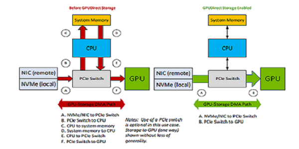
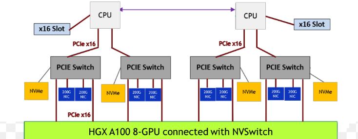

# 1. Design Guide - GPUDirect Storage Design Guide

# 1\. Design Guide[#](<https://docs.nvidia.com/gpudirect-storage/design-guide/index.html#design-guide> "Link to this heading")

The purpose of the Design Guide is to show OEMs, CSPs and ODMs how to design their servers to take advantage of GPUDirect Storage and to help application developers understand where GPUDirect Storage can bring value to application performance.

# 2\. Introduction[#](<https://docs.nvidia.com/gpudirect-storage/design-guide/index.html#introduction> "Link to this heading")

This section provides an introduction to NVIDIA® GPUDirect® Storage (GDS).

GDS is the newest addition to the GPUDirect family. Like GPUDirect peer to peer (<https://developer.nvidia.com/gpudirect>) that enables a direct memory access (DMA) path between the memory of two graphics processing units (GPUs) and GPUDirect RDMA that enables a direct DMA path to a network interface card (NIC), GDS enables a direct DMA data path between GPU memory and storage, thus avoiding a bounce buffer through the CPU. This direct path can increase system bandwidth while decreasing latency and utilization load on the CPU and GPU (refer to Figure 1). Some people define a supercomputer as a machine that turns a compute-bound problem into an IO-bound problem. GDS helps relieve the IO bottleneck to create more balanced systems.

While GDS seeks to eliminate the CPU as a bottleneck, it relies on the CPU to prepare the communication, to specify what should be accessed. Newer variants of GDS include asynchrony by enqueuing the storage IO in the context of a CUDA stream or graph. THese enable the developer to leverage GPU synchronization hardware to start a kernel after data is loaded, or to store data after a kernel completes. In the terminology of the GPUDirect taxonomy, this form of GDS is GPUDirect Async Stream Triggered (GDA-ST) and Graph Triggered (GDA-GT).

The GDS feature is exposed using . cuFile APIs are provided by `libcufile.so` for dynamic linking and `libcufile_static.a` for static linking. The kernel driver supporting GPUDirect Storage peer to peer transfer is distributed as a kernel source package and installed as a DKMS kernel module by the name `nvidia_fs.ko`.

These libraries and kernel sources are packaged as part of the CUDA toolkit as debs and RPMs for ubuntu and RedHat distros respectively.The kernel sources for `nvidia_fs.ko` are also distributed as part of DGX™ BaseOS 6.0 and above releases.

Refer to the following guides for more information about GDS:

  * [Overview Guide](<https://docs.nvidia.com/gpudirect-storage/overview-guide/index.html>)

  * [cuFile API Reference Guide](<https://docs.nvidia.com/gpudirect-storage/api-reference-guide/index.html>)

  * [Release Notes](<https://docs.nvidia.com/gpudirect-storage/release-notes/index.html>)

  * [Best Practices Guide](<https://docs.nvidia.com/gpudirect-storage/best-practices-guide/index.html>)

  * [Troubleshooting Guide](<https://docs.nvidia.com/gpudirect-storage/troubleshooting-guide/index.html>)

  * [O_DIRECT Requirements Guide](<https://docs.nvidia.com/gpudirect-storage/o-direct-guide/index.html>)

To learn more about GDS, refer to the following posts:

  * [GPUDirect Storage: A Direct Path Between Storage and GPU Memory](<https://devblogs.nvidia.com/gpudirect-storage/>)

  * The [Magnum IO](<https://developer.nvidia.com/blog/tag/magnum-io/>) series.

# 3\. Data Transfer Issues for GPU and Storage[#](<https://docs.nvidia.com/gpudirect-storage/design-guide/index.html#data-transfer-issues-for-gpu-and-storage> "Link to this heading")

This section provides information about issues you might face during a data transfer for GDS and storage.

The data movement between GPU memory and storage is set up and managed using system software drivers that execute on the CPU. We refer to this as the control path. Data movement may be managed by any of the three agents listed.

  * The GPU and its DMA engine. The GPU’s DMA engine is programmed by the CPU. Third-party devices do not generally expose their memory to be directly addressed by another DMA engine. Therefore, the GPU’s DMA engine can only copy to and from CPU memory, implying a bounce buffer in CPU memory.

  * The CPU using load and store instructions. CPUs generally cannot copy directly between two other devices. So, it needs to use an intermediate bounce buffer in CPU memory.

  * A DMA engine near storage, for example, in an NVMe drive, NIC, or storage controller such as a RAID card. The GPU PCIe Base Address Register (BAR) addresses can be exposed to other DMA engines. GPUDirect RDMA, for example, exposes these to the DMA engine in the NIC, via the NIC’s driver. NIC drivers from Mellanox and others support this. However, when the endpoint is in file system storage, the operating system gets involved. Unfortunately, today’s OSes do not support passing a GPU virtual address down through the file system.

# 4\. GPUDirect Storage Benefits[#](<https://docs.nvidia.com/gpudirect-storage/design-guide/index.html#gpudirect-storage-benefits> "Link to this heading")

This section provides the benefits of using GDS.

Using the GDS functionality avoids a “bounce buffer” in CPU system memory, where the bounce buffer is defined as a temporary buffer in system memory to facilitate data transfers between two devices such as a GPU and storage.

The following performance benefits can be realized by using GPUDirect Storage:

  * **Bandwidth** : The PCIe bandwidth into and out of a CPU may be lower than the bandwidth capabilities of the GPUs. This difference can be due to fewer PCIe paths to the CPU based on the PCIe topology of the server. GPUs, NICs, and storage devices sitting under a common PCIe switch will typically have higher PCIe bandwidth between them. Utilizing GPUDirect Storage should alleviate those CPU bandwidth concerns, especially when the GPU and storage device are sitting under the same PCIe switch. As shown in Figure 1, GDS enables a direct data path (green) rather than an indirect path (red) through a bounce buffer in the CPU. This boosts bandwidth, lowers latency, and reduces CPU and GPU throughput load. In addition, it enables the DMA engine near storage to move data directly into GPU memory.

Figure 4.1 Comparing GPUDirect Storage Paths[#](<https://docs.nvidia.com/gpudirect-storage/design-guide/index.html#id15> "Link to this image")

  * **Latency** : The use of a bounce buffer results in two copy operations:

    * Copying data from the source into the bounce buffer.

    * Copying again from the bounce buffer to the target device.

A direct data path has only one copy, from source to target. If the CPU performs the data movement, latencies may be impacted by conflicts over CPU availability, which can lead to jitter. GDS mitigates those latency concerns.

  * **CPU Utilization** : If the CPU is used to move data, overall CPU utilization increases and interferes with the rest of the work on the CPU. Using GDS reduces the CPU workload, allowing the application code to run in less time. As a result, both compute and memory bandwidth bottlenecks are avoided with GDS. Both components are relieved with GDS.

Once data no longer needs to follow a path through CPU memory, new possibilities are opened.

  * **New PCIe Paths** : Consider systems where there are two levels of PCIe switches. NVMe drives hang off the first level of switches with up to four drives per PCIe tree. There may be two to four NVMe drives in each PCIe tree, hanging off the first level of switches. If fast enough drives are used, they can nearly saturate the PCIe bandwidth through the first level PCIe switch. For example, the NVIDIA GPUDirect Storage engineering team measured 13.3 GB/s from a set of 4 drives in a 2x2 RAID 0 configuration on a PCIe Gen 3 box. Using RAID 0 on the control path via the CPU does not impede a direct data path. In an NVIDIA DGX™-2, eight PCIe slots hang off the second level switches, which may be populated with either NICs or RAID cards. In this Gen 3 configuration, NICs have been measured at 11 GB/s and RAID cards at 14 GB/s. These two paths, from local storage and remote storage, can be used simultaneously, and importantly, bandwidth is additive across the system.

  * **PCIe ATS** : As PCIe Address Translation Service (ATS) support is added to devices, they may no longer need to
    

use the CPU’s input output memory management unit (IOMMU) for the address translation that’s required for virtualization. Since the CPU’s IOMMU is not needed, the direct path can be taken.

  * **Capacity and Cost** : When data is copied through the CPU’s memory, space must be allocated in CPU memory.
    

CPU memory has limited capacity, usually on the order of 1TB, with higher density memory being the most expensive. Local storage can have a capacity on the order of 10s of TB, and remote storage capacity can be in petabytes. Disk storage is much cheaper than CPU memory. It does not matter to GDS where storage is, only that it is in the node, in the same rack, or far away.

  * **Memory Allocation** : CPU bounce buffers must be managed: allocated and deallocated. This takes time and energy.
    

In some scenarios, that buffer management can get on the critical path for performance. If there is no CPU bounce buffer, this management cost is avoided. When no bounce buffer is needed on the CPU, system memory is freed for other purposes.

  * **Migratable Memory:** Migration of memory back and forth between CPU and GPU have long been possible with `cudaMallocManaged`. More recently, heterogeneous memory management (HMM) for x86-based systems and the integration of the CPU and GPUas of the Grace-Hopper generation, have made support for buffer targets that could be anywhere more important. As of CUDA 12.2, GDS supports targeting buffers with any kind of allocation, whether CPU only or migratable between CPU and GPU.

  * **Asynchrony** : While the initial set of cuFile APIs were not asynchronous, enhanced APIs in CUDA 12.2 added a CUDA stream parameter, enabling asynchronous submission and execution.

In Figure 2, an NVIDIA DGX A100 system has two CPU sockets, and each has two PCIe trees. Each of the four PCIe trees (just one shown above) has one level of switches. Up to two NVMe drives hang off each switch, along with two PCIe slots that can be populated with DPU, NIC, or RAID cards, and two GPUs.

Figure 4.2 Sample Topology for Half a System[#](<https://docs.nvidia.com/gpudirect-storage/design-guide/index.html#id16> "Link to this image")

# 5\. Application Suitability[#](<https://docs.nvidia.com/gpudirect-storage/design-guide/index.html#application-suitability> "Link to this heading")

This section provides information about application sustainability in GDS.

This section provides information about the conditions in which applications are suitable for acceleration with and would enjoy the benefits provided by GDS, summarized as follows:

  * Data transfers or IO transfers are directly to and from the GPU, not through the CPU.

  * IO must be a significant performance bottleneck.

  * Data transfers or IO transfers must be explicit.

  * Buffers must be pinned in the GPU memory.

  * CUDA and the cuFile APIs must be used along with GPUDirect capable NVIDIA GPUs (Quadro® or Data Center GPUs only).

  * Applications that need a common set of IO APIs to work with device and host memory and leverage optimal paths based on system topology and that work seamlessly with CUDA semantics such as CUDA contexts, streams and graphs.

## 5.1. Transfers To and From the GPU[#](<https://docs.nvidia.com/gpudirect-storage/design-guide/index.html#transfers-to-and-from-the-gpu> "Link to this heading")

GPUDirect Storage enables direct data transfers between GPU memory and storage. If an application uses the CPU to parse or process the data before or after GPU computation, GPUDirect Storage doesn’t help. To benefit, the GPU must be the first and/or last agent that touches data transferred to or from storage.

## 5.2. Understanding IO Bottlenecks[#](<https://docs.nvidia.com/gpudirect-storage/design-guide/index.html#understanding-io-bottlenecks> "Link to this heading")

For IO to be a bottleneck, it must be on the critical path. If computation time is far greater than the IO time, then GPUDirect Storage provides little benefit. If IO time can be fully overlapped with computation, for example, with asynchronous IO, then it need not be a bottleneck. Workloads that stream large quantities of data and perform small amounts of computing on each data element tend to be IO bound.

## 5.3. Explicit GDS APIs[#](<https://docs.nvidia.com/gpudirect-storage/design-guide/index.html#explicit-gds-apis> "Link to this heading")

Any application currently using mmap causes data to be moved implicitly rather than explicitly. This indirect and reactive approach is slower because data is loaded from storage to CPU memory and then from CPU memory to GPU memory and because faults introduce signficiant overhead that could be avoided with explicit transfers.

For applications that use explicit APIs, GPU memory must be allocated with `cudaMalloc`, so that it is pinned, rather than with `cudaMallocManaged`, which can migrate. Use of explicitly APIs is applicable when applications know exactly what data to transfer and where.

The APIs provided by GDS are explicit, similar to Linux `pread` and `pwrite`, rather than being implicit and using a memory faulting model. This may require changing some application code, for example, switching from a model that [mmaps](<http://man7.org/linux/man-pages/man2/mmap.2.html>) memory before accessing it directly as needed on the GPU. The explicit model delivers higher performance because it avoids faulting and copying overheads, which also have the potential downside of inducing jitter.

## 5.4. Pinned Memory for DMA Transfers[#](<https://docs.nvidia.com/gpudirect-storage/design-guide/index.html#pinned-memory-for-dma-transfers> "Link to this heading")

The memory on the GPU must be pinned to enable DMA transfers. This requires that memory be allocated with `cudaMalloc` rather than cudaMallocManaged or malloc. This restriction might be relaxed in the future, with more OS enabling. The size of each data transfer must fit into the allocated buffer. The transfer does not need to be aligned to anything other than a byte boundary.

## 5.5. cuFile APIs[#](<https://docs.nvidia.com/gpudirect-storage/design-guide/index.html#cufile-apis> "Link to this heading")

Application and framework developers enable GPUDirect Storage capabilities by incorporating the cuFile APIs. Applications can use cuFile APIs directly or they can leverage frameworks like RAPIDS or DALI and higher-level APIs like C++ or Python using `vikio`. cuFile provides synchronous and asynchronous APIs. Synchronous APIs such as `cuFileRead` and `cuFileWrite` enable read and write similar to POSIX pread and pwrite with O_DIRECT. cuFile Batch APIs provide asynchronous execution of IO similar to linux AIO. cuFile stream APIs starting in CUDA 12.2 release support asynchronous submission in a CUDA stream and asynchronous execution similar to Linux AIO. In addition there are cuFile APIs for driver initialization, finalization, buffer registration, and more. The cuFile based IO transfers are explicit and direct, thereby enabling maximum performance.

# 6\. Platform Performance Suitability[#](<https://docs.nvidia.com/gpudirect-storage/design-guide/index.html#platform-performance-suitability> "Link to this heading")

GPUDirect Storage benefits can be maximized under the conditions described in this section.

## 6.1. Bandwidth from Storage[#](<https://docs.nvidia.com/gpudirect-storage/design-guide/index.html#bandwidth-from-storage> "Link to this heading")

Bandwidth into GPUs from remote storage is maximized when the bandwidth from NICs or RAID cards matches the PCIe bandwidth into GPUs, up to the limits of IO demand. Diverse examples include 200 GbE NICs that match Gen 4 PCIe GPUs such as NVIDIA Ampere architecture and NDR400 CX8s or BlueField 3s that match Gen 5 PCIe GPUs such as Hopper.

For local storage, a larger number of drives is needed to approach PCIe saturation. The number of drives is of first order importance. It takes at least 4 x4 PCIe drives to saturate a x16 PCIe link. The IO storage bandwidth of a system is proportional to the number of drives. Many systems such as an NVIDIA DGX-2 can take at most 16 drives attached via the Level- 1 PCIe switches. The peak bandwidth per drive is of secondary importance. NVMe drives tend to offer higher bandwidth and lower latency than SAS drives. Some file systems and block systems vendors support only NVMe drives and non-SAS drives.

## 6.2. Paths from Storage to GPUs[#](<https://docs.nvidia.com/gpudirect-storage/design-guide/index.html#paths-from-storage-to-gpus> "Link to this heading")

PCIe switches aren’t required to achieve some of the performance benefits, since a direct path between PCIe endpoints may pass through the CPU without using a bounce buffer.

Using PCIe switches can increase the peak bandwidth between NICs or RAID cards or local drives and GPUs. One level of switches on each PCIe tree can double potential bandwidth. For example:

  * Some HGX systems have Gen4 CPUs, which top out at 25 GB/s per tree. But A100 GPUs and CX6 NICs support 50 GB/s.

  * Having a PCIe switch that enables a direct data path between remote storage reached over the NICs and the GPUs can sustain 50 GB/s bandwidth using GDS, whereas if not for GDS, bandwidth would be reduced to the CPUs limit of 25 GB/s.

  * Storage controllers are an alternative to remote storage over NICs. Gen 4 RAID cards have been seen to deliver 26 GiB/s with GDS by bypassing the CPU.

Figure 6.1 Comparing the Paths from Storage to the GPUs[#](<https://docs.nvidia.com/gpudirect-storage/design-guide/index.html#path-storage-gpu-fig-pgq-kgv-fnb> "Link to this image")

## 6.3. GPU BAR1 Size[#](<https://docs.nvidia.com/gpudirect-storage/design-guide/index.html#gpu-bar1-size> "Link to this heading")

The GPU PCIe BAR1 aperture is relevant to DMA engines other than the CPU chipset DMA controller; it’s how they “see” GPU memory. GPUDirect Storage enables DMA engines to move data directly through the GPU BAR1 aperture into or out of GPU memory from devices other than the CPU. The transfer size might exceed the size of the current GPU BAR1 aperture. In such cases, the GPUDirect Storage software recognizes that, chunks the large transfers to fit, and uses an intermediate buffer in GPU memory for the DMA engine to copy into and the GPU to copy out of into the target buffer. This is handled transparently but adds some overhead.

Increasing the GPU BAR1 size, or choosing a GPU with a larger maximum BAR1 size, can reduce or eliminate such copy overheads.

Only a subset of GPUs expose the BAR1, including NVIDIA RTX and Data Center GPUs. Refer to [GPUDirect Storage Release Notes](<https://docs.nvidia.com/gpudirect-storage/release-notes/index.html>) for a list of GPUs with the proper support.

# 7\. Call to Action[#](<https://docs.nvidia.com/gpudirect-storage/design-guide/index.html#call-to-action> "Link to this heading")

The following list suggests things that can be done today or as part of a GPUDirect Storage implementation.

  * Choose to be part of the GPU storage platform of the future.

  * Enable your application by fully porting it to the GPU, so that the IO is directly between GPU memory and storage.

  * Use interfaces that make explicit transfers: use cuFile APIs directly or via a framework layer that is already enabled to use cuFile APIs.

  * Use cuFile APIs for any type of memory allocation, including memory on the CPU, so that a consistent set of interfaces is used for storage throughout your application. Make use of the [GPUDirect Storage Best Practices Guide](<https://docs.nvidia.com/gpudirect-storage/best-practices-guide/index.html>) to select and apply the best APIs to use.

  * Choose and use distributed file systems or distributed block systems that are enabled with GPUDirect Storage.

# 8\. Notice[#](<https://docs.nvidia.com/gpudirect-storage/design-guide/index.html#notice> "Link to this heading")

This document is provided for information purposes only and shall not be regarded as a warranty of a certain functionality, condition, or quality of a product. NVIDIA Corporation (“NVIDIA”) makes no representations or warranties, expressed or implied, as to the accuracy or completeness of the information contained in this document and assumes no responsibility for any errors contained herein. NVIDIA shall have no liability for the consequences or use of such information or for any infringement of patents or other rights of third parties that may result from its use. This document is not a commitment to develop, release, or deliver any Material (defined below), code, or functionality.

NVIDIA reserves the right to make corrections, modifications, enhancements, improvements, and any other changes to this document, at any time without notice.

Customer should obtain the latest relevant information before placing orders and should verify that such information is current and complete.

NVIDIA products are sold subject to the NVIDIA standard terms and conditions of sale supplied at the time of order acknowledgement, unless otherwise agreed in an individual sales agreement signed by authorized representatives of NVIDIA and customer (“Terms of Sale”). NVIDIA hereby expressly objects to applying any customer general terms and conditions with regards to the purchase of the NVIDIA product referenced in this document. No contractual obligations are formed either directly or indirectly by this document.

NVIDIA products are not designed, authorized, or warranted to be suitable for use in medical, military, aircraft, space, or life support equipment, nor in applications where failure or malfunction of the NVIDIA product can reasonably be expected to result in personal injury, death, or property or environmental damage. NVIDIA accepts no liability for inclusion and/or use of NVIDIA products in such equipment or applications and therefore such inclusion and/or use is at customer’s own risk.

NVIDIA makes no representation or warranty that products based on this document will be suitable for any specified use. Testing of all parameters of each product is not necessarily performed by NVIDIA. It is customer’s sole responsibility to evaluate and determine the applicability of any information contained in this document, ensure the product is suitable and fit for the application planned by customer, and perform the necessary testing for the application in order to avoid a default of the application or the product. Weaknesses in customer’s product designs may affect the quality and reliability of the NVIDIA product and may result in additional or different conditions and/or requirements beyond those contained in this document. NVIDIA accepts no liability related to any default, damage, costs, or problem which may be based on or attributable to: (i) the use of the NVIDIA product in any manner that is contrary to this document or (ii) customer product designs.

No license, either expressed or implied, is granted under any NVIDIA patent right, copyright, or other NVIDIA intellectual property right under this document. Information published by NVIDIA regarding third-party products or services does not constitute a license from NVIDIA to use such products or services or a warranty or endorsement thereof. Use of such information may require a license from a third party under the patents or other intellectual property rights of the third party, or a license from NVIDIA under the patents or other intellectual property rights of NVIDIA.

Reproduction of information in this document is permissible only if approved in advance by NVIDIA in writing, reproduced without alteration and in full compliance with all applicable export laws and regulations, and accompanied by all associated conditions, limitations, and notices.

THIS DOCUMENT AND ALL NVIDIA DESIGN SPECIFICATIONS, REFERENCE BOARDS, FILES, DRAWINGS, DIAGNOSTICS, LISTS, AND OTHER DOCUMENTS (TOGETHER AND SEPARATELY, “MATERIALS”) ARE BEING PROVIDED “AS IS.” NVIDIA MAKES NO WARRANTIES, EXPRESSED, IMPLIED, STATUTORY, OR OTHERWISE WITH RESPECT TO THE MATERIALS, AND EXPRESSLY DISCLAIMS ALL IMPLIED WARRANTIES OF NONINFRINGEMENT, MERCHANTABILITY, AND FITNESS FOR A PARTICULAR PURPOSE. TO THE EXTENT NOT PROHIBITED BY LAW, IN NO EVENT WILL NVIDIA BE LIABLE FOR ANY DAMAGES, INCLUDING WITHOUT LIMITATION ANY DIRECT, INDIRECT, SPECIAL, INCIDENTAL, PUNITIVE, OR CONSEQUENTIAL DAMAGES, HOWEVER CAUSED AND REGARDLESS OF THE THEORY OF LIABILITY, ARISING OUT OF ANY USE OF THIS DOCUMENT, EVEN IF NVIDIA HAS BEEN ADVISED OF THE POSSIBILITY OF SUCH DAMAGES. Notwithstanding any damages that customer might incur for any reason whatsoever, NVIDIA’s aggregate and cumulative liability towards customer for the products described herein shall be limited in accordance with the Terms of Sale for the product.

# 9\. OpenCL[#](<https://docs.nvidia.com/gpudirect-storage/design-guide/index.html#opencl> "Link to this heading")

OpenCL is a trademark of Apple Inc. used under license to the Khronos Group Inc.

# 10\. Trademarks[#](<https://docs.nvidia.com/gpudirect-storage/design-guide/index.html#trademarks> "Link to this heading")

NVIDIA, the NVIDIA logo, CUDA, DGX, DGX-1, DGX-2, DGX-A100, Tesla, and Quadro are trademarks and/or registered trademarks of NVIDIA Corporation in the United States and other countries. Other company and product names may be trademarks of the respective companies with which they are associated.