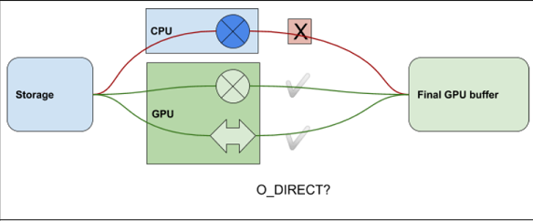

# 1. O_DIRECT Requirements Guide - GPUDirect Storage O_DIRECT Requirements Guide

# 1\. O_DIRECT Requirements Guide[#](<https://docs.nvidia.com/gpudirect-storage/o-direct-guide/index.html#o-direct-requirements-guide> "Link to this heading")

The NVIDIA® GPUDirect Storage® (GDS) O_DIRECT Requirements Guide helps you understand how GDS can provide significant benefits when it can leverage the O_DIRECT `fcntl.h` file mode for a direct data path between GPU memory and storage.

# 2\. Introduction[#](<https://docs.nvidia.com/gpudirect-storage/o-direct-guide/index.html#introduction> "Link to this heading")

This section provides an introduction to the O_DIRECT requirements for the cuFile portion of GDS.

Note

O_DIRECT is the only supported mode before CUDA toolkit 12.2 (GDS version 1.7). CUDA 12.2 (GDS version 1.7) introduces support for non O_DIRECT file descriptors as well. The rest of this guide is still relevant for applications depending upon GDS benefits by expressing intent to use O_DIRECT file mode.

NVIDIA® GPUDirect® Storage (GDS) is the newest addition to the GPUDirect family. GDS enables a direct data path for direct memory access (DMA) transfers between GPU memory and storage, which avoids a bounce buffer through the CPU. Using this direct path can relieve effective system bandwidth bottlenecks and decrease the latency and utilization load on the CPU.

GDS can provide significant benefit when it can leverage the O_DIRECT ([fcntl.h](<https://github.com/torvalds/linux/blob/master/include/uapi/asm-generic/fcntl.h>)) file mode for a direct data path between GPU memory and storage. There are many conditions that must be met to achieve the performance benefits of the O_DIRECT mode, and these conditions are not always met by all file systems. The conditions might depend on the transfer size, whether it’s a read or write, whether the write is to new data (past the end of the file or to a hole in the file), and based on many other conditions such as whether checksums are required. This document describes the conditions where O_DIRECT, on which GDS relies, can be used.

The target audience for this guide includes:

  * End users and administrators who:

    * Understand file systems, so they can carefully consider the implications of features they enable.

    * Compare support from different file systems to determine the appropriate models and how to use them.

    * Evaluate the weighted fraction of cases that do or don’t use O_DIRECT effectively.

  * Middleware developers who:

    * Consider the design trade-offs that increase the likelihood that the vendor layer can effectively use O_DIRECT.

  * Filesystems vendors and implementers who:

>     * Accelerate their assessment of the various cases to be handled with O_DIRECT as they enable GDS in new or customized file systems.

## 2.1. Related Documents[#](<https://docs.nvidia.com/gpudirect-storage/o-direct-guide/index.html#related-documents> "Link to this heading")

Since the original creation of this guide, additional GDS documents and online resources have been created which support and provide additional context for the optimal use of and understanding of this specification.

Refer to the following guides for more information about GDS:

  * [Design Guide](<https://docs.nvidia.com/gpudirect-storage/design-guide/index.html>)

  * [Overview Guide](<https://docs.nvidia.com/gpudirect-storage/overview-guide/index.html>)

  * [cuFile API Reference Guide](<https://docs.nvidia.com/gpudirect-storage/api-reference-guide/index.html>)

  * [Release Notes](<https://docs.nvidia.com/gpudirect-storage/release-notes/index.html>)

  * [Best Practices Guide](<https://docs.nvidia.com/gpudirect-storage/best-practices-guide/index.html>)

  * [Troubleshooting Guide](<https://docs.nvidia.com/gpudirect-storage/troubleshooting-guide/index.html>)

To learn more about GDS, refer to the following blogs:

  * [GPUDirect Storage: A Direct Path Between Storage and GPU Memory](<https://devblogs.nvidia.com/gpudirect-storage/>).

  * The [Magnum IO](<https://developer.nvidia.com/blog/tag/magnum-io/>) series.

# 3\. GPUDirect Storage Requirements[#](<https://docs.nvidia.com/gpudirect-storage/o-direct-guide/index.html#gpudirect-storage-requirements> "Link to this heading")

This section provides some basic background on where GDS can be most effectively used.

This information enables readers with varying degrees of technical accuity to get a general sense of whether, and to what degree, GDS can benefit file systems that make different design choices.

## 3.1. Summary of Basic Requirements[#](<https://docs.nvidia.com/gpudirect-storage/o-direct-guide/index.html#summary-of-basic-requirements> "Link to this heading")

The GDS architecture has the following key requirements:

  * The kernel storage driver can perform a DMA of user data to or from GPU memory by using addresses that were obtained from callbacks to the GDS kernel module, `nvidia-fs.ko`.

  * The device near the storage has a DMA engine that can reach the GPU memory buffer via PCIe.

    * For local storage, an NVMe device performs DMA.

    * For remote storage, a NIC device performs RDMA.

  * The file system stack that operates at the user-level, or the kernel-level, or both, and never needs to access the data in CPU system memory.

> Instead, data is transferred directly between storage and GPU memory, which is achieved by file systems that exclusively use the O_DIRECT mode for a given file.

Figure 1 illustrates a way to visualize conditions for O_DIRECT. It covers cases where there is, or is not, an operator () in the data path to storage, and whether that operator is in the CPU or GPU. If the operator is in the CPU, you cannot use O_DIRECT.

Figure 3.1 Summary of Basic Requirements[#](<https://docs.nvidia.com/gpudirect-storage/o-direct-guide/index.html#fig-visualize-odirect-conditions> "Link to this image")

The data coming from (or going to) storage cannot use O_DIRECT if it must be processed in the CPU, as symbolized by cross operator. It can use O_DIRECT if it only goes through the GPU whether there’s a transformational operator there as symbolized by a cross operator like checksum on the GPU or there’s no operation at all, as symbolized by a clean arrow.

Lack of support for RDMA in network file systems, or network block devices, implies the need to copy data to socket buffers in system memory. This need is incompatible with the basic requirements listed above.

If the conditions for using GDS do not hold, for example, because the mount for the file is not GDS enabled, or the nvidia-fs.ko driver is not available, compatibility mode, a cuFile feature that falls back to copying through a CPU bounce buffer, can be used. You can enable compatibility mode in the `cufile.json` file. Users can override the system’s version of the cufile.json file by creating their own copy and pointing the appropriate environment variable to that user’s copy. Outside of compatibility mode, the APIs will fail if O_DIRECT is not possible.

Note

As of CUDA toolkit 12.2 (GDS version 1.7), the APIs would work in compatibility mode, even if the fil descriptor that is used with the cuFile APIs is opened in non O_DIRECT mode. Even in such a case, the APIs would leverage the GDS path whenever a direct path between storage and gpu buffer exits. For all other cases the APIs go via the page cache for fds opened in non O_DIRECT mode. This can be viewed as the compatibility mode leveraging the page cache that can typically be used for smaller file I/Os with a high degree of temporal locality, like the case of application headers or metadata.

## 3.2. Client and Server[#](<https://docs.nvidia.com/gpudirect-storage/o-direct-guide/index.html#client-and-server> "Link to this heading")

In a local file or block systems, a software stack performs all IO. In a distributed file or block system, at least two agents are involved. the client makes a read or write request, and a server services it. There are two types of file systems:

  * Block-based

  * Network-attached

A block-based system can be serviced locally or remotely, while network-attached file systems are always remote.

Consider the following interaction between a client and server:

  * The direct data path between the NIC and GPU memory happens on the client.

To enable this direct path, client-side drivers must first be enabled with GDS.

  * RDMA is a protocol to access remote data over a network and uses the NIC to DMA directly into client-side memory.

Without RDMA, there is no direct path, and GDS for distributed file and block systems relies on GPUDirect RDMA for the direct path between the NIC and GPU memory.

  * Using RDMA also relies on server-side support.

File system implementations that do not support RDMA on the server side will not support GDS. For example, NFS only works with server-side NFS instead of RDMA support, but this has become available from most NFS vendors since the inception of GDS.

## 3.3. Cases Where O_DIRECT is Not a Fit[#](<https://docs.nvidia.com/gpudirect-storage/o-direct-guide/index.html#cases-where-o-direct-is-not-a-fit> "Link to this heading")

In POSIX, the mode in which files are opened is controlled by a set of flags. One of these flags, O_DIRECT, indicates a user’s intent to not buffer transfers in CPU system memory but to rather make transfers be more direct. O_DIRECT, for example, generally disables the use of a page cache. Although this flag is an expression of user intention, the implementation can still make its own trade-offs.

For example, the implementation might decide to treat small transfers differently from larger transfers that take a more direct path. In another example, a file system might offer an option for the user to enable read ahead for the page cache. This option, however, might conflict with the request from the user to use O_DIRECT for a file. In this case, how the implementation treats the competing requests depends on the implementation policy. Therefore, O_DIRECT can be considered a hint.

Several cases are listed below where a user’s request to use O_DIRECT is not currently supported in file systems, is not used in specific cases, or is fundamentally not feasible. The cases are delineated according to the agent that makes choices or trade-offs which impact that option.

Here is some additional information:

  * Possibly relevant for users

    * User-buffered IO: Transfers might be buffered in the user space before being transferred to the kernel.

This case might be used when many small transactions have good spatial and temporal locality.

  * Possibly relevant for middleware

    * Metadata management: There might be metadata with the data payload.

Metadata might take many forms, including checksums for the data payload, file sizes that must be updated when lengthening files, and maps of file layout when filling holes.

    * Hierarchical storage model: Some implementations used a tiered scheme where some data resides in CPU system memory, and where shorter latency and high bandwidth is possible.

There are outer tiers of progressively slower, but higher-capacity storage. An example of this tiered scheme is flash and then spinning disks.

    * Read ahead: An optimization that is sometimes used, especially for buffered IO and many small consecutive transfers, is to anticipate what will be used next and to buffer it in CPU system memory.

    * Examining or transforming data: When the CPU examines or transforms data before (or after) IO transactions, this process interferes with direct transfers between the storage and GPU memory.

  * File system only

    * Kernel-buffered IO: If there is good temporal and spatial locality, and the bandwidth and latency to copy from kernel memory is significantly better than copying from storage, a mechanism such as fscache might be used to maintain a copy in system memory.

    * Inline data: Small files are stored and managed differently than larger files.

    * Block allocation: Various policies are available to allocate space in files, and there might be implications for client- and server-side activities.

There are cases where middleware performs some of the same functions as a file system. Middleware might have more contextual information available to it than low-level calls to the file system, and it might take steps to increase the likelihood that the file system can use O_DIRECT. Consider the case of computing a checksum. A user might be able to control whether checksums are even used. If checksums are enabled, middleware might intervene in the following ways:

  * It could invoke a GPU kernel to compute the checksum and juxtapose the checksum data with the payload so that one cuFileWrite can be used to write back the data to storage.

  * It could again invoke a GPU kernel to compute the checksum to a different buffer and use two cuFileWrites to write each of the checksum and payload.

In these cases, the requests to the file system can use O_DIRECT.

### 3.3.1. Buffered IO[#](<https://docs.nvidia.com/gpudirect-storage/o-direct-guide/index.html#buffered-io> "Link to this heading")

The Linux virtual file system (VFS) uses a buffered IO when O_DIRECT is not specified, and there are potentially multiple layers of caching. Examples of caching might include the following:

  * Page caching, which is backed by fscache.

  * File-system-specific page pools, such as ZFS adaptive replay cache (ARC) and Spectrum Storage (GPFS) page pools.

### 3.3.2. Inline Files[#](<https://docs.nvidia.com/gpudirect-storage/o-direct-guide/index.html#inline-files> "Link to this heading")

Filesystems that are based on Linux are implemented by using the common VFS interface to open, close, read, and write files. User data is organized in files, which are represented in the following ways:

  * Inodes, whose primary purpose is to store metadata.

  * Fixed blocks, which are generally referred to as pages that hold user content.

A typical block size is 4096 bytes.

Inline files have data that is smaller than a page size and small enough to fit in the inode. Generally, file systems provide flags to detect whether the inode is inline. Inodes are normally read into system memory, so inline user data is copied into system memory with the metadata.

In RDMA-based network-attached file systems, files that are smaller than the specified size threshold are sent inline in the remote procedure calls (RPCs). This process involves buffering in system memory, which requires an additional copy of user data rather than a direct data transfer. For some file systems, such as ext4 and Lustre, the inline files modes can be disabled at the file system level or on a per-inode basis.

### 3.3.3. Block Allocation For Writes[#](<https://docs.nvidia.com/gpudirect-storage/o-direct-guide/index.html#block-allocation-for-writes> "Link to this heading")

Before data can be written to a file, a data block must be allocated. See Inline Files for more information. For file systems to support the O_DIRECT mode for writing files, free data blocks in storage must be available and ready to be used by the file system. Otherwise, as in the following cases, user data can be buffered into the system page cache, which makes direct data transfers impossible. Here is a list of cases where some file systems need to fall back to buffered mode because of block allocations:

Note

These limitations do not apply to distributed file systems if the features are implemented on the storage server, and the client does not perform buffering.

  * Extending writes: writes that are happening to increase the file size.

  * Allocating writes: writes to a block that has not yet been allocated.

  * Writes to preallocated blocks: the block was already allocated in storage, but the metadata needs to be updated before the data is written.

  * Hole filling: writes to a hole in the middle of the file, which was a sparse block.

  * Copy on write (COW) file systems: copy operations that are triggered when a write to a data buffer involves caching in the CPU system memory.

  * Delayed allocation or allocate on flush: allocation is reactive (not proactive) to reduce disk fragmentation on slow random writes or to large sequential writes for spinning disks.

For network-attached storage or distributed file systems, the file system architecture determines whether the allocation decision is made locally, on each client, or on the remote server. If the block allocation handling is done on the server side, there is no CPU buffering impediment to direct transfers. If block allocation was handled on the client side, there might be some impediments.

### 3.3.4. Examining or Transforming User Data[#](<https://docs.nvidia.com/gpudirect-storage/o-direct-guide/index.html#examining-or-transforming-user-data> "Link to this heading")

Here is a list of some cases where the user data needs to be copied into system memory, so that it can be examined or transformed by the file systems as part of a read or write transfer:

  * Data journaling is used to track changes that are not yet committed to persistent storage.

Data journaling typically disables O_DIRECT. In general, the journaling of data is not required with the O_DIRECT use case, unless there is a high-speed journaling media. Metadata journaling does not require access to user data.

  * Checksums can be computed during writes and checked upon reads.

For network file systems with checksum support, the checksums are typically performed on the client to detect network corruptions, in addition to checksum computation on the server.

  * Client-side compression and deduplication can be provided on network clients to achieve bandwidth improvements in addition to compression on the server side for data storage.

Inline deduplication requires looking at user content to determine the fingerprint by using MD5 or SHA1 algorithms. Similarly, client-side encryption can provide more secure communication from the client to server.

  * Erasure encoding can be performed by the file system or the block device.

In such cases, the data is copied to CPU system memory before performing the DMA to the disk pool or network servers. For distributed block devices, the erasure coding decision is performed on the client side.

Synchronous replication involves a data copy into system memory before the DMA operation to a remote block device or server, depending on the recovery time objective.

### 3.3.5. Summary[#](<https://docs.nvidia.com/gpudirect-storage/o-direct-guide/index.html#summary> "Link to this heading")

There are many cases in which the O_DIRECT mode, in which CPU system memory is entirely unused, is not a fit. The relevance of these cases depends on the local or distributed file system implementation, and in some cases, on the set of features that were selected by the user. Vendors can provide their own assessments of the relevance of these issues.

# 4\. Notice[#](<https://docs.nvidia.com/gpudirect-storage/o-direct-guide/index.html#notice> "Link to this heading")

This document is provided for information purposes only and shall not be regarded as a warranty of a certain functionality, condition, or quality of a product. NVIDIA Corporation (“NVIDIA”) makes no representations or warranties, expressed or implied, as to the accuracy or completeness of the information contained in this document and assumes no responsibility for any errors contained herein. NVIDIA shall have no liability for the consequences or use of such information or for any infringement of patents or other rights of third parties that may result from its use. This document is not a commitment to develop, release, or deliver any Material (defined below), code, or functionality.

NVIDIA reserves the right to make corrections, modifications, enhancements, improvements, and any other changes to this document, at any time without notice.

Customer should obtain the latest relevant information before placing orders and should verify that such information is current and complete.

NVIDIA products are sold subject to the NVIDIA standard terms and conditions of sale supplied at the time of order acknowledgement, unless otherwise agreed in an individual sales agreement signed by authorized representatives of NVIDIA and customer (“Terms of Sale”). NVIDIA hereby expressly objects to applying any customer general terms and conditions with regards to the purchase of the NVIDIA product referenced in this document. No contractual obligations are formed either directly or indirectly by this document.

NVIDIA products are not designed, authorized, or warranted to be suitable for use in medical, military, aircraft, space, or life support equipment, nor in applications where failure or malfunction of the NVIDIA product can reasonably be expected to result in personal injury, death, or property or environmental damage. NVIDIA accepts no liability for inclusion and/or use of NVIDIA products in such equipment or applications and therefore such inclusion and/or use is at customer’s own risk.

NVIDIA makes no representation or warranty that products based on this document will be suitable for any specified use. Testing of all parameters of each product is not necessarily performed by NVIDIA. It is customer’s sole responsibility to evaluate and determine the applicability of any information contained in this document, ensure the product is suitable and fit for the application planned by customer, and perform the necessary testing for the application in order to avoid a default of the application or the product. Weaknesses in customer’s product designs may affect the quality and reliability of the NVIDIA product and may result in additional or different conditions and/or requirements beyond those contained in this document. NVIDIA accepts no liability related to any default, damage, costs, or problem which may be based on or attributable to: (i) the use of the NVIDIA product in any manner that is contrary to this document or (ii) customer product designs.

No license, either expressed or implied, is granted under any NVIDIA patent right, copyright, or other NVIDIA intellectual property right under this document. Information published by NVIDIA regarding third-party products or services does not constitute a license from NVIDIA to use such products or services or a warranty or endorsement thereof. Use of such information may require a license from a third party under the patents or other intellectual property rights of the third party, or a license from NVIDIA under the patents or other intellectual property rights of NVIDIA.

Reproduction of information in this document is permissible only if approved in advance by NVIDIA in writing, reproduced without alteration and in full compliance with all applicable export laws and regulations, and accompanied by all associated conditions, limitations, and notices.

THIS DOCUMENT AND ALL NVIDIA DESIGN SPECIFICATIONS, REFERENCE BOARDS, FILES, DRAWINGS, DIAGNOSTICS, LISTS, AND OTHER DOCUMENTS (TOGETHER AND SEPARATELY, “MATERIALS”) ARE BEING PROVIDED “AS IS.” NVIDIA MAKES NO WARRANTIES, EXPRESSED, IMPLIED, STATUTORY, OR OTHERWISE WITH RESPECT TO THE MATERIALS, AND EXPRESSLY DISCLAIMS ALL IMPLIED WARRANTIES OF NONINFRINGEMENT, MERCHANTABILITY, AND FITNESS FOR A PARTICULAR PURPOSE. TO THE EXTENT NOT PROHIBITED BY LAW, IN NO EVENT WILL NVIDIA BE LIABLE FOR ANY DAMAGES, INCLUDING WITHOUT LIMITATION ANY DIRECT, INDIRECT, SPECIAL, INCIDENTAL, PUNITIVE, OR CONSEQUENTIAL DAMAGES, HOWEVER CAUSED AND REGARDLESS OF THE THEORY OF LIABILITY, ARISING OUT OF ANY USE OF THIS DOCUMENT, EVEN IF NVIDIA HAS BEEN ADVISED OF THE POSSIBILITY OF SUCH DAMAGES. Notwithstanding any damages that customer might incur for any reason whatsoever, NVIDIA’s aggregate and cumulative liability towards customer for the products described herein shall be limited in accordance with the Terms of Sale for the product.

# 5\. OpenCL[#](<https://docs.nvidia.com/gpudirect-storage/o-direct-guide/index.html#opencl> "Link to this heading")

OpenCL is a trademark of Apple Inc. used under license to the Khronos Group Inc.

# 6\. Trademarks[#](<https://docs.nvidia.com/gpudirect-storage/o-direct-guide/index.html#trademarks> "Link to this heading")

NVIDIA, the NVIDIA logo, CUDA, DGX, DGX-1, DGX-2, DGX-A100, Tesla, and Quadro are trademarks and/or registered trademarks of NVIDIA Corporation in the United States and other countries. Other company and product names may be trademarks of the respective companies with which they are associated.