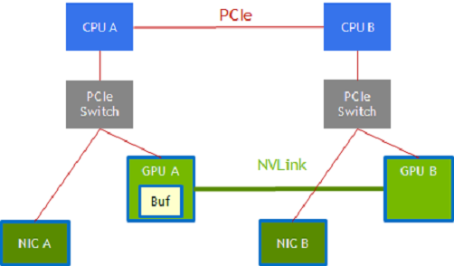
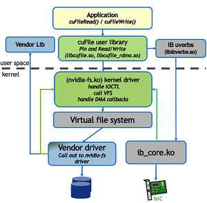

# 1. Overview Guide - GPUDirect Storage Overview Guide

# 1\. Overview Guide[#](<https://docs.nvidia.com/gpudirect-storage/overview-guide/index.html#overview-guide> "Link to this heading")

The NVIDIA® Magnum IO GPUDirect® Storage Overview Guide provides a high-level overview of GPUDirect® Storage (GDS).

## 1.1. Introduction[#](<https://docs.nvidia.com/gpudirect-storage/overview-guide/index.html#introduction> "Link to this heading")

GPUDirect® Storage (GDS) enables a direct data path for direct memory access (DMA) transfers between GPU memory and storage, which avoids a bounce buffer through the CPU. Using this direct path can relieve system bandwidth bottlenecks and decrease the latency and utilization load on the CPU.

This guide provides you guidance to help you enable filesystems for GDS, and some insights about the features of a file system and how it relates to GDS. The guide also outlines the functionalities, considerations, and software architecture about GDS. This high-level introduction sets the stage for deeper technical information in the [cuFile API Reference Guide](<https://docs.nvidia.com/gpudirect-storage/api-reference-guide/index.html>) for GDS users who need to modify the kernel.

### 1.1.1. Related Documents[#](<https://docs.nvidia.com/gpudirect-storage/overview-guide/index.html#related-documents> "Link to this heading")

Refer to the following guides for more information about GDS:

  * [Design Guide](<https://docs.nvidia.com/gpudirect-storage/design-guide/index.html>)

  * [cuFile API Reference Guide](<https://docs.nvidia.com/gpudirect-storage/api-reference-guide/index.html>)

  * [Release Notes](<https://docs.nvidia.com/gpudirect-storage/release-notes/index.html>)

  * [Benchmarking and Configuration Guide](<https://docs.nvidia.com/gpudirect-storage/configuration-guide/index.html>)

  * [Best Practices Guide](<https://docs.nvidia.com/gpudirect-storage/best-practices-guide/index.html>)

  * [Installation and Troubleshooting Guide](<https://docs.nvidia.com/gpudirect-storage/troubleshooting-guide/index.html>)

  * [O_DIRECT Requirements Guide](<https://docs.nvidia.com/gpudirect-storage/o-direct-guide/index.html>)

To learn more about GDS, refer to the following blogs:

  * [GPUDirect Storage: A Direct Path Between Storage and GPU Memory](<https://devblogs.nvidia.com/gpudirect-storage/>).

  * The [Magnum IO](<https://developer.nvidia.com/blog/tag/magnum-io/>) blog.

### 1.1.2. Benefits for a Developer[#](<https://docs.nvidia.com/gpudirect-storage/overview-guide/index.html#benefits-for-a-developer> "Link to this heading")

GDS provides the following benefits for application developers:

  * Enables a direct path between GPU memory and storage.

  * Can relieve bandwidth bottlenecks, reduce the latency, and reduce the load on CPUs for data transferral.

  * Reduces the performance impact and dependence on CPUs to process storage data transfer.

  * Performance force multiplier on top of the compute advantage for computational pipelines that are fully migrated to the GPU so that the GPU, rather than the CPU, has the first and last touch of data that moves between storage and the GPU.

  * Supports interoperability with other OS-based file access, which enables data to be transferred to and from the device by using traditional file IO, which is then accessed by middleware or an application program that uses the cuFile APIs.

The cuFile APIs and their implementations provide the following benefits:

  * A family of APIs that provide CUDA® applications with the best-performing access to local or distributed file and block storage.

  * When transferring to and from the GPU, increased performance and lower CPU load relative to existing standard Linux file IO.

  * Greater ease of use by removing the need for the careful expert management of memory allocation and data movement.

  * An API sequence that is simpler relative to existing implicit file-GPU data movement methods which require a more complex management of memory and data movement on and between the CPU and GPU.

  * Generality across a variety of storage types that span various local and distributed file systems, block interfaces, and namespace systems, including standard Linux and third-party solutions.

  * Primary API to do file I/O independent of memory type for GPU applications.

  * Ability to target memory that has been allocated with any of cudaMalloc or cuMemAlloc or cuMemCreate/cuMemMap to the GPU, or cudaHostAlloc or cudaMallocHost to the CPU. GDS peer-to-peer mode does not support migratable memory, allocated with `cudaMallocManaged` or system-allocated memory (malloc, stack, etc.) on systems where UVM support is available such as Grace-Hopper. GDS will support IO to these memory allocations using a compatible path using internal GPU/CPU bounce buffers.

The Stream subset of the cuFile APIs provides the following benefits:

  * Asynchronous offloaded operations are ordered with respect to a CUDA stream.

    * IO after compute: The GPU kernel produces data before it is transferred to IO.

    * Compute after IO: After the data transfer is complete, the GPU kernel can proceed.

  * Available concurrency across streams.

    * Using different CUDA streams allows the possibility of concurrent execution and the concurrent use of multiple DMA engines.

### 1.1.3. Intended Uses[#](<https://docs.nvidia.com/gpudirect-storage/overview-guide/index.html#intended-uses> "Link to this heading")

cuFile features can be used in the following ways:

  * cuFile implementations boost throughput when IO between storage and GPU memory is a performance bottleneck.

This condition arises in cases where the compute pipeline has been migrated to the GPU from the CPU, so that the first and last agents to touch data, before or after transfers with storage, execute on the GPU.

  * cuFile APIs are currently explicit, and reading or writing between storage and buffers that completely fit into the available GPU physical memory.

  * Rather than fine-grained random access, the cuFile APIs are a suitable match for coarse-grained streaming transfers.

  * For fine-grained accesses, the underlying software overheads for making a kernel transition and going through the operating system can be amortized.

## 1.2. Functional Overview[#](<https://docs.nvidia.com/gpudirect-storage/overview-guide/index.html#functional-overview> "Link to this heading")

This section provides a functional overview of GDS. It covers basic usage, generality, performance considerations, and a scope of the solution. This documentation applies to the cuFile APIs, which are issued from the CPU.

### 1.2.1. Explicit and Direct[#](<https://docs.nvidia.com/gpudirect-storage/overview-guide/index.html#explicit-and-direct> "Link to this heading")

GDS is a performance-centric solution, so the performance of an end-to-end transfer is a function of latency overheads and the maximal achievable bandwidth.

The following are some terms used in GDS:

Explicit programmatic request
    

An explicit programmatic request that immediately invokes the transfer between the storage and the GPU memory is _proactive_.

Implicit request
    

An implicit request to storage, which is induced by a memory reference that causes a page miss from the GPU back to the CPU, and potentially the CPU to storage, is _reactive_.

Note

Reactive activity tends to induce more overhead. As a result of being explicit and proactive, GDS maximizes performance with its explicit cuFile APIs.

Latency is lower when extra copies are avoided, and the highest bandwidth paths are taken. Without GDS, an extra copy through a bounce buffer in the CPU is necessary, which introduces latency and lowers effective bandwidth.

Note

The latency improvements from GDS are most apparent with small transfers.

With GDS, although there are exceptions, a zero-copy approach is possible. Additionally, when a copy through the CPU is no longer necessary, the data path does not include the CPU memory even if it must pass through CPU root ports because of the PCIe topology. On some systems, a direct path between local or remote storage that goes through a PCIe switch or a NIC acting as a PCIe switch offers at least twice the peak bandwidth as compared to taking a data path through the CPU. Using cuFile APIs to access GDS technology enables explicit and direct transfers, which offers lower latency and higher bandwidth.

For direct data transfers between GPU memory and storage, the file must be opened in `O_DIRECT` mode. If the file is not opened in this mode, contents might be buffered in the CPU system memory, which is incompatible with direct transfers. Refer to the [GPUDirect Storage O_DIRECT Requirements Guide](<https://docs.nvidia.com/gpudirect-storage/o-direct-guide/index.html>) for more details.

Note

Starting from CUDA Toolkit 12.2 (GDS version 1.7.x) even for files opened in non-O_DIRECT mode, the cuFile library takes the GDS driven O_DIRECT path for transfers between GPU memory and storage for page aligned buffers with aligned sizes and offsets.

**Explicit Copy versus Using mmap**

The following code samples compare the code sequences of an explicit copy versus using mmap and incurring an implicit page fault where necessary.

This code sample uses explicit copy:
    
    
    int fd = open(file_name,...)
    void *sysmem_buf, *gpumem_buf;
    sysmem_buf = malloc(buf_size);
    cudaMalloc(gpumem_buf, buf_size);
    pread(fd, sysmem_buf, buf_size);
    cudaMemcpy(sysmem_buf,
      gpumem_buf, buf_size, H2D);
    doit<<<gpumem_buf, ...>>>
    // no faults;
    

Copy to clipboard

This code sample uses `mmap`:
    
    
    int fd = open(file_name, O_DIRECT,...)
    void *mgd_mem_buf;
    cudaMallocManaged(mgd_mem_buf, buf_size);
    mmap(mgd_mem_buf, buf_size, ..., fd, ...)
    doit<<<mgd_mem_buf, ...>>>
    // fault on references to mgdmem_buf
    

Copy to clipboard

In the first sample, `pread` is used to move data from storage into a CPU bounce buffer, `sysmem_buf`, and `cudaMemcpy` is used to move that data to the GPU. In the second sample, `mmap` makes the managed memory backed by the file. The references to managed memory from the GPU that are not present in GPU memory will induce a fault back to the CPU and then to storage, which causes an implicit transfer.

GDS enables DMA between agents (NICs or NVMe drives) near storage and GPU memory. Traditional POSIX read and write APIs only work with addresses of buffers that reside in CPU system memory. cuFile APIs, in contrast, operate on addresses of buffers that reside in GPU memory. So they look very similar, but have a few differences, as shown in Figure 2.

**Comparing the POSIX APIs and the cuFile APIs**

The following code samples compare the POSIX APIs and cuFile APIs. POSIX pread and pwrite require buffers in CPU system memory and an extra copy, but cuFile read and write only requires file handle registration.

This code sample uses the POSIX APIs:
    
    
    int fd = open(...)
    void *sysmem_buf, *gpumem_buf;
    sysmem_buf = malloc(buf_size);
    cudaMalloc(gpumem_buf, buf_size);
    pread(fd, sysmem_buf, buf_size);
    cudaMemcpy(sysmem_buf,
               gpumem_buf, buf_size, H2D);
    cuStreamSynchronize(0);
    doit<<<gpumem_buf, ...>>>
    

Copy to clipboard

This code sample uses the cuFile APIs:
    
    
    int fd = open(file_name, O_DIRECT,...)
    CUFileHandle_t *fh;
    CUFileDescr_t desc;
    desc.type=CU_FILE_HANDLE_TYPE_OPAQUE_FD;
    desc.handle.fd = fd;
    cuFileHandleRegister(&fh, &desc);
    void *gpumem_buf;
    cudaMalloc(gpumem_buf, buf_size);
    cuFileRead(&fh, gpumem_buf, buf_size, ...);
    doit<<<gpumem_buf, ...>>>
    

Copy to clipboard

The essential cuFile functionalities are:

  * Explicit data transfers between storage and GPU memory, which closely mimic POSIX `pread` and `pwrite`.

  * Performing IO in a CUDA stream, so that it is both async and ordered relative to the other commands in that same stream.

The direct data path that GDS provides relies on the availability of file system drivers that are enabled with GDS. These drivers run on the CPU and implement the control path that sets up the direct data path.

### 1.2.2. Performance Optimizations[#](<https://docs.nvidia.com/gpudirect-storage/overview-guide/index.html#performance-optimizations> "Link to this heading")

After there is a viable path to explicitly and directly move data between storage and GPU memory, there are additional opportunities to improve performance.

#### 1.2.2.1. Implementation Performance Enhancements[#](<https://docs.nvidia.com/gpudirect-storage/overview-guide/index.html#implementation-performance-enhancements> "Link to this heading")

GDS provides a user interface that abstracts the implementation details. With the performance optimizations in that implementation, there are trade offs that are enhanced over time and are tuned to each platform and topology.

The following graphic shows you a list of some of these performance optimizations:

Figure 1.1 Performance Optimizations[#](<https://docs.nvidia.com/gpudirect-storage/overview-guide/index.html#fig-paths-and-staging> "Link to this image")

  * **Path selection**

> There might be multiple paths available between endpoints. In an NVIDIA DGX-2 system, for example, GPU A and GPU B that are connected to CPU sockets CPU A and CPU B respectively may be connected via two paths.
> 
>     * **GPU A** –> **CPU A PCIe root port** –> **CPU A to CPU B** via the **CPU interconnect** –> **CPU B** along another PCIe path to **GPU B**.
> 
>     * **GPU A** –> **GPU B** using NVLink.
> 
> Similarly, a NIC that is attached to CPU A and to GPU A via PCIe by using an intervening switch has a choice of data paths to GPU B:
> 
>     * The **NIC** –> **CPU A PCIe root port** , **CPU A** –> **CPU B** via CPU interconnect, and CPU B along another **PCIe path** –> **GPU B**.
> 
>     * The **NIC** –> a staging buffer in **GPU A** and **NVLink** –> **GPU B**.

  * **Staging in intermediate buffers**

Bulk data transfers are performed with DMA copy engines. Not all paths through a system are possible with a single-stage transfer, and sometimes a transfer is broken into multiple stages with a staging buffer along the way.

In the NIC-GPU A-GPU B example in the graphic, a staging buffer in GPU A is required, and the DMA engine in GPU A or GPU B is used to transfer data between GPU A’s memory and GPU B’s memory.

Data might be transferred through the CPUs along PCIe only or directly between GPUs over NVLink. Although DMA engines can reach across PCIe endpoints, paths that involve the NVLink may involve staging through a buffer (GPU A).

  * **Dynamic routing**

Paths and staging. The two paths in the previous graphic are available between endpoints on the left half and the right half, the red PCIe path or the green NVLink path.

#### 1.2.2.2. Concurrency Across Threads[#](<https://docs.nvidia.com/gpudirect-storage/overview-guide/index.html#concurrency-across-threads> "Link to this heading")

Note

All APIs are thread safe.

Using GDS is a performance optimization. After the applications are functionally enabled to move data directly between storage and a GPU buffer by passing a pointer to the GPU buffer down through application layers, performance is the next concern. IO performance at the system level comes from concurrent transfers on multiple links and across multiple devices. Concurrent transfers for each 4 x 4 NVMe PCIe device is necessary to get full bandwidth from one x16 PCIe link. Since there are PCIe links to each GPU and to each NIC, many concurrent transfers are necessary to saturate the system. GDS does not boost concurrency, so this level of performance tuning is managed by the application.

#### 1.2.2.3. Asynchrony[#](<https://docs.nvidia.com/gpudirect-storage/overview-guide/index.html#asynchrony> "Link to this heading")

Another form of concurrency, between the CPU and one or more GPUs, can be achieved in an application thread through asynchrony.

In this process, work is submitted for deferred execution by the CPU, and the CPU can continue to submit more work to a GPU or complete the work on the CPU. This process adds support in CUDA for async IO, which can enable a graph of interdependent work that includes IO to be submitted for deferred execution.

#### 1.2.2.4. Batching[#](<https://docs.nvidia.com/gpudirect-storage/overview-guide/index.html#batching> "Link to this heading")

There is a fixed overhead involved with each submission from an application into the cuFile implementation. For usage models where many IO transactions get submitted simultaneously, batching reduces the overhead by amortizing that fixed overhead across the transactions in the batch, which improves performance.

Batch APIs are asynchronous in nature. Refer to the [cuFile API Reference Guide](<https://docs.nvidia.com/gpudirect-storage/api-reference-guide/index.html>) for more information.

#### 1.2.2.5. Use of CUDA Streams in cuFile[#](<https://docs.nvidia.com/gpudirect-storage/overview-guide/index.html#use-of-cuda-streams-in-cufile> "Link to this heading")

Provides a mechanism to perform asynchronous submission and asynchronous execution of I/Os following CUDA stream semantics.

The data size, offsets in buffer and file may dynamically change within the valid range based on the execution of the previous CUDA kernel or function.

### 1.2.3. Compatibility and Generality[#](<https://docs.nvidia.com/gpudirect-storage/overview-guide/index.html#compatibility-and-generality> "Link to this heading")

Although the purpose of GDS is to avoid using a bounce buffer in CPU system memory, the ability to fall back to this approach allows the cuFile APIs to be used ubiquitously even under suboptimal circumstances. A compatibility mode is available for unsupported configurations that maps IO operations to a fallback path.

This path stages through CPU system memory for systems where one or more of the following conditions is true:

  * Explicit configuration control by using the user version of the `cufile.json` file.

Refer to the [cuFile API Reference Guide](<https://docs.nvidia.com/gpudirect-storage/api-reference-guide/index.html>) for more information.

  * The lack of availability of the `nvidia-fs.ko` kernel driver, for example, because it was not installed on the host machine, where a container with an application that uses cuFile, is running. The `nvidia-fs.ko` kernel driver is not necessary for the case of mounts of NVMe (local or with NVIDIA DOCA SNAP) for cuFile in CUDA version 12.8 and higher.

  * The lack of availability of relevant GDS-enabled filesystems on the selected file mounts, for example, because one of several used system mounts does not support GDS.

  * File-system-specific conditions, such as when `O_DIRECT` cannot be applied.

Vendors, middleware developers, and users who are doing a low-level analysis of file systems should review the [GPUDirect Storage O_DIRECT Requirements Guide](<https://docs.nvidia.com/gpudirect-storage/o-direct-guide/index.html>) for more information.

Refer to `cuFileHandleRegister` in the [cuFile API Reference Guide](<https://docs.nvidia.com/gpudirect-storage/api-reference-guide/index.html>) for more information. Performance on GPU-based applications that transfer between the storage and GPU memory in compatibility mode is generally at least the same or better than current CPU-based APIs when GDS is not used. Testing for the CPU path is limited to POSIX-based APIs and qualified platforms and filesystems that do not include GDS.

Even when transfers are possible with GDS, a direct transfer is not always possible. Here is a sampling of cases that are handled seamlessly by the cuFile APIs:

  * The buffer is not aligned, such as the following:

    * The offsets of the file are not cufile block size aligned.

    * The GPU memory buffer address is not cufile block size aligned.

    * The IO request size is not a multiple of cufile block size.

    * The requested IO size is too small, and the filesystem cannot support RDMA.

  * The size of the transfer exceeds the size of the GPU BAR1 aperture.

  * The optimal transfer path between the GPU memory buffer and storage involves an intermediate staging buffer, for example, to use NVLink.

The compatibility mode and the seamless handling of cases that require extra steps broaden the generality of GDS and makes it easier to use.

### 1.2.4. Monitoring[#](<https://docs.nvidia.com/gpudirect-storage/overview-guide/index.html#monitoring> "Link to this heading")

This section provides information about the monitoring facilities that are available to track functional and performance issues in GDS.

GDS supports the following monitoring facilities for tracking functional and performance issues:

  * `Ftrace`

Exported symbols for GDS functions can be traced using `Ftrace`. You can also use static tracepoints in the `libcufile.so` library, but the tracepoints are not yet supported for `nvidia-fs.ko`. Refer to the [GPUDirect Storage Troubleshooting Guide](<https://docs.nvidia.com/gpudirect-storage/troubleshooting-guide/index.html>) for more information.

  * `Logging`

Error conditions and debugging outputs can be generated in a log file. This information is useful for conditions that affect many of the APIs but need only be reported once or affect APIs with no return value to report errors. The `cufile.json` file is used to select at least reporting level, such as `ERROR`, `WARN`, `INFO`, `DEBUG`, and `TRACE`.

  * `Profiling`

GDS can be configured to collect a variety of statistics.

These facilities, and the limitations of third-party tools support, are described in greater detail in the [GPUDirect Storage Troubleshooting Guide](<https://docs.nvidia.com/gpudirect-storage/troubleshooting-guide/index.html>).

### 1.2.5. Scope of the Solutions in GDS[#](<https://docs.nvidia.com/gpudirect-storage/overview-guide/index.html#scope-of-the-solutions-in-gds> "Link to this heading")

GDS has added new APIs with functionality that is not supported by today’s operating systems, including direct transfers to GPU buffers, asynchrony, and batching. These APIs offer a performance boost, with a platform-tuned and topology-tuned selection of paths and staging, which add enduring value.

The implementations under cuFile APIs overcome limitations in current operating systems. Some of those limitations are transient and may be removed in future versions of operating systems. Although these solutions are not currently available and may require time for adoption, other GDS-enabled solutions are needed today. Here are the solutions currently available in GDS:

  * Third-party vendor solutions for distributed file systems.

  * Long-term support through open source, upstreamed Linux that future GDS implementations will seamlessly use.

  * Local filesystem support by using modified storage drivers.

  * The overall cuFile architecture involves a combination of components, some from NVIDIA and some from third parties.

  * Here is a list of the NVIDIA-originated content:

    * User-level cuFile library, `libcufile.so`, which implements the following in the closed source code:

      * cuFile Driver APIs:

        * `cuFileDriver{Open, Close}`

        * `cuFileDriver{GetProperties, Set*}`

      * cuFile synchronous IO APIs:

        * `cuFileHandle{Register, Deregister}`

        * `cuFileBuf(Register, Deregister}`

        * `cuFile{Read, Write}`

>     * Stream subset of the cuFile APIs:
> 
>       * `cuFile{Read, Write}Async, cuFileStreamRegister, cuFileStreamDeregister`
> 
>     * cuFileBatch APIs:
> 
>       * `cuFileBatchIO{SetUp, Submit, GetStatus, Cancel, Destroy}`
> 
>       * Calls to VFS components in standard Linux whether the filesystem is standard Linux for all kernel-based file systems and raw device files.
> 
>     * `nvidia-fs.ko`, the kernel-level driver:
> 
>       * Implements callbacks from modified Linux kernel modules or from proprietary filesystems that enable direct DMA to GPU memory.
> 
>       * Licensed under GPLv2.
> 
> Likewise, any kernel third-party kernel components that call the nvidia-fs APIs should expect to be subject to GPLv2.
> 
>       * Not needed for NVMe (local drives or DOCA SNAP) as of CUDA 12.8

  * Third-party content

    * Proprietary code stacks that replace portions of the Linux filesystem and block system, and so on.

### 1.2.6. Dynamic Routing[#](<https://docs.nvidia.com/gpudirect-storage/overview-guide/index.html#dynamic-routing> "Link to this heading")

GDS Dynamic Routing is a feature for choosing the optimal path for cuFileReads and cuFileWrites to and from files on network-based file systems such as DDN-EXAScaler, VAST-NFS, and WekaFS. For hardware platforms, where GPUs do not share the same Root Port with the Storage NICs, peer-to-peer transactions (p2p) may have higher latency and are inefficient compared to p2p traffic under PCIe switches.

With this feature, based on platform configuration, the cuFile library tries to efficiently route the I/O to and from GPU without paying the penalty of cross-root port p2p traffic. For example, if the storage NIC shares a common PCIe root port with another allowed GPU (say GPU1) and the target GPU (say GPU0) is across the CPU root complex, cuFile library can use a bounce buffer on GPU1 to perform the p2p transaction to GPU1 and copy the data to target GPU0. The presence of NVLINKs across GPUs can further accelerate the subsequent device to device (GPU1->GPU0) I/O transfers using NVLINK instead of PCIe.

For each mount/volume, cuFile library pre-computes the best GPUs having the smallest PCI-distance with the available storage NICs for routing the I/O. During reads and writes cuFile checks if the target GPU shares a common PCIe switch and does not need traffic to cross the CPU root complex. If the path is already optimal, then dynamic routing does not apply, otherwise cuFile library selects a candidate GPU for intermediate bounce buffer and performs a device-to-device copy to the target GPU buffer.

Note

There is a possibility that there might be multiple candidate GPUs for the staging the intermediate buffer and may not be equidistant from all the Storage NICs, in that cuFile relies on the underlying file system driver to pick the best storage NIC for the candidate GPU based on the nvidia-fs callback interface to choose the best NIC based on the GPU buffer.

#### 1.2.6.1. cuFile Configuration for Dynamic Routing[#](<https://docs.nvidia.com/gpudirect-storage/overview-guide/index.html#cufile-configuration-for-dynamic-routing> "Link to this heading")

The `"properties.rdma_dynamic_routing"` enables/disables dynamic routing feature for distributed file systems (Lustre, WekaFS, NFS). By default, this feature is turned off.

In platforms where I/O transfer to a GPU will cause cross RootPort PCie transfers, enabling this feature might help improve overall BW provided there exists a GPU(s) with Root Port common to that of the storage NIC(s). If this feature is enabled, provide the IP addresses used by the mount either in file system-specific section for mount_table or in the `rdma_dev_addr_list` property in the properties section.

`"rdma_dynamic_routing": false`

The `properties.rdma_dynamic_routing order` expresses routing rules. The routing policy is selected based on the order in which they are specified if they are applicable. By default the routing order is as shown below. If the first policy is not applicable, fall back to the next, and so on.

  * policy GPU_MEM_NVLINKS: use GPU memory with NVLink to transfer data between GPUs

  * policy GPU_MEM: use GPU memory with PCIe to transfer data between GPUs

  * policy SYS_MEM: use system memory with PCIe to transfer data to GPU

  * policy P2P: use P2P PCIe to transfer across between NIC and GPU

  * `"rdma_dynamic_routing_order": [ "GPU_MEM_NVLINKS", "GPU_MEM", "SYS_MEM", "P2P" ]`

The table below summarizes the use cases where dynamic routing can apply and describes each routing policy.

Table 1.1 Dynamic Routing Policies[#](<https://docs.nvidia.com/gpudirect-storage/overview-guide/index.html#id30> "Link to this table") Use Case | GPU_MEM_NVLINKS | GPU_MEM | SYS_MEM | P2P  
---|---|---|---|---  
NIC and GPU do not share a common parent PCIe switch Dynamic Routing will be used if enabled | GPUs in the system have NVLinks Use GPU memory with NVLink to transfer data between GPUs. This policy applies only:

  1. if there is another GPU which is in the same PCIe tree as the NIC
  2. there exists an NVLink between the pair of GPUs

| GPUs in the system do not have NVLinks Use GPU memory with PCIe to transfer data between GPUs. This policy applies only if there is a GPU which is in the same PCIe tree as the NIC. | No GPUs share a common Root-Port with the storage NIC(s) Use pinned system memory and PCIe to transfer data to GPU | This is default mode without dynamic routing. Use P2P PCIe to transfer between NIC and GPU. The PCIe traffic will be across RootPorts.  
NIC and GPU reside in the same PCIe Tree Dynamic Routing will not be used even if enabled | P2P/Compatible Mode | P2P/Compatible Mode | P2P/Compatible Mode | P2P/Compatible Mode  
  
A sample routing order could be:

`"rdma_dynamic_routing_order": [ "GPU_MEM_NVLINKS", "SYS_MEM"]`

A use case could be if there exists a pair of GPUs but without NVLinks, the routing policy shall fallback to using system memory for I/O transfer.

Another sample routing order could be:

`"rdma_dynamic_routing_order": [ "SYS_MEM"]`

If such an order is specified, then even if there exists a pair of GPUs with NVLinks, the routing policy will use system memory for I/O transfer.

#### 1.2.6.2. cuFile Configuration for DFS Mount[#](<https://docs.nvidia.com/gpudirect-storage/overview-guide/index.html#cufile-configuration-for-dfs-mount> "Link to this heading")

The user can specify to the library the list of Storage NICs used by the distributed filesystem mount through the json property `rdma_dev_addr_list`. This information is used by the library to compute the best GPUs which can be used for routing the IO. The device addresses list can be specified in a hierarchical format.

Table 1.2 Dynamic Routing Policies[#](<https://docs.nvidia.com/gpudirect-storage/overview-guide/index.html#id31> "Link to this table") Property Name | Description  
---|---  
      
    
    property.rdma_dev_addr_list : {}
    

Copy to clipboard | Applies to a Single File System, Single Mount. This is the global config which is used only if the per file system or the per-mount IP address list is empty.  
      
    
    fs.lustre.rdma_dev_addr_list : {}
    

Copy to clipboard | Applies to all Lustre file system mounts. This is the per-file system IP address list. This overrides the global IP address list for a file belonging to this file system. Please note that if this key is set, the user should not configure the per mount_table and it is treated as a config error.  
      
    
    fs.lustre.mount_table : {
       /mnt/001 : { rdma_dev_addr_list : []
    }
    

Copy to clipboard | Applies to multiple Lustre mounts.  
      
    
    /mnt/002 : {
       rdma_dev_addr_list : [] }
    }
    

Copy to clipboard | This is the per mount IP address list. This overrides the per-file system IP address list. This setting has the highest priority in terms of the address list configuration and overrides all above settings for that mount.  
      
    
    fs.nfs.rdma_dev_addr_list : {}
    

Copy to clipboard | Applies to all NFS mounts.  
      
    
    fs.nfs.mount_table : {
       /mnt/003 : { rdma_dev_addr_list : [] }
       /mnt/004 : { rdma_dev_addr_list : [] }
    }
    

Copy to clipboard | Applies to NFS shares.  
  
**A Sample RDMA Configuration**
    
    
    {
       "lustre": {
          // IO threshold for read/write (param should be 4K aligned)) equal to or below which
          // cuFile will use posix read/write
          "posix_gds_min_kb" : 0,
          "rdma_dev_addr_list" : [],
          "mount_table" : {
             "/lustre/ai200/client1" : {
                "rdma_dev_addr_list" : ["172.172.1.40"]
             },
             "/lustre/ai200/client2" : {
                "rdma_dev_addr_list" : ["172.172.2.40"]
             }
          }
       },
       "nfs": {
          "rdma_dev_addr_list" : [],
          "mount_table" : {
             "/mnt/nfs/ib0/data/0" : {
                "rdma_dev_addr_list" : ["192.168.0.12"]
             },
             "/mnt/nfs/ib1/data/0" : {
                "rdma_dev_addr_list" : ["192.168.1.12"]
             },
             "/mnt/nfs/ib2/data/0" : {
                "rdma_dev_addr_list" : ["192.168.2.12"]
             },
             "/mnt/nfs/ib3/data/0" : {
                "rdma_dev_addr_list" : ["192.168.3.12"]
             }
          },
          "weka": {
             // enable/disable RDMA write
             "rdma_write_support" : false
          },
       }
    }
    

Copy to clipboard

**Limitation:**

The library cannot distinguish multiple mount points which use the same network shared file system share specified through the config; and considers all such IP addresses as a unique mount entry. So it is advised to provide configuration only for unique shares in the configuration.

#### 1.2.6.3. cuFile Configuration Validation for Dynamic Routing[#](<https://docs.nvidia.com/gpudirect-storage/overview-guide/index.html#cufile-configuration-validation-for-dynamic-routing> "Link to this heading")

Once the cuFile configuration is enabled for dynamic routing with the required IP address configuration, users can use `gdscheck` to validate the same.
    
    
    $ ./gdscheck -p
    ...
    properties.rdma_dynamic_routing : 1
    properties.rdma_dynamic_routing_order : GPU_MEM_NVLINKS GPU_MEM SYS_MEM P2P
    fs.lustre.mount_table :
    /lustre/ai200/client1 dev_id 64768 : 172.172.1.40
    /lustre/ai200/client2 dev_id 64769 : 172.172.2.40
    fs.weka.rdma_write_support: 0
    fs.nfs.mount_table :
    /mnt/nfs/ib0/data/0 dev_id 58 : 192.168.0.12
    /mnt/nfs/ib1/data/0 dev_id 59 : 192.168.1.12
    /mnt/nfs/ib2/data/0 dev_id 60 : 192.168.2.12
    /mnt/nfs/ib3/data/0 dev_id 61 : 192.168.3.12
     ...
    

Copy to clipboard

## 1.3. Software Architecture[#](<https://docs.nvidia.com/gpudirect-storage/overview-guide/index.html#software-architecture> "Link to this heading")

GDS enables a DMA engine near storage (NVMe or NIC) to push (or pull) data directly into (and out of) GPU memory. cuFile APIs are passed parameters for one file, a file offset, a size to transfer, and a GPU virtual address to which the parameters can read or write. Although the resulting aggregate transfer is one contiguous virtual address range, several smaller transfers may occur in the implementation. The filesystem breaks the contiguous virtual address range into what might become multiple transfers that may span multiple devices. An example is RAID-0 and potentially multiple pages with non-contiguous physical address ranges. The resulting set of physical address ranges is called a scatter-gather list.

Existing operating systems attempting to program DMA engines cannot process GPU virtual addresses without help. The GDS-enabled kernel drivers use callbacks to the GDS kernel module, `nvidia-fs.ko`, for all interfaces before CUDA 12.8 and for non-NVMe mounts for CUDA 12.8 and beyond.. These callbacks provide the GPU virtual addresses needed in the final scatter-gather list used to program the DMA engine.

### 1.3.1. Software Components[#](<https://docs.nvidia.com/gpudirect-storage/overview-guide/index.html#software-components> "Link to this heading")

The following layers exist in the GDS software stack:

  * The application, which includes cufile.h and which makes cuFile API calls from the CPU.

  * The GDS user-level library, `libcufile.so`.

  * The Linux virtual filesystem, VFS.

  * Linux or vendor kernel storage drivers.

  * The GDS kernel-level library, `nvidia-fs.ko` (see conditions below).

### 1.3.2. Primary Components[#](<https://docs.nvidia.com/gpudirect-storage/overview-guide/index.html#primary-components> "Link to this heading")

The primary components in the GDS software architecture are:

  * (**From NVIDIA**) `libcufile.so`, which is the user-level cuFile library:

    * Implements the cuFile API, which is the application-facing API for GDS.

`cuFileRead` is shown in the architecture overview graphic in [Software Components for Deployment](<https://docs.nvidia.com/gpudirect-storage/overview-guide/index.html#software-components-for-deployment>).

    * There are two alternatives to implement the cuFile API:

      * Use the `nvidia-fs.ko` kernel driver.

All filesystems that use VFS use this path except for the cases listed below under `nvidia-fs.ko`.

>     * The cuFile user library implements an alternative implementation that does the following:
> 
>       * Uses its non-page cache buffering in the CPU system memory.
> 
>       * Uses the standard POSIX call implementations.
> 
>       * Does not need to use the NVFS kernel driver.
>
>> This is a compatibility mode that does not enjoy the GDS benefits.

  * (**Not from NVIDIA**) Non-block-based or distributed filesystems:

    * These filesystems might be the standard Linux virtual filesystem (VFS), for example an NFS driver or a third-party proprietary system.

The selection of control paths is based on how filesystems are mounted:

_< file path>_ –> _< mount point>_ –> _< filesystem selection>_

    * In some cases, NVIDIA provides patches to these, or alternate, implementations, for example, to kernel modules for NVMe and NVMe-oF.

  * (**From NVIDIA**) Kernel-level `nvidia-fs.ko` driver:

    * Handles IOCTLs from the cuFile user library.

    * Implements DMA callbacks to check and translate GPU virtual addresses to physical addresses. These callbacks are called from storage drivers.

    * Manages the mechanisms and buffering that enable DMA from the device.

    * As of CUDA 12.8, GDS supports additional peer-to-peer DMA for NVMe devices using upstream kernel PCI P2PDMA infrastructure for x86_64 platforms (local or remote with SNAP). This feature will no longer depend on `nvidia-fs.ko` or custom patches to `nvme.ko`. This feature is dependent on OS distributions that support PCI P2PDMA, for example linux kernel version 6.2 and above on Ubuntu distributions. In addition OpenRM driver version 570.x or above must be installed with specific registration keys to allow OpenRM driver to enable the PCI P2PDMA support. RAID0, NVMe Multipathing are currently not enabled with PCI P2PDMA in the upstream kernel and will not work without a specialized patch. See [here](<https://docs.nvidia.com/gpudirect-storage/configuration-guide/index.html#gpudirect-storage-parameters>) for configuration details.

      * OS support for the P2PDMA feature can be checked as follows:
            
            $ cat /proc/kallsyms | grep -i p2pdma_pgmap_ops
            0000000000000000 d p2pdma_pgmap_ops
            

Copy to clipboard

> Note
> 
> The Linux kernel core is completely unmodified.

#### 1.3.2.1. Workflows for GDS Functionality[#](<https://docs.nvidia.com/gpudirect-storage/overview-guide/index.html#workflows-for-gds-functionality> "Link to this heading")

The two workflows that are associated with GDS functionality are illustrated in the following graphic:

Figure 1.2 Workflows for GDS Functionality[#](<https://docs.nvidia.com/gpudirect-storage/overview-guide/index.html#arch-overview> "Link to this image")

For more information about these workflows, see [Workflow 1](<https://docs.nvidia.com/gpudirect-storage/overview-guide/index.html#workflow-1>) and [Workflow 2](<https://docs.nvidia.com/gpudirect-storage/overview-guide/index.html#workflow-2>).

#### 1.3.2.2. Workflow 1[#](<https://docs.nvidia.com/gpudirect-storage/overview-guide/index.html#workflow-1> "Link to this heading")

Use the following steps to complete Workflow 1.

The first workflow pertains to `cuFileRead` and `cuFileWrite` usage. The GPU virtual addresses are represented by proxy CPU system memory addresses. The proxy CPU system memory addresses are passed through the Linux IO stack and are converted to device-specific DMA bus addresses.

Note

None of the following steps are used on a standard `pread` or `pwrite` POSIX call.

  1. **``App``** to **``libcufile.so``**.

     1. GPU applications or GPU-enabled frameworks link to the cuFile library

     2. The applications or frameworks call the cuFile Driver and IO APIs, such as `cuFileRead` and `cuFileWrite`.

The alignment is handled at this level, and there might be some performance impact, so that buffers do not need to be aligned, such as to 4KB pages or 512KB storage offsets and chunk sizes.

  2. **``libcufile``**.`libcufile` makes decisions about which mode to use based on the filesystem, the configuration, and the hardware support to select between compatibility mode and GDS, and whether to use internal GPU buffers for efficiency.

  3. **``libcufile.so``** to **``nvidia-fs.ko``**.

     1. The cuFile library, `libcufile.so`, services those calls and makes appropriate IOCTL calls to the `nvidia-fs.ko` driver.

     2. The library interacts with the CUDA user-mode driver library, `libcuda.so`, as necessary for the stream subset of the cuFile APIs.

  4. **``nvidia-fs.ko``** to **``VFS``**.

     1. The kernel driver iterates through the set of necessary IO operations and passes in the IO completion callback, in `kiocb->common.ki_complete` with the callback function value `nvfs_io_complete` that will be used in step 7. Those calls are to the VFS, which calls the appropriate lower layers, such as the standard Linux block system (ext4/XFS and NVMe) or another vendor-distributed filesystem such as EXAScaler.

  5. **Storage kernel drivers to ``nvidia-fs.ko``** : Callback APIs are registered via the `cuFileDriverOpen` initialization, as described in Filesystems Interoperability in the GDS External Architecture Spec.

With this design, drivers only need to handle GPU addresses through the substeps below. GPU memory addresses are available in a separate map, outside the Linux page map, so the `nvidia-fs.ko` APIs are used to complete the following tasks:

     * Check whether the DMA target address is on the GPU (`nvfs_is_gpu_page`) and needs to be handled differently.

     * Query the list of GPU DMA target addresses by using `nvfs_dma_map_sg*`, which are used instead of the CPU system memory address that is passed through the VFS.

  6. **Storage kernel drivers to DMA/RDMA engines** : After the appropriate GPU memory addresses are obtained, the underlying DMA engines at (for example, NVMe drivers) or near (for example, NIC) storage can be programmed to move data directly between storage (for example, NVMe or storage controller or NIC) and GPU memory. The special proxy addresses in CPU system memory are not accessed by the DMA engines.

  7. **DMA/RDMA engines to storage kernel driver** : Completion of each block transfer is signaled back to the storage driver layer.

The completion of each iteration is signaled back to the `nvidia-fs.ko` driver by using the callback that was registered in step 4.

#### 1.3.2.3. Workflow 2[#](<https://docs.nvidia.com/gpudirect-storage/overview-guide/index.html#workflow-2> "Link to this heading")

This section provides information about the second workflow that relates to reads and writes with user-space RDMA using `ib_verbs`.

  1. **App to ``libcufile.so``** : GPU applications or GPU-enabled frameworks link to the cuFile library and call the cuFile Driver and IO APIs. The alignment is handled at this level, though perhaps with some performance impact, so that buffers do not need to be aligned, such as 4KB pages or 512KB storage offsets and chunk sizes.

  2. **``libcufile_rdma.so``** : obtain RDMA info (keys, GID, LID, and so on) to libcufile.

  3. **``libcufile.so``** `to vendor library`: libcufile calls the appropriate vendor library callback functions to communicate the Rkeys directly in userspace or through the `nvidia-fs` kernel callbacks depending on the vendor driver implementation.

### 1.3.3. Aligning with Other Linux Initiatives[#](<https://docs.nvidia.com/gpudirect-storage/overview-guide/index.html#aligning-with-other-linux-initiatives> "Link to this heading")

There have been efforts in the Linux community to add native support for DMA among peer devices, which can include NICs and GPUs. As this support is upstreamed, it will take time for all users to adopt the new Linux versions via distributions. In the meantime, NVIDIA has worked with a wide variety of third-party vendors to enable GDS.

Specifically, Linux has added support for PCI P2PDMA in Linux kernel version 6.2 and above kernels, enabling `ZONE_DEVICE` address pointers to GPU memory to be passed through the VFS without causing a page fault, in the case of NVMe, `nvidia-fs.ko`

The cuFile APIs and their implementation is the mechanism by which CUDA adds support for file IO. The cuFile APIs cover explicit transfers between CPU and GPU storage and memory. The APIs also add support for asynchrony and batching, which are not available in POSIX IO. The cuFile APIs will remain relevant after the functionalities mentioned earlier are added to Linux. Only the underlying implementations will change, but not the existing cuFile APIs.

NVIDIA’s initial implementations for cuFile focus on distributed filesystems and systems where appropriate drivers have been installed to enable a direct transfer between storage and GPU memory without using a bounce buffer in the CPU. For compatibility and broader applicability, later implementations may support extensions for local storage and implicit transfers.

## 1.4. Deployment[#](<https://docs.nvidia.com/gpudirect-storage/overview-guide/index.html#deployment> "Link to this heading")

Effective use of GDS entails having a good understanding of how GDS is deployed, its dependencies, and its limitations and constraints.

### 1.4.1. Software Components for Deployment[#](<https://docs.nvidia.com/gpudirect-storage/overview-guide/index.html#software-components-for-deployment> "Link to this heading")

Here is some information about the software components that are required to deploy GDS.

cuFile APIs are a supplement to the CUDA driver and runtime APIs and are distributed and installed with the CUDA toolkit.

Applications access cuFile functionality by including cuFile.h and linking against the `libcufile.so` library. The stream subset of the cuFile APIs, a CUDA stream parameter is needed, which takes different forms for runtime and driver APIs. The cudaFile and cuFile prefixes are used for those two cases, respectively. The conversion from runtime to drive APIs can be done in header files.

Beyond `libcufile.so`, there are no linker dependencies that are required to use the cuFile API, but a runtime dynamic dependency on libcuda.so exists. No link dependency on other CUDA Toolkit libraries, CUDA Runtime libraries, or any other components of the display driver currently exist. However, an eventual runtime dependency on the CUDA Runtime library should be anticipated for applications that are using the cudaFile* APIs after they are added to CUDA Runtime. This is step is consistent with the application using any other cuda* API and use of the CUDA Runtime in deployment is covered in the CUDA deployment documentation at NVIDIA Developer Documentation.

In addition to `libcuda.so`, cuFile has dependencies on external third-party libraries.

The following table provides information about the third-party libraries and CUDA library levels:

Table 1.3 Third-Party Libraries and CUDA Library Levels[#](<https://docs.nvidia.com/gpudirect-storage/overview-guide/index.html#id32> "Link to this table") Level | APIs, Types, and Enum Style | Dependencies | Packaged Together  
---|---|---|---  
cuFile user library | Matches the following CUDA driver conventions:

  * cuFile APIs
  * `cuFile_` enum vals and defines
  * `CU_FILE_` errors

| 

  * Provides `libcufile.so` until perhaps it gets merged into `libcuda.so`.
  * Provides `cuFile.h` until perhaps it gets merged into `cuda.h`.
  * External library dependencies: libmount-dev libnuma-dev

| Shipped separately from `libcufile.so`.  
CUDA runtime + toolkit | Compatibility in `cufile.h` for streams APIs’ usage of `cudaStream_t.` | None | `cufile.h` remains distinct from `cuda.h` and `cuda_runtime.h`.  
`nvidia-fs` kernel driver | `nvfs_` prefix | 

  * Provides `nvidia-fs.ko` GPLv2.
  * cuFile uses kernel facilities that are in Linux kernel version 4.15.0.x and later.
  * cuFile has a dependency on MLNX_OFED versions (5.1 and later) for support for RDMA-based filesystems.
  * GPUDirect partners may have dependencies on host-channel adapters that are Mellanox Connect X-5 or later.

| Separately shippable with respect to the NVIDIA driver (until perhaps it gets merged), but it might become co-installed.  
  
Note

GDS has no internal dependencies on other libraries:

  * cuFile libraries and drivers do not modify CUDA.

  * The streams subset of the cuFile APIs use the CUDA user driver (`libcuda.so`) and CUDA runtime (`libcudart.so`).

The only APIs used by those drivers are public APIs.

### 1.4.2. Using GPUDirect Storage in Containers[#](<https://docs.nvidia.com/gpudirect-storage/overview-guide/index.html#using-gpudirect-storage-in-containers> "Link to this heading")

GDS has user-level and kernel-level components. Containers include only user-level code and rely on kernel-level components having been installed on the host machine. Applications can be developed with GDS’s header files and user-level library and distributed in containers. When the appropriate drivers and vendor-enable kernel software are not installed or properly configured, GDS’s compatibility mode enables the cuFile APIs to continue to maintain functional operation with minimized performance impact.

See [NVIDIA/MagnumIO](<https://github.com/NVIDIA/MagnumIO/tree/main/gds/docker>) for an example of GDS used in a container.

## 1.5. Notice[#](<https://docs.nvidia.com/gpudirect-storage/overview-guide/index.html#notice> "Link to this heading")

This document is provided for information purposes only and shall not be regarded as a warranty of a certain functionality, condition, or quality of a product. NVIDIA Corporation (“NVIDIA”) makes no representations or warranties, expressed or implied, as to the accuracy or completeness of the information contained in this document and assumes no responsibility for any errors contained herein. NVIDIA shall have no liability for the consequences or use of such information or for any infringement of patents or other rights of third parties that may result from its use. This document is not a commitment to develop, release, or deliver any Material (defined below), code, or functionality.

NVIDIA reserves the right to make corrections, modifications, enhancements, improvements, and any other changes to this document, at any time without notice.

Customer should obtain the latest relevant information before placing orders and should verify that such information is current and complete.

NVIDIA products are sold subject to the NVIDIA standard terms and conditions of sale supplied at the time of order acknowledgement, unless otherwise agreed in an individual sales agreement signed by authorized representatives of NVIDIA and customer (“Terms of Sale”). NVIDIA hereby expressly objects to applying any customer general terms and conditions with regards to the purchase of the NVIDIA product referenced in this document. No contractual obligations are formed either directly or indirectly by this document.

NVIDIA products are not designed, authorized, or warranted to be suitable for use in medical, military, aircraft, space, or life support equipment, nor in applications where failure or malfunction of the NVIDIA product can reasonably be expected to result in personal injury, death, or property or environmental damage. NVIDIA accepts no liability for inclusion and/or use of NVIDIA products in such equipment or applications and therefore such inclusion and/or use is at customer’s own risk.

NVIDIA makes no representation or warranty that products based on this document will be suitable for any specified use. Testing of all parameters of each product is not necessarily performed by NVIDIA. It is customer’s sole responsibility to evaluate and determine the applicability of any information contained in this document, ensure the product is suitable and fit for the application planned by customer, and perform the necessary testing for the application in order to avoid a default of the application or the product. Weaknesses in customer’s product designs may affect the quality and reliability of the NVIDIA product and may result in additional or different conditions and/or requirements beyond those contained in this document. NVIDIA accepts no liability related to any default, damage, costs, or problem which may be based on or attributable to: (i) the use of the NVIDIA product in any manner that is contrary to this document or (ii) customer product designs.

No license, either expressed or implied, is granted under any NVIDIA patent right, copyright, or other NVIDIA intellectual property right under this document. Information published by NVIDIA regarding third-party products or services does not constitute a license from NVIDIA to use such products or services or a warranty or endorsement thereof. Use of such information may require a license from a third party under the patents or other intellectual property rights of the third party, or a license from NVIDIA under the patents or other intellectual property rights of NVIDIA.

Reproduction of information in this document is permissible only if approved in advance by NVIDIA in writing, reproduced without alteration and in full compliance with all applicable export laws and regulations, and accompanied by all associated conditions, limitations, and notices.

THIS DOCUMENT AND ALL NVIDIA DESIGN SPECIFICATIONS, REFERENCE BOARDS, FILES, DRAWINGS, DIAGNOSTICS, LISTS, AND OTHER DOCUMENTS (TOGETHER AND SEPARATELY, “MATERIALS”) ARE BEING PROVIDED “AS IS.” NVIDIA MAKES NO WARRANTIES, EXPRESSED, IMPLIED, STATUTORY, OR OTHERWISE WITH RESPECT TO THE MATERIALS, AND EXPRESSLY DISCLAIMS ALL IMPLIED WARRANTIES OF NONINFRINGEMENT, MERCHANTABILITY, AND FITNESS FOR A PARTICULAR PURPOSE. TO THE EXTENT NOT PROHIBITED BY LAW, IN NO EVENT WILL NVIDIA BE LIABLE FOR ANY DAMAGES, INCLUDING WITHOUT LIMITATION ANY DIRECT, INDIRECT, SPECIAL, INCIDENTAL, PUNITIVE, OR CONSEQUENTIAL DAMAGES, HOWEVER CAUSED AND REGARDLESS OF THE THEORY OF LIABILITY, ARISING OUT OF ANY USE OF THIS DOCUMENT, EVEN IF NVIDIA HAS BEEN ADVISED OF THE POSSIBILITY OF SUCH DAMAGES. Notwithstanding any damages that customer might incur for any reason whatsoever, NVIDIA’s aggregate and cumulative liability towards customer for the products described herein shall be limited in accordance with the Terms of Sale for the product.

## 1.6. OpenCL[#](<https://docs.nvidia.com/gpudirect-storage/overview-guide/index.html#opencl> "Link to this heading")

OpenCL is a trademark of Apple Inc. used under license to the Khronos Group Inc.

## 1.7. Trademarks[#](<https://docs.nvidia.com/gpudirect-storage/overview-guide/index.html#trademarks> "Link to this heading")

NVIDIA, the NVIDIA logo, CUDA, DGX, DGX-1, DGX-2, DGX-A100, Tesla, and Quadro are trademarks and/or registered trademarks of NVIDIA Corporation in the United States and other countries. Other company and product names may be trademarks of the respective companies with which they are associated.